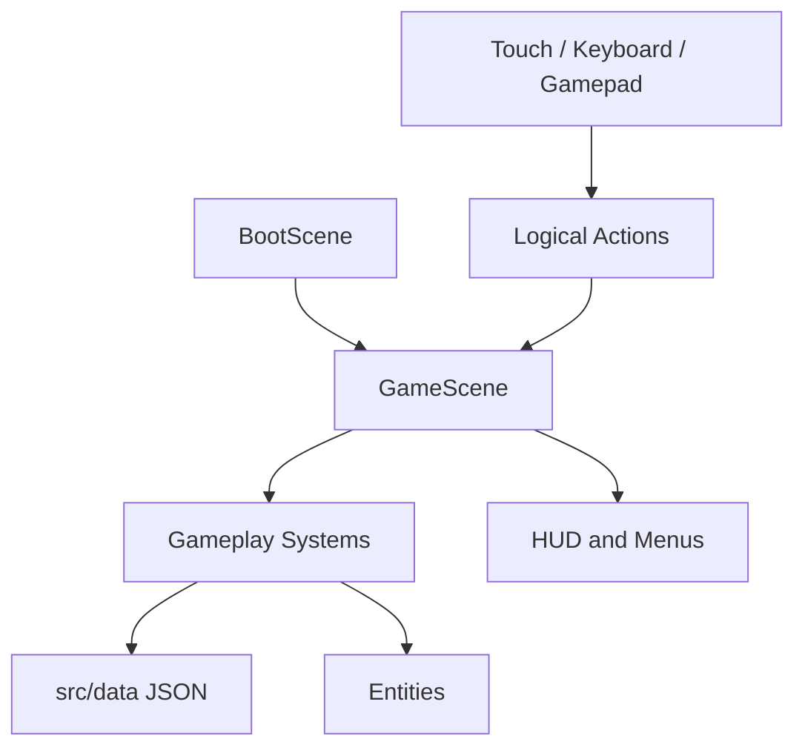

# Architecture

This document explains how Meowcenary should be organised. It is written for future agents and future maintainers, not just engine specialists.

## Core Idea

Phaser should run the game screen. TypeScript systems should run the game rules.

That means scenes should stay thin. A scene can create objects, wire systems together, and call `update()`. It should not become the place where every combat, upgrade, save, achievement, input-device, and economy rule lives.

## Main Principles

- Keep code modular, easy to read, and as simple as possible.
- Prefer small files with clear names over clever frameworks.
- Put gameplay tuning in JSON data when practical.
- Put game rules in systems that can be tested.
- Let Phaser own rendering, physics, scene lifecycle, and browser input/audio primitives.
- Avoid new dependencies unless they clearly make the code simpler.
- No ads, paid power, subscriptions, timers, or energy systems.
- Preserve automatic targeting/firing as the primary combat model; skill expression comes from movement, positioning, threat reading, builds, and simple bounded abilities/evades rather than required manual aiming.
- Touch, keyboard, and game-controller input must converge on logical actions; platform/device adapters do not own gameplay rules.
- Meowcenary owns achievement/mastery truth. Native services such as Game Center or Google Play Games are optional synchronization mirrors, not progression authorities.

## Runtime Shape



## System Boundaries

| System | Owns | Does Not Own |
| --- | --- | --- |
| Input / Actions | Touch, keyboard, pointer, gamepad adapters; movement intent; logical actions; focus/navigation intent; device connect/disconnect state | Player stats, cooldown rules, direct gameplay mutation, platform-specific gameplay branches |
| Player | Player health, position, movement state, and any approved simple evade state | Upgrade generation or enemy spawning |
| Weapons | Fire timing, targeting, projectiles, run weapon instances, and run merge state | Level-up card selection or persistent Gunsmith inventory |
| Enemies | Enemy movement, damage, death, ranged/projectile behavior, elite/boss state | Global stage progression or permanent rewards |
| Spawn Director | When and where enemies appear | Enemy rendering details or objective completion rules |
| Contracts / Stages | Stage definitions, objective state, completion/failure, chapter/stage selection, and resolved encounter requirements | Enemy rendering or permanent-item implementation details |
| Upgrades | Run-only upgrade choices, stacks, effects, ownership/read-model state, and presentation metadata such as placeholder icon IDs | Persistent progression, armour, achievements, or Gunsmith part ownership |
| Loot | XP, currency, chests, weapon reward grants, and reward tables | Paid rewards or ad multipliers |
| Save | Local persistence, settings, migrations, and persistent state | Run-time combat decisions |
| Progression | Pure purchase, unlock, reward banking, and durable progression mutation | In-run loot generation, achievement-platform sync, or final UI rendering |
| Achievements / Mastery | Game-owned definitions, progress/completion, mastery state, exactly-once achievement rewards, platform-neutral sync commands/read models | Game Center/Google Play as authority, stage/enemy rule implementation, UI presentation timing |
| Achievement Platform Adapter | Best-effort mapping/report/reconciliation to local/web, Game Center, Google Play Games or future native services | Deciding whether an achievement is earned; granting gameplay unlocks |
| Characters | Character data, registry, selection state, run-contribution resolution, passives, and registered simple active-ability hooks | Weapon/enemy internals, armour rules, save persistence implementation, or final selection-screen UI |
| Gunsmith | Persistent player-owned guns, modular part inventory, slot compatibility, part merge/upgrade/infusion rules, assembled-build resolution | In-run upgrade-card selection or the temporary six-slot rack UI |
| Equipment | Persistent Helmet/Armour/Gloves/Boots ownership, equip/upgrade rules, set bonuses, tier/unlock state | Gunsmith part behavior or temporary card stacks |
| Arenas | Arena data, registry, selection state, world bounds, spawn regions, static obstacles, and the hazard shell | Enemy spawn scheduling, difficulty curves, character rules, or final map art |
| UI | HUD, menus, cards, inventory, settings, achievements/mastery, Gunsmith/equipment presentation and visible focus | Core gameplay calculations, achievement completion rules, or rule duplication |
| Audio | Music, SFX, mute, and volume | Gameplay rules |
| Debug | Developer-only visibility and cheats | Production player progression |
| Feedback | Event-driven visual cues, reduced-motion presentation, cosmetic effect lifetime/caps | Combat outcomes, balance, rewards, progression, gameplay RNG |

## Unified Input / Action Architecture

Epic 19 freezes the concrete Alpha 2 version of this boundary.

Conceptually:

```text
Touch ───────┐
Keyboard ────┼─> Input / Action Adapter ─> logical actions ─> gameplay + UI commands
Gamepad ─────┘
```

Movement remains an analog/vector intent where available. Representative non-movement actions include:

```ts
type GameAction =
  | 'confirm'
  | 'back'
  | 'pause'
  | 'inventory'
  | 'dash'
  | 'ability'
  | 'navUp'
  | 'navDown'
  | 'navLeft'
  | 'navRight';
```

This type is illustrative until the Epic 19 architecture pass freezes the exact live contract.

### Input rules

- Gameplay/UI consume logical actions, not Xbox/PlayStation labels, scan codes, or touch-widget IDs.
- Controller support covers menus, selection, combat, upgrade cards, rack/merge, settings, results, Retry/Menu—not combat only.
- Controller-only navigation must not require pointer hover, drag, touch, or a hidden cursor.
- Analog deadzones/normalization live at the adapter boundary and are testable.
- Disconnecting a controller clears held analog/button state safely.
- Reconnecting or switching active input source does not require scene restart.
- Mixed-device input cannot double-confirm, double-merge, or select an upgrade twice.
- UI focus must be explicit/visible under keyboard/controller navigation.
- Control-hint presentation may follow the last active input source, but hints never change gameplay semantics.
- Auto-fire remains the same across input methods; required right-stick/manual aim is outside the product direction.
- Epic 24 character abilities use the same logical action layer.
- Future iOS/Android wrappers may supply additional adapters, but must not fork gameplay rules.

## Data-Driven Gameplay

If a value changes how the game feels, prefer putting it in data first.

Good data candidates:

- Weapon stats.
- Enemy stats and boss behavior configuration.
- Upgrade cards and presentation metadata.
- Spawn curves.
- Character stats/passive/ability definitions.
- Loot tables.
- Permanent upgrade costs where that legacy system remains relevant.
- Arena definitions.
- Stage/contract/objective definitions.
- Achievement/mastery definitions and optional platform ID mappings.
- Persistent Gunsmith part/trait/slot definitions.
- Armour/equipment/set/tier definitions.

Use TypeScript interfaces and validation so bad data fails early.

Epic-specific data contracts:

- [Epic 4 Slice 1: enemy data and spawn curves](architecture/epic-4-enemy-data.md)
- [Epic 4 Slice 2: enemy runtime state and lifecycle](architecture/epic-4-enemy-runtime.md)
- [Epic 4 Slice 3: enemy movement and charger timing](architecture/epic-4-enemy-movement.md)
- [Epic 4 Slice 4: deterministic spawn director](architecture/epic-4-spawn-director.md)
- [Epic 4 Slice 5: spawn and difficulty integration](architecture/epic-4-spawn-integration.md)
- [Epic 5: meta progression](architecture/epic-5-meta-progression.md)
- [Epic 6: characters](architecture/epic-6-characters.md)
- [Epic 7: maps and arenas](architecture/epic-7-maps-and-arenas.md)
- [Epic 8: loot and economy](architecture/epic-8-loot-and-economy.md)
- [Epic 9: UI and UX](architecture/epic-9-ui-and-ux.md)
- [Epic 10: audio](architecture/epic-10-audio.md)
- [Epic 10 issue #67 delivery handoff](architecture/epic-10-audio-remainder.md)
- [Epic 11: balancing and developer tooling](architecture/epic-11-balancing-and-developer-tooling.md)
- [Epic 11 issue #69 delivery handoff](architecture/epic-11-remainder.md)
- [Epic 12: polish and performance](architecture/epic-12-polish-and-performance.md)
- [Epic 13: presentation runtime and physics stability](architecture/epic-13-presentation-runtime.md)
- [Epic 14: weapon acquisition and rack economy](architecture/epic-14-weapon-acquisition-and-rack-economy.md)
- [Epic 15: inventory and merge experience](architecture/epic-15-inventory-and-merge-experience.md)
- [Epic 16: visual identity and Junkyard world](architecture/epic-16-visual-identity-and-junkyard-world.md)
- [Epic 17: combat feel and weapon identity](architecture/epic-17-combat-feel-and-weapon-identity.md)

Existing dedicated architecture documents remain implementation truth for
their delivered scopes and supersede older issue wording where they differ.
The Epic 16 document is the implementation source of truth and PR #83
delivery record for the single 46-binding visual manifest, required-asset
preload gate, data-referenced actor/weapon/pickup art, pooled
projectile/drop/defeat presentation, actor clip adoption, authored arena
render data, enlarged Junkyard Lot, and the physics/presentation invariants
that keep art from changing gameplay. Its selected visual-design packet
remains reference material; all runtime pixels come from deterministic
Pixelorama sources and exports.

## Alpha 2 Forward Contracts

### Epic 18 — upgrade-card presentation / build variety

Issue #77 freezes several architecture requirements before implementation:

- a larger underlying upgrade pool (target ~15–20 meaningful cards);
- normally 4–5 visible options per level-up offer, drawn deterministically without replacement from eligible definitions;
- chooser/read-model state must expose whether a card is already owned plus current/max stacks;
- every upgrade definition must expose a placeholder icon/image identifier and category/presentation metadata;
- missing required placeholder mappings fail clearly during validation/development rather than producing blank cards;
- placeholder art may be produced later by Codex and replaced with final art without changing gameplay IDs or chooser rules;
- temporary run cards remain separate from Epic 23's future persistent Gunsmith.

The existing Epic 3 offer-token/stale-command protections stay authoritative when offer size/presentation expands.

### Epic 19 — touchscreen + controller gate

Issue #78 now makes the full input experience an explicit Alpha 2 gate:

- automatic targeting/firing remains primary across touch, keyboard, and controller;
- compare anchored versus floating virtual-stick behavior on real displayed phone sizes;
- validate whether movement/positioning alone creates enough agency;
- if evidence shows movement-only is materially passive, one simple deterministic/pause-safe dash/evade may be introduced as a tightly scoped exception;
- freeze the shared logical input/action contract and controller deadzone/focus/disconnect semantics;
- require controller-only completion of menus, combat, upgrade selection, rack/merge, settings, summary, Retry/Menu;
- reserve a logical `ability` action/layout slot for Epic 24;
- do not introduce required twin-stick/manual aiming.

## Save and Persistent State

Current save ownership remains `SaveManager` + `GameContext` with linear,
versioned migrations. Existing meta state holds persistent currency, unlocks,
and legacy permanent-upgrade state.

Post-Alpha-2 epics may require new persistent structures for stage completion,
achievement/mastery progress, Gunsmith parts/builds, character abilities, and
equipment ownership. Those must be introduced through explicit versioned
migrations; do not append ad-hoc LocalStorage keys per feature.

## Achievement / Mastery Authority

Epic 22 (#91) creates the achievement/mastery primitive **before** the persistent systems that consume it.

Conceptual flow:

```text
authoritative gameplay/progression facts
                ↓
Meowcenary Achievement/Mastery State  ← authoritative
                ↓
┌──────────────────┬──────────────────┬────────────────────┐
│ web/local adapter│ Game Center      │ Google Play Games  │
│                  │ mirror           │ mirror             │
└──────────────────┴──────────────────┴────────────────────┘
```

Frozen boundary:

- Stable Meowcenary IDs/state are save/progression truth.
- Standard, incremental, hidden, and mastery achievements are planned first-class types.
- Web/offline play earns achievements with no platform account.
- Platform mapping IDs are optional metadata.
- Local achievement completion/rewards commit before/independently of platform reporting.
- Platform reporting/reconciliation is retryable/idempotent and may fail without blocking gameplay.
- Reconciliation may raise local knowledge from a trusted mirror if architecture explicitly allows it, but must never reduce a legitimate local completion merely because the mirror is stale.
- Achievement-triggered unlocks route through the normal progression/save boundary exactly once.
- Epics 23–26 reference Epic 22 achievement/mastery IDs/state rather than maintaining parallel counters.
- Achievement UI must be controller-, keyboard-, pointer-, and touch-navigable.

## Post-Alpha-2 Planned Architecture — Depth & Progression

Epics 20–26 are **product contracts only until their dedicated architecture passes are written**. Do not implement them directly from this summary; each should receive the same architecture-first treatment as existing Golden Run epics.

### Epic 20 — Contracts, Objectives, and Stage Progression (#85)

Planned boundaries:

- validated stage/contract definitions;
- pure objective state/progress/completion rules for a deliberately small set of objective families;
- frontier stages designed to become severely hostile around an intended ~3-minute clear window rather than allowing indefinite kiting;
- objective completion enables stage clear/extraction; optional continued greed, if retained, must be explicit risk/reward;
- initial chapter target: four normal stages plus a boss stage;
- persistent stage completion/unlock state routes through the progression/save boundary;
- authoritative stage-completion facts feed Epic 22 without duplicate achievement counters;
- stage selection/clear/retry/next-stage supports the unified input/action layer.

### Epic 21 — Enemy Roster Expansion and Boss Framework (#86)

Planned boundaries:

- expand toward roughly eight behavioral archetypes including a ranged/projectile enemy;
- enemy variety changes movement/priority decisions rather than only HP/damage;
- boss runtime has explicit authoritative state/phases/telegraphs and integrates with Epic 20 boss stages;
- bosses are unique encounters with small readable movesets, not enlarged normal enemies;
- combat/boss facts feed Epic 22 achievement/mastery tracking;
- encounters remain viable under the same touch/controller combat model.

### Epic 22 — Achievements, Mastery, and Platform Sync (#91)

Planned boundaries:

- validated stable achievement/mastery definitions and persistent progress;
- standard, incremental, hidden, and mastery categories;
- event/fact-driven progress with exactly-once completion/rewards;
- in-game gallery/progress read models;
- platform-neutral adapter interface;
- web/local authoritative behavior;
- optional Game Center / Google Play Games mirroring;
- offline-first and failure-tolerant synchronization;
- no downstream unlock depends on successful native-platform synchronization.

### Epic 23 — Persistent Gunsmith and Weapon-Part Crafting (#87)

Planned boundaries:

- persistent player-owned guns are separate from run-only `WeaponInstance` rack state;
- modular slots include receiver/core, barrel, optic, stock, trigger, magazine, and underbarrel/specialist attachment;
- part merge/upgrade/trait-infusion rules are pure, bounded, and testable outside combat;
- components should frequently alter behavior, not just add tiny stats;
- a bounded trait model supports hybrid outcomes such as a conventional barrel gaining an incendiary/fire trait;
- crafting/merging occurs in the Gunsmith between runs, never as substantial inventory work during active combat;
- achievement-gated content references Epic 22 state.

### Epic 24 — Mercenary Roster Expansion (#88)

Planned boundaries:

- expand to more than three characters; initial target ~8;
- each character has a clear base/passive/start identity and one simple registered active ability;
- abilities are deterministic, pause-safe, command-driven, and do not introduce manual aiming;
- abilities consume Epic 19's logical action model on touch/keyboard/controller;
- later characters are primarily gated by stages, bosses, Epic 22 achievements/mastery rather than currency alone.

### Epic 25 — Armour Sets and Equipment Progression (#89)

Planned boundaries:

- persistent Helmet/Armour/Gloves/Boots loadout;
- roughly eight initial set families with 2-piece and 4-piece bonuses;
- static definitions remain separate from persistent owned instances/upgrades;
- coins upgrade owned gear;
- higher-tier access is gated by gameplay accomplishment such as stage/chapter progress, bosses, Epic 22 achievements/mastery;
- equipment management supports controller-only navigation with no required drag/touch interaction.

### Epic 26 — Meta Progression Rebalance and Depth Integration (#90)

Planned boundaries:

- explicitly assign one purpose to each progression/reward layer;
- integrate stage/boss/Epic-22 unlocks with Gunsmith, armour, and characters;
- simplify or retire legacy permanent-upgrade mechanics that no longer have a unique role;
- prevent easiest-stage farming from becoming the dominant progression strategy;
- keep all persistent mutation behind one migration-safe progression/save boundary;
- consume local authoritative achievement state, never native mirrors, for unlock logic;
- preserve controller-only access across all between-run progression surfaces.

## Progression-Layer Boundary

Future agents must preserve this conceptual separation unless a later architecture document explicitly supersedes it:

| Layer | Scope | Purpose |
| --- | --- | --- |
| Upgrade cards | Current contract/run | Temporary build direction and run variety |
| Six-slot weapon rack / merges | Current run | Short-term combat escalation |
| Achievements/mastery | Persistent | Game-owned accomplishment/progression primitive; optional platform mirrors |
| Gunsmith | Persistent | Engineer and personalize guns/parts between runs |
| Armour/equipment | Persistent | Mercenary loadout, set bonuses, long-term gear upgrading |
| Mercenary roster | Persistent selection | Distinct passive/active play styles |
| Stages/bosses | Persistent progression | Content milestones and authoritative accomplishment facts |
| Coins/scrap | Persistent resource | Improve appropriate owned gear/items; not a universal milestone bypass |

## AI Handoff Pattern

Every feature should move through the same simple flow:

1. Architecture: define boundaries and data shape.
2. Implementation: code the smallest useful slice.
3. Tests: cover pure rules and validation.
4. Playtest: confirm the feature is understandable and fun.
5. Follow-up: tune balance separately from architecture defects.

## Review Checklist

Before merging implementation work, check:

- Did the scene stay thin?
- Is the feature split into clear systems?
- Are pure rules tested?
- Is tuning data-driven where practical?
- Are browser/mobile/controller constraints considered?
- Can the core player journey be completed controller-only where the epic touches it?
- Does platform-specific integration stay behind an adapter rather than leaking into gameplay?
- Is local Meowcenary state authoritative for achievements/progression?
- Is the code easy for the next agent to read?
- Does a new persistent system have a unique progression role rather than duplicating cards, achievements, Gunsmith, armour, or currency?
