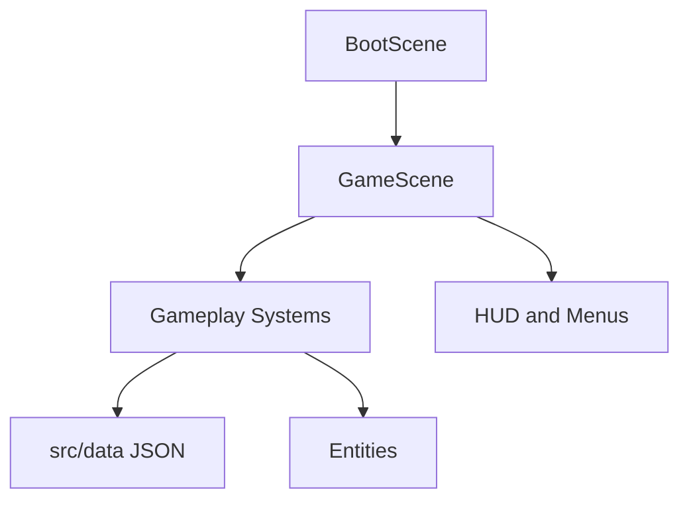

# Architecture

This document explains how Meowcenary should be organised. It is written for future agents and future maintainers, not just engine specialists.

## Core Idea

Phaser should run the game screen. TypeScript systems should run the game rules.

That means scenes should stay thin. A scene can create objects, wire systems together, and call `update()`. It should not become the place where every combat, upgrade, save, and economy rule lives.

## Main Principles

- Keep code modular, easy to read, and as simple as possible.
- Prefer small files with clear names over clever frameworks.
- Put gameplay tuning in JSON data when practical.
- Put game rules in systems that can be tested.
- Let Phaser own rendering, physics, scene lifecycle, and browser input/audio primitives.
- Avoid new dependencies unless they clearly make the code simpler.
- No ads, paid power, subscriptions, timers, or energy systems.

## Runtime Shape

## System Boundaries

| System | Owns | Does Not Own |
| --- | --- | --- |
| Input | Keyboard, pointer, and touch intent | Player stats or movement rules |
| Player | Player health, position, and movement state | Upgrade generation or enemy spawning |
| Weapons | Fire timing, targeting, projectiles, and merge state | Level-up card selection |
| Enemies | Enemy movement, damage, death, and rewards | Global difficulty curves |
| Spawn Director | When and where enemies appear | Enemy rendering details |
| Upgrades | Run-only upgrade choices, stacks, and modifiers | Permanent progression |
| Loot | XP, currency, chests, and reward tables | Paid rewards or ad multipliers |
| Save | Local persistence, settings, migrations, and meta state | Run-time combat decisions |
| UI | HUD, menus, cards, inventory, settings | Core gameplay calculations |
| Audio | Music, SFX, mute, and volume | Gameplay rules |
| Debug | Developer-only visibility and cheats | Production player progression |

## Data-Driven Gameplay

If a value changes how the game feels, prefer putting it in data first.

Good data candidates:

- Weapon stats.
- Enemy stats.
- Upgrade cards.
- Spawn curves.
- Character stats.
- Loot tables.
- Permanent upgrade costs.
- Arena definitions.

Use TypeScript interfaces and validation so bad data fails early.

Epic-specific data contracts:

- [Epic 4 Slice 1: enemy data and spawn curves](architecture/epic-4-enemy-data.md)
- [Epic 4 Slice 2: enemy runtime state and lifecycle](architecture/epic-4-enemy-runtime.md)

## AI Handoff Pattern

Every feature should move through the same simple flow:

1. Architecture: define boundaries and data shape.
2. Implementation: code the smallest useful slice.
3. Tests: cover pure rules and validation.
4. Playtest: confirm the feature is understandable and fun.
5. Follow-up: tune balance separately from architecture defects.

## Review Checklist

Before merging implementation work, check:

- Did the scene stay thin?
- Is the feature split into clear systems?
- Are pure rules tested?
- Is tuning data-driven where practical?
- Are browser and mobile constraints considered?
- Is the code easy for the next agent to read?
