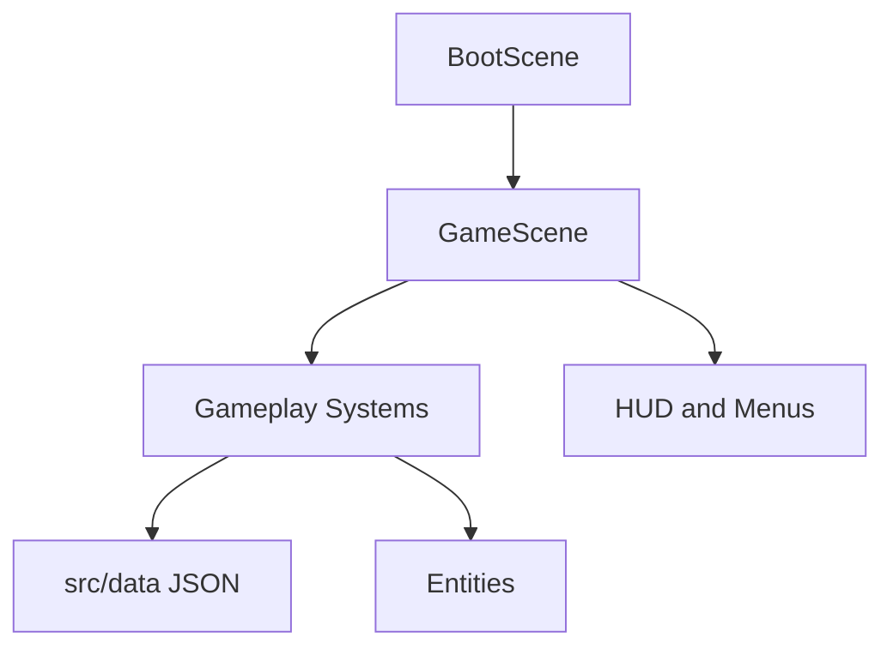

# Architecture

## Architecture Principles

- Phaser owns rendering, physics, scenes, and frame lifecycle.
- TypeScript owns game rules, state transitions, and data contracts.
- Gameplay balance lives in JSON data first.
- Systems should be small, explicit, and independently testable.
- Scene code should orchestrate systems rather than becoming the game logic dump.

## Current Runtime Shape

## Planned System Boundaries

| System | Responsibility | Should Not Own |
| --- | --- | --- |
| Input | Keyboard, pointer, touch abstraction | Player stats or combat rules |
| Player | Position, health, movement state | Upgrade selection, enemy spawning |
| Weapon | Firing cadence, projectile creation, targeting | Level-up card generation |
| Enemy | Movement intent, damage, death rewards | Global difficulty curves |
| Spawn Director | Spawn timing, enemy mix, pressure scaling | Enemy rendering details |
| Upgrade | Card generation, stack rules, modifiers | Projectile physics |
| Save | Persistence, migration, settings | Run-time combat decisions |
| UI | Menus, HUD, upgrade cards | Core gameplay calculations |

## Data-Driven Gameplay

The following should remain data-backed unless a feature clearly requires code:

- Weapon base stats.
- Enemy base stats.
- Upgrade cards.
- Spawn curves.
- Character base stats.
- Loot tables.
- Meta progression costs.

Each JSON file should map to a TypeScript interface in `src/systems/types.ts` or a more specific contract file once the system grows.

## AI Handoff Pattern

Each feature issue should produce four artifacts:

1. Architecture note from Opus Supercode.
2. Implementation plan with file-level changes.
3. GPT-5.5 implementation and tests.
4. Playtest notes and balancing follow-up.

## Acceptance Criteria Template

Every implementation feature should include:

- Player-facing behaviour.
- Data model changes.
- Affected systems.
- Edge cases.
- Test expectations.
- Manual playtest checklist.
