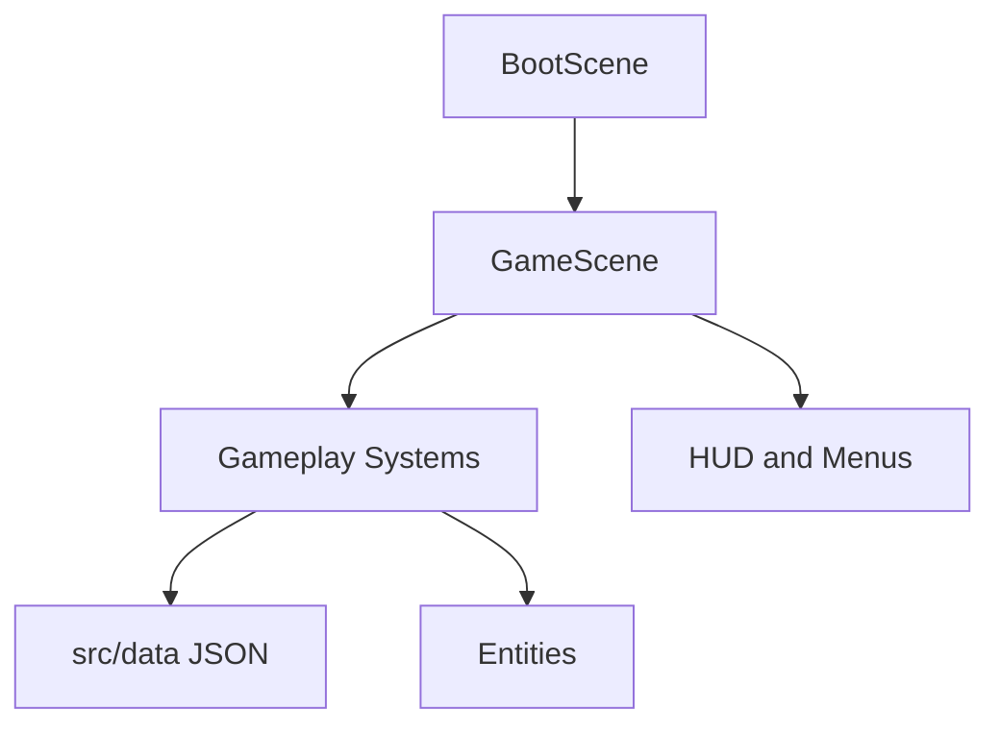

# Architecture

This document explains how Meowcenary should be organised. It is written for future agents and future maintainers, not just engine specialists.

## Core Idea

Phaser should run the game screen. TypeScript systems should run the game rules.

That means scenes should stay thin. A scene can create objects, wire systems together, and call `update()`. It should not become the place where every combat, upgrade, save, and economy rule lives.

## Main Principles

- Keep code modular, easy to read, and as simple as possible.
- Prefer small files with clear names over clever frameworks.
- Put gameplay tuning in JSON data when practical.
- Put game rules in systems that can be tested.
- Let Phaser own rendering, physics, scene lifecycle, and browser input/audio primitives.
- Avoid new dependencies unless they clearly make the code simpler.
- No ads, paid power, subscriptions, timers, or energy systems.
- Preserve automatic targeting/firing as the primary combat model; touch skill expression comes from movement, positioning, threat reading, and simple bounded abilities/evades rather than manual aiming.

## Runtime Shape

## System Boundaries

| System | Owns | Does Not Own |
| --- | --- | --- |
| Input | Keyboard, pointer, touch intent, and explicit gameplay commands such as a validated dash/ability request | Player stats, cooldown rules, or direct gameplay mutation |
| Player | Player health, position, movement state, and any approved simple evade state | Upgrade generation or enemy spawning |
| Weapons | Fire timing, targeting, projectiles, run weapon instances, and run merge state | Level-up card selection or persistent Gunsmith inventory |
| Enemies | Enemy movement, damage, death, ranged/projectile behavior, elite/boss state | Global stage progression or permanent rewards |
| Spawn Director | When and where enemies appear | Enemy rendering details or objective completion rules |
| Contracts / Stages | Stage definitions, objective state, completion/failure, chapter/stage selection, and resolved encounter requirements | Enemy rendering or permanent-item implementation details |
| Upgrades | Run-only upgrade choices, stacks, effects, ownership/read-model state, and presentation metadata such as placeholder icon IDs | Persistent progression, armour, or Gunsmith part ownership |
| Loot | XP, currency, chests, weapon reward grants, and reward tables | Paid rewards or ad multipliers |
| Save | Local persistence, settings, migrations, and meta state | Run-time combat decisions |
| Progression | Pure purchase, unlock, reward, achievement/mastery, and permanent-state rules | In-run loot generation or final UI rendering |
| Characters | Character data, registry, selection state, run-contribution resolution, passives, and registered simple active-ability hooks | Weapon/enemy internals, armour rules, save persistence implementation, or final selection-screen UI |
| Gunsmith | Persistent player-owned guns, modular part inventory, slot compatibility, part merge/upgrade/infusion rules, assembled-build resolution | In-run upgrade-card selection or the temporary six-slot rack UI |
| Equipment | Persistent Helmet/Armour/Gloves/Boots ownership, equip/upgrade rules, set bonuses, tier/unlock state | Gunsmith part behavior or temporary card stacks |
| Arenas | Arena data, registry, selection state, world bounds, spawn regions, static obstacles, and the hazard shell | Enemy spawn scheduling, difficulty curves, character rules, or final map art |
| UI | HUD, menus, cards, inventory, settings, Gunsmith/equipment presentation | Core gameplay calculations or rule duplication |
| Audio | Music, SFX, mute, and volume | Gameplay rules |
| Debug | Developer-only visibility and cheats | Production player progression |
| Feedback | Event-driven visual cues, reduced-motion presentation, cosmetic effect lifetime/caps | Combat outcomes, balance, rewards, progression, gameplay RNG |

## Data-Driven Gameplay

If a value changes how the game feels, prefer putting it in data first.

Good data candidates:

- Weapon stats.
- Enemy stats and boss behavior configuration.
- Upgrade cards and presentation metadata.
- Spawn curves.
- Character stats/passive/ability definitions.
- Loot tables.
- Permanent upgrade costs where that legacy system remains relevant.
- Arena definitions.
- Stage/contract/objective definitions.
- Persistent Gunsmith part/trait/slot definitions.
- Armour/equipment/set/tier definitions.
- Achievement/mastery/unlock definitions.

Use TypeScript interfaces and validation so bad data fails early.

Epic-specific data contracts:

- [Epic 4 Slice 1: enemy data and spawn curves](architecture/epic-4-enemy-data.md)
- [Epic 4 Slice 2: enemy runtime state and lifecycle](architecture/epic-4-enemy-runtime.md)
- [Epic 4 Slice 3: enemy movement and charger timing](architecture/epic-4-enemy-movement.md)
- [Epic 4 Slice 4: deterministic spawn director](architecture/epic-4-spawn-director.md)
- [Epic 4 Slice 5: spawn and difficulty integration](architecture/epic-4-spawn-integration.md)
- [Epic 5: meta progression](architecture/epic-5-meta-progression.md)
- [Epic 6: characters](architecture/epic-6-characters.md)
- [Epic 7: maps and arenas](architecture/epic-7-maps-and-arenas.md)
- [Epic 8: loot and economy](architecture/epic-8-loot-and-economy.md)
- [Epic 9: UI and UX](architecture/epic-9-ui-and-ux.md)
- [Epic 10: audio](architecture/epic-10-audio.md)
- [Epic 10 issue #67 delivery handoff](architecture/epic-10-audio-remainder.md)
- [Epic 11: balancing and developer tooling](architecture/epic-11-balancing-and-developer-tooling.md)
- [Epic 11 issue #69 delivery handoff](architecture/epic-11-remainder.md)
- [Epic 12: polish and performance](architecture/epic-12-polish-and-performance.md)
- [Epic 13: presentation runtime and physics stability](architecture/epic-13-presentation-runtime.md)
- [Epic 14: weapon acquisition and rack economy](architecture/epic-14-weapon-acquisition-and-rack-economy.md)
- [Epic 15: inventory and merge experience](architecture/epic-15-inventory-and-merge-experience.md)
- [Epic 16: visual identity and Junkyard world](architecture/epic-16-visual-identity-and-junkyard-world.md)

The Epic 5 document is the implementation source of truth for save V2,
permanent modifier ordering, finished-run banking, and the Epics 6/8/9
boundaries. It supersedes older backlog wording where those contracts differ.
The Epic 6 document is the implementation source of truth for the pre-run
`RunRequest` configuration boundary, the character data/registry/selection
contracts, and the reactive-passive lifecycle seam. It supersedes older Epic 6
issue wording where those contracts differ.
The Epic 7 document is the implementation source of truth for the arena data
model, the arena registry/selection contracts, the pure `spawnPoint(arena, rng)`
bridge into the spawn director, arena world bounds, static obstacles, and the
hazard shell. It supersedes older Epic 7 issue wording where those contracts
differ, and is split into seven per-slice architecture PRs indexed from the
overview document.
The Epic 8 document is the implementation source of truth for loot-table data,
pure resolution, pool-ready drops, the event-driven kill pipeline, and the
chest shell. It supersedes older Epic 8 issue wording where contracts differ.
The Epic 9 document is the implementation source of truth for production menu
and scene flow, HUD/read models, settings UI, touch presentation, pause and
inventory/merge UI, upgrade-chooser integration, and terminal run summary. It
supersedes issue #10 where that issue predates current offer-token, progression,
selection, input, and banking seams.
The Epic 10 document is the implementation source of truth for the shared
game-scoped audio manager, audio asset/map data and validation, the pure
cooldown gate, the `settings:changed` live-settings seam, additive `ui:*`
sound events, the autoplay unlock policy, and the placeholder asset pipeline.
It supersedes issue #11 where that issue predates the current audio shell,
settings, and menu seams.
The Epic 10 remainder document
([`architecture/epic-10-audio-remainder.md`](architecture/epic-10-audio-remainder.md))
is the implementation/delivery handoff for issue #67 (slices 3–5: settings
and scene wiring, exactly-one `ui:*` events, deterministic placeholders, and
the delivery record). It does not redefine the manager contract in the Epic 10
document.
The Epic 11 document is the implementation source of truth for aggregate data
validation and the descriptor-driven validator wiring, the shared curve
helpers, the development-gated cheat flags, the debug-overlay run metrics,
and the local playtest summary. It supersedes issue #12 where that issue
predates the live validation, linear enemy-scaling, spawn-director, and debug
seams.
The Epic 11 remainder document
([`architecture/epic-11-remainder.md`](architecture/epic-11-remainder.md))
is the implementation/delivery record for Issue #69. PR #66 delivered slices
1–2 only; PR #70 delivered slices 3–5 (development-only cheat flags, rolling
DPS/overlay metrics, local playtest summary, and the tuning guide) on the
single branch `agent/epic-11-remainder` and supersedes the older Epic 11
document's remaining-slice instructions where they differ.
The Epic 12 document is the implementation source of truth for final polish and
performance. It was delivered in PR #71 and freezes subscriber-only deterministic
combat feedback, shared reduced-motion policy, strict generic pooling,
behavior-preserving projectile and drop reuse, F3 performance/pool diagnostics,
an evidence-gated decision to defer enemy pooling, and FIT-based
responsive/browser verification. It supersedes issue #13 where that older wording
would otherwise allow gameplay entity caps or speculative enemy pooling to change
current combat/economy semantics.
The Epic 13 document is the implementation source of truth and PR #79 delivery
record for physics-debug diagnostics gating, the actor-view presentation
boundary, body-dimension invariants, the validated actor-art catalog and
AI-directed Pixelorama asset pipeline, and deterministic charger environment
clipping. It supersedes issue #72 where that wording predates the live
presentation, pooling, and debug seams.
The Epic 14 document is the implementation source of truth and PR #80 delivery
record for the six-slot authoritative `RunState.equipped` rack, one-weapon
starts, stable-definition weapon grants, atomic capacity-checked admission,
physical no-loss full-rack pickups, a dedicated `weapon-rewards` run RNG stream,
the guaranteed early duplicate, and the boundary that keeps final rack UI, art,
feedback, and pacing in Epics 15–18. It supersedes issue #73 where that wording
predates the live rack, reward-stream, and pickup seams.
The Epic 15 document is the implementation source of truth and PR #81 delivery
record for the immutable six-slot rack read model, allocation-free next-tier
preview, tap/keyboard selection contract, direct HUD entry, responsive rack
presentation, and the boundary that keeps final weapon art and weapon-specific
feedback in Epics 16 and 17.
The Epic 16 document is the implementation source of truth for the planned
single visual manifest, required-asset preload gate, data-referenced weapon and
pickup art, pooled visual switching, actor clip adoption, authored arena render
data, enlarged Junkyard Lot, and the physics/presentation invariants that keep
art from changing gameplay. Its selected visual-design packet is reference
material for deterministic Pixelorama production, not a runtime asset.

## Alpha 2 Forward Contracts

### Epic 18 — upgrade-card presentation / build variety

Issue #77 now freezes several architecture requirements before implementation:

- a larger underlying upgrade pool (target ~15–20 meaningful cards);
- normally 4–5 visible options per level-up offer, drawn deterministically without replacement from eligible definitions;
- chooser/read-model state must expose whether a card is already owned plus current/max stacks;
- every upgrade definition must expose a placeholder icon/image identifier and category/presentation metadata;
- missing required placeholder mappings fail clearly during validation/development rather than producing blank cards;
- placeholder art may be produced later by Codex and replaced with final art without changing gameplay IDs or chooser rules;
- temporary run cards remain separate from the future persistent Gunsmith.

The existing Epic 3 offer-token/stale-command protections stay authoritative when offer size/presentation expands.

### Epic 19 — touchscreen combat validation

Issue #78 now makes the mobile combat loop an explicit Alpha 2 gate:

- automatic targeting/firing remains primary;
- compare anchored versus floating virtual-stick behavior on real displayed phone sizes;
- validate whether movement/positioning alone creates enough agency;
- if evidence shows movement-only is materially passive, one simple deterministic/pause-safe dash/evade may be introduced as a tightly scoped exception;
- reserve a clean right-thumb layout slot for the post-Alpha-2 character active-ability system;
- do not introduce twin-stick/manual aiming.

## Post-Alpha-2 Planned Architecture — Depth & Progression

Epics 20–25 are **product contracts only until their dedicated architecture passes are written**. Do not implement them directly from this summary; each should receive the same architecture-first treatment as existing Golden Run epics.

### Epic 20 — Contracts, Objectives, and Stage Progression (#85)

Planned boundaries:

- validated stage/contract definitions;
- pure objective state/progress/completion rules for a deliberately small set of objective families;
- frontier stages designed to become severely hostile around an intended ~3-minute clear window rather than allowing indefinite kiting;
- objective completion enables stage clear/extraction; optional continued greed, if retained, must be explicit risk/reward;
- initial chapter target: four normal stages plus a boss stage;
- persistent stage completion/unlock state routes through the progression/save boundary.

### Epic 21 — Enemy Roster Expansion and Boss Framework (#86)

Planned boundaries:

- expand toward roughly eight behavioral archetypes including a ranged/projectile enemy;
- enemy variety changes movement/priority decisions rather than only HP/damage;
- boss runtime has explicit authoritative state/phases/telegraphs and integrates with Epic 20 boss stages;
- bosses are unique encounters with small readable movesets, not enlarged normal enemies.

### Epic 22 — Persistent Gunsmith and Weapon-Part Crafting (#87)

Planned boundaries:

- persistent player-owned guns are separate from run-only `WeaponInstance` rack state;
- modular slots include receiver/core, barrel, optic, stock, trigger, magazine, and underbarrel/specialist attachment;
- part merge/upgrade/trait-infusion rules are pure, bounded, and testable outside combat;
- components should frequently alter behavior, not just add tiny stats;
- a bounded trait model supports hybrid outcomes such as a conventional barrel gaining an incendiary/fire trait;
- crafting/merging occurs in the Gunsmith between runs, never as substantial inventory work during active combat.

### Epic 23 — Mercenary Roster Expansion (#88)

Planned boundaries:

- expand to more than three characters; initial target ~8;
- each character has a clear base/passive/start identity and one simple registered active ability where the Epic 19 control baseline supports it;
- abilities are deterministic, pause-safe, command-driven, and do not introduce manual aiming;
- later characters are primarily gated by stages, bosses, achievements, or mastery rather than currency alone.

### Epic 24 — Armour Sets and Equipment Progression (#89)

Planned boundaries:

- persistent Helmet/Armour/Gloves/Boots loadout;
- roughly eight initial set families with 2-piece and 4-piece bonuses;
- static definitions remain separate from persistent owned instances/upgrades;
- coins upgrade owned gear;
- higher-tier access is gated by gameplay accomplishment such as stage/chapter progress, bosses, achievements, or mastery.

### Epic 25 — Meta Progression Rebalance and Depth Integration (#90)

Planned boundaries:

- explicitly assign one purpose to each progression/reward layer;
- integrate stage/boss/achievement unlocks with Gunsmith, armour, and characters;
- simplify or retire legacy permanent-upgrade mechanics that no longer have a unique role;
- prevent easiest-stage farming from becoming the dominant progression strategy;
- keep all persistent mutation behind one migration-safe progression/save boundary.

## Progression-Layer Boundary

Future agents must preserve this conceptual separation unless a later architecture document explicitly supersedes it:

| Layer | Scope | Purpose |
| --- | --- | --- |
| Upgrade cards | Current contract/run | Temporary build direction and run variety |
| Six-slot weapon rack / merges | Current run | Short-term combat escalation |
| Gunsmith | Persistent | Engineer and personalize guns/parts between runs |
| Armour/equipment | Persistent | Mercenary loadout, set bonuses, long-term gear upgrading |
| Mercenary roster | Persistent selection | Distinct passive/active play styles |
| Stages/bosses/achievements | Persistent progression | Content milestones and unlock gates |
| Coins/scrap | Persistent resource | Improve appropriate owned gear/items; not a universal milestone bypass |

## AI Handoff Pattern

Every feature should move through the same simple flow:

1. Architecture: define boundaries and data shape.
2. Implementation: code the smallest useful slice.
3. Tests: cover pure rules and validation.
4. Playtest: confirm the feature is understandable and fun.
5. Follow-up: tune balance separately from architecture defects.

## Review Checklist

Before merging implementation work, check:

- Did the scene stay thin?
- Is the feature split into clear systems?
- Are pure rules tested?
- Is tuning data-driven where practical?
- Are browser and mobile constraints considered?
- Is the code easy for the next agent to read?
- Does a new persistent system have a unique progression role rather than duplicating cards, Gunsmith, armour, or currency?
