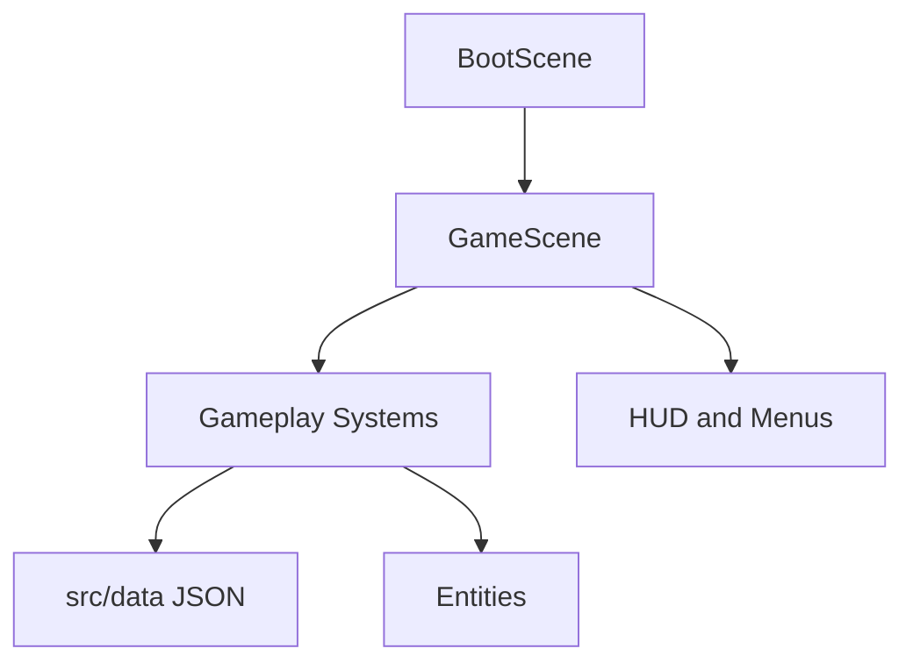

# Architecture

This document explains how Meowcenary should be organised. It is written for future agents and future maintainers, not just engine specialists.

## Core Idea

Phaser should run the game screen. TypeScript systems should run the game rules.

That means scenes should stay thin. A scene can create objects, wire systems together, and call `update()`. It should not become the place where every combat, upgrade, save, and economy rule lives.

## Main Principles

- Keep code modular, easy to read, and as simple as possible.
- Prefer small files with clear names over clever frameworks.
- Put gameplay tuning in JSON data when practical.
- Put game rules in systems that can be tested.
- Let Phaser own rendering, physics, scene lifecycle, and browser input/audio primitives.
- Avoid new dependencies unless they clearly make the code simpler.
- No ads, paid power, subscriptions, timers, or energy systems.

## Runtime Shape

## System Boundaries

| System | Owns | Does Not Own |
| --- | --- | --- |
| Input | Keyboard, pointer, and touch intent | Player stats or movement rules |
| Player | Player health, position, and movement state | Upgrade generation or enemy spawning |
| Weapons | Fire timing, targeting, projectiles, and merge state | Level-up card selection |
| Enemies | Enemy movement, damage, death, and rewards | Global difficulty curves |
| Spawn Director | When and where enemies appear | Enemy rendering details |
| Upgrades | Run-only upgrade choices, stacks, and modifiers | Permanent progression |
| Loot | XP, currency, chests, and reward tables | Paid rewards or ad multipliers |
| Save | Local persistence, settings, migrations, and meta state | Run-time combat decisions |
| Progression | Pure purchase, unlock, reward, and permanent-modifier rules | In-run loot generation or final UI rendering |
| Characters | Character data, registry, selection state, run-contribution resolution, and the reactive-passive lifecycle seam | Weapon/enemy internals, save schema, or final selection-screen UI |
| Arenas | Arena data, registry, selection state, world bounds, spawn regions, static obstacles, and the hazard shell | Enemy spawn scheduling, difficulty curves, character rules, or final map art |
| UI | HUD, menus, cards, inventory, settings | Core gameplay calculations |
| Audio | Music, SFX, mute, and volume | Gameplay rules |
| Debug | Developer-only visibility and cheats | Production player progression |

## Data-Driven Gameplay

If a value changes how the game feels, prefer putting it in data first.

Good data candidates:

- Weapon stats.
- Enemy stats.
- Upgrade cards.
- Spawn curves.
- Character stats.
- Loot tables.
- Permanent upgrade costs.
- Arena definitions.

Use TypeScript interfaces and validation so bad data fails early.

Epic-specific data contracts:

- [Epic 4 Slice 1: enemy data and spawn curves](architecture/epic-4-enemy-data.md)
- [Epic 4 Slice 2: enemy runtime state and lifecycle](architecture/epic-4-enemy-runtime.md)
- [Epic 4 Slice 3: enemy movement and charger timing](architecture/epic-4-enemy-movement.md)
- [Epic 4 Slice 4: deterministic spawn director](architecture/epic-4-spawn-director.md)
- [Epic 4 Slice 5: spawn and difficulty integration](architecture/epic-4-spawn-integration.md)
- [Epic 5: meta progression](architecture/epic-5-meta-progression.md)
- [Epic 6: characters](architecture/epic-6-characters.md)
- [Epic 7: maps and arenas](architecture/epic-7-maps-and-arenas.md)
- [Epic 8: loot and economy](architecture/epic-8-loot-and-economy.md)
- [Epic 9: UI and UX](architecture/epic-9-ui-and-ux.md)
- [Epic 10: audio](architecture/epic-10-audio.md)
- [Epic 10 issue #67 delivery handoff](architecture/epic-10-audio-remainder.md)
- [Epic 11: balancing and developer tooling](architecture/epic-11-balancing-and-developer-tooling.md)
- [Epic 11 issue #69 delivery handoff](architecture/epic-11-remainder.md)

The Epic 5 document is the implementation source of truth for save V2,
permanent modifier ordering, finished-run banking, and the Epics 6/8/9
boundaries. It supersedes older backlog wording where those contracts differ.
The Epic 6 document is the implementation source of truth for the pre-run
`RunRequest` configuration boundary, the character data/registry/selection
contracts, and the reactive-passive lifecycle seam. It supersedes older Epic 6
issue wording where those contracts differ.
The Epic 7 document is the implementation source of truth for the arena data
model, the arena registry/selection contracts, the pure `spawnPoint(arena, rng)`
bridge into the spawn director, arena world bounds, static obstacles, and the
hazard shell. It supersedes older Epic 7 issue wording where those contracts
differ, and is split into seven per-slice architecture PRs indexed from the
overview document.
The Epic 8 document is the implementation source of truth for loot-table data,
pure resolution, pool-ready drops, the event-driven kill pipeline, and the
chest shell. It supersedes older Epic 8 issue wording where contracts differ.
The Epic 9 document is the implementation source of truth for production menu
and scene flow, HUD/read models, settings UI, touch presentation, pause and
inventory/merge UI, upgrade-chooser integration, and terminal run summary. It
supersedes issue #10 where that issue predates current offer-token, progression,
selection, input, and banking seams.
The Epic 10 document is the implementation source of truth for the shared
game-scoped audio manager, audio asset/map data and validation, the pure
cooldown gate, the `settings:changed` live-settings seam, additive `ui:*`
sound events, the autoplay unlock policy, and the placeholder asset pipeline.
It supersedes issue #11 where that issue predates the current audio shell,
settings, and menu seams.
The Epic 10 remainder document
([`architecture/epic-10-audio-remainder.md`](architecture/epic-10-audio-remainder.md))
is the implementation/delivery handoff for issue #67 (slices 3–5: settings
and scene wiring, exactly-one `ui:*` events, deterministic placeholders, and
the delivery record). It does not redefine the manager contract in the Epic 10
document.
The Epic 11 document is the implementation source of truth for aggregate data
validation and the descriptor-driven validator wiring, the shared curve
helpers, the development-gated cheat flags, the debug-overlay run metrics,
and the local playtest summary. It supersedes issue #12 where that issue
predates the live validation, linear enemy-scaling, spawn-director, and debug
seams.
The Epic 11 remainder document
([`architecture/epic-11-remainder.md`](architecture/epic-11-remainder.md))
is the implementation/delivery record for Issue #69. PR #66 delivered slices
1–2 only; PR #70 delivered slices 3–5 (development-only cheat flags, rolling
DPS/overlay metrics, local playtest summary, and the tuning guide) on the
single branch `agent/epic-11-remainder` and supersedes the older Epic 11
document's remaining-slice instructions where they differ.

## AI Handoff Pattern

Every feature should move through the same simple flow:

1. Architecture: define boundaries and data shape.
2. Implementation: code the smallest useful slice.
3. Tests: cover pure rules and validation.
4. Playtest: confirm the feature is understandable and fun.
5. Follow-up: tune balance separately from architecture defects.

## Review Checklist

Before merging implementation work, check:

- Did the scene stay thin?
- Is the feature split into clear systems?
- Are pure rules tested?
- Is tuning data-driven where practical?
- Are browser and mobile constraints considered?
- Is the code easy for the next agent to read?
