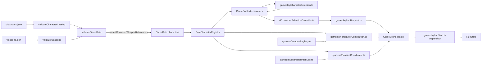
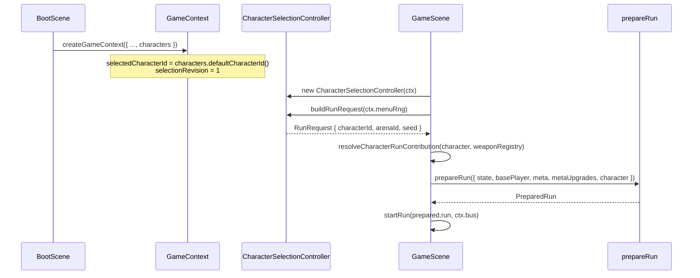
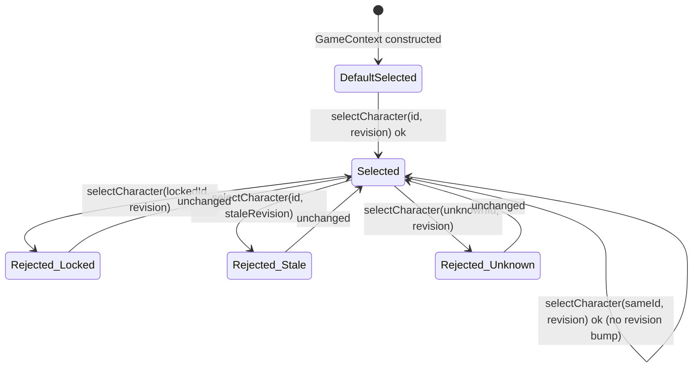

# Epic 6: Characters Architecture

Status: implementation-ready architecture for Epic 6 / issue #7. This document
is the repository source of truth for Epic 6. It supersedes conflicting Epic 6
issue text, in particular the `startingWeaponIds: string[]`-only loadout
contract, the optional `skinId?: string` field, and the old wording that
character `baseStats` "seed the base of `RunState.stats`". It defines
architecture only. The seven implementation slices below are dependency-ordered
implementation and review checkpoints; they describe file ownership, tests, and
acceptance criteria, not mandatory PR topology.

## 1. Decision summary

- `GameScene` no longer hardcodes `characterId: 'starter-meowcenary'`, an empty
  `CharacterRunContribution`, or a `createDefaultWeaponLoadout` call. A new
  `RunRequest` value, produced by a headless `CharacterSelectionController`,
  is the one pre-run configuration boundary `GameScene` consumes.
- `GameContext` gains a canonical `characters: CharacterRegistry`, an in-memory
  `selectedCharacterId`, a `selectionRevision` counter, and a
  `selectCharacter(characterId, expectedRevision)` command. Selection is
  session-transient: it is never written to `SaveDataV2` and never introduces
  `SaveDataV3`.
- The existing Epic 5 seam `CharacterRunContribution` is kept unchanged and
  becomes real: a new pure function `resolveCharacterRunContribution` maps a
  validated `CharacterDefinition` into it. `prepareRun` and its permanent →
  character → card ordering are untouched.
- Character starting loadouts are declared as exact `WeaponDefinition` id
  references (`startingWeaponIds: readonly string[]`, 1 to 6 entries, no
  duplicates). Runtime `WeaponInstance`s are never stored in JSON; they are
  constructed at run-prepare time through the existing `WeaponRegistry`, reusing
  its existing monotonic instance-id counter so instance ids stay deterministic
  and collision-free without a new id scheme.
- Static passives expand to `Modifier`s with source
  `character:<characterId>:<passiveId>`, matching the Epic 5 namespace exactly.
  Reactive passives get a lifecycle-safe `PassiveCoordinator` system and a
  typed `PassiveHandlerRegistry`, but the initial shipped catalog (two
  characters) uses **only static passives**. The reactive seam is built and
  tested with a synthetic handler; no reactive content ships in Epic 6.
- Character JSON is validated by one authoritative path
  (`validateCharacterCatalog`), reused by both `validateGameData` and the
  defensive `DataCharacterRegistry` constructor, exactly like
  `DataMetaUpgradeRegistry`/`DataEnemyRegistry`. A single invalid character
  fails the entire `loadGameData()` call — Epic 6 does not introduce a
  per-item content-exclusion recovery model that has no precedent elsewhere in
  this codebase.
- Character art loading is **not wired in Epic 6**. No scene in the current
  `main` branch loads any image or atlas (`Player` renders a Phaser circle);
  Epic 6 only freezes the canonical data ↔ asset path contract from
  `docs/art/character-asset-standard.md` for whichever later epic first needs
  rendered sprites (Epic 9 selection preview or Epic 12 polish).
- Epic 6 adds a minimal dev-only selection shell (a `RuntimeConfig.isDev`
  keyboard hotkey cycling `CharacterSelectionController.select`), not a menu
  scene. Epic 9 owns the production character-select screen against the same
  headless controller.

## 2. Repository baseline

This design is based on the current post-Epic-5 `main` branch (merged PRs #34,
#35):

- `GameScene.create()` builds `RunState` directly:
  `characterId: 'starter-meowcenary'` is a scene-local string literal that
  never matched any content definition; `arenaId` is
  `ctx.data.spawnCurves[0]?.id ?? 'arena'`; the `character` argument to
  `prepareRun` is `{ baseStats: {}, passiveModifiers: [],
  startingWeapons: createDefaultWeaponLoadout(weaponRegistry) }`.
- `prepareRun` (`src/gameplay/runStart.ts`) already implements the fixed
  ordering permanent progression → character contribution → later cards, and
  already validates character modifier sources against
  `^character:<characterId>:[a-z][a-z0-9]*(?:-[a-z0-9]+)*$`. Nothing about this
  pipeline changes in Epic 6; Epic 6 becomes its first real producer of a
  non-empty `CharacterRunContribution`.
- `RunState.characterId` and `RunState.arenaId` already exist and already flow
  into the `run:start` event payload.
- `DataWeaponRegistry.createWeaponInstance` already assigns
  `weapon-<n>` ids from a per-registry monotonic counter starting at 1; a fresh
  `DataWeaponRegistry` is constructed once per `GameScene.create()` call
  (i.e., once per run/restart).
- `GameContext` (`src/engine/context.ts`) already owns one current `SaveData`
  snapshot plus `metaUpgrades: MetaUpgradeRegistry`, constructed once in
  `BootScene.create()` and stored in the Phaser registry under
  `GAME_CONTEXT_REGISTRY_KEY`. It survives `GameScene.scene.restart()`.
- `validateGameData` validates each JSON catalog independently
  (`weapons.json`, `enemies.json`, `upgrades.json`, `meta-upgrades.json`,
  `spawn-curves.json`), then runs cross-catalog reference checks
  (`assertSpawnReferences`). Every catalog is fail-closed: on any invalid row,
  `loadGameData()` throws and `BootScene` cannot boot. There is no partial
  content-recovery precedent anywhere in `src/systems/validation.ts`.
- `DataEnemyRegistry` and `DataMetaUpgradeRegistry` both re-validate their raw
  input inside their own constructor (defense against direct construction that
  bypasses `loadGameData`), then `structuredClone` + recursively freeze
  (`DataEnemyRegistry`) or manually clone + freeze
  (`DataMetaUpgradeRegistry`) before publishing lookups.
- No scene in `main` currently calls `this.load.image`/`this.load.atlas`
  anywhere; `public/` does not exist yet. `Player` is a Phaser
  `Arc` (circle) graphic, not a sprite.
- `docs/art/character-asset-standard.md` already fixes the runtime asset path
  (`/assets/characters/<character-id>/<character-id>.png` + `.json`), frame
  size (48×48), and animation tags (`idle`/`run`/`hurt`/`defeat`) independently
  of this document; Epic 6 aligns its data contract to that standard rather
  than redefining it.

## 3. Ownership table

| Owner | Owns in Epic 6 | Does not own |
| --- | --- | --- |
| `src/data/characters.json` | Character content | Weapon/enemy/upgrade content |
| `src/systems/types.ts` | `CharacterDefinition` and nested JSON-safe shapes | Runtime contribution shapes |
| `src/systems/validation.ts` | `validateCharacterCatalog`, cross-catalog weapon reference checks, default-character-exists check | Purchase, selection, or passive-lifecycle rules |
| `src/systems/characters.ts` | `CharacterRegistry`/`DataCharacterRegistry`: immutable lookup | Selection state, unlock gating logic |
| `src/gameplay/characterSelection.ts` | Pure `canSelectCharacter`, `selectableCharacters`, `defaultCharacterId` | Storage, events, scenes |
| `src/gameplay/characterContribution.ts` | Pure `resolveCharacterRunContribution` (starting-loadout + static-passive resolution) | Run-start ordering (owned by `runStart.ts`) |
| `src/gameplay/runRequest.ts` | `RunRequest`, `createRunRequest`, `defaultArenaId` | Character/arena content or selection state |
| `src/gameplay/characterPassives.ts` | Reactive passive handler types, event allowlist, registry factory | Scene lifecycle, Phaser |
| `src/systems/PassiveCoordinator.ts` | Per-run reactive-passive subscription lifecycle | Modifier math (delegates to handlers/`ModifierStack`) |
| `src/engine/context.ts` | `characters`, `selectedCharacterId`, `selectionRevision`, `selectCharacter` | Gameplay calculations, scene flow |
| `src/ui/characterSelectionController.ts` | Headless read/command model for selection | Phaser rendering, dialogs, navigation |
| `src/scenes/BootScene.ts` | Constructing `DataCharacterRegistry` and passing it into `createGameContext` | Character rules |
| `src/scenes/GameScene.ts` | Building one `RunRequest`, resolving one contribution, wiring `PassiveCoordinator` into `systems`, a dev-only selection hotkey | Selection rules, passive math, unlock math |

Explicit non-goals:

- no character-select production menu, transitions, responsive layout,
  controller/focus navigation, or confirmation dialogs (Epic 9);
- no arena data model, world bounds, spawn regions, or obstacles (Epic 7);
- no loot tables, drop entities, or economy tuning (Epic 8);
- no final character art, spritesheet export, or animation wiring (Epic 12
  for polish; Epic 9 for the selection-screen preview);
- no paid characters/skins, monetisation, or account-bound unlocks;
- no persisted character selection, `SaveDataV3`, or new storage key;
- no reactive-passive production content — the lifecycle seam ships with zero
  shipped reactive passives;
- no change to `ArenaId`/spawn-curve selection logic beyond routing today's
  existing `spawnCurves[0]` fallback through the new `RunRequest` seam
  unchanged (Epic 7 replaces the arena half of that seam);
- no new `GameEventMap` events — Epic 6 needs none.

## 4. Exact TypeScript contracts

### 4.1 Character data (`src/systems/types.ts` additions)

```ts
import type { UnlockRule } from '../gameplay/meta';
import type { PlayerBaseStats } from '../gameplay/runStart';

export const CHARACTER_PASSIVE_EVENTS = [
  'enemy:killed',
  'player:damaged',
  'level:up',
  'xp:gained',
] as const;
export type CharacterPassiveEvent = (typeof CHARACTER_PASSIVE_EVENTS)[number];

export interface CharacterStaticPassiveDefinition {
  readonly id: string;
  readonly kind: 'static';
  readonly name: string;
  readonly description: string;
  readonly effects: readonly UpgradeEffect[];
}

export interface CharacterReactivePassiveDefinition {
  readonly id: string;
  readonly kind: 'reactive';
  readonly name: string;
  readonly description: string;
  readonly event: CharacterPassiveEvent;
  readonly handlerId: string;
}

export type CharacterPassiveDefinition =
  | CharacterStaticPassiveDefinition
  | CharacterReactivePassiveDefinition;

export interface CharacterDefinition {
  readonly id: string;
  readonly name: string;
  readonly description: string;
  readonly baseStats: Readonly<PlayerBaseStats>;
  readonly startingWeaponIds: readonly string[];
  readonly passives: readonly CharacterPassiveDefinition[];
  readonly unlock: UnlockRule;
  readonly cosmeticSkinIds: readonly string[];
}

export interface GameData {
  // ...existing fields...
  characters: CharacterDefinition[];
}
```

`UnlockRule` (`gameplay/meta.ts`) and `PlayerBaseStats` (`gameplay/runStart.ts`)
are reused verbatim — Epic 6 defines no competing shape. Both imports are
`import type` only. This forms a type-level cycle
(`types.ts` → `runStart.ts`/`meta.ts` → `types.ts`), but because every edge is
`import type`, TypeScript erases all three at compile time and there is no
runtime circular `require`. `systems/types.ts` already imports
`gameplay/stats.ts` (`StatKey`), so `systems/` importing type-only shapes from
`gameplay/` is an established direction in this file. Do not convert any of
these three imports to value imports.

There is no `skinId?: string` field. The default skin is implicitly the
character's own base asset (see §16); `cosmeticSkinIds` is the only skin field
and is a required (possibly empty) array — this codebase's JSON contracts
never use optional fields with implicit defaults (compare
`MetaUpgradeDefinition`, `WeaponDefinition`, `EnemyDefinition`: every field is
required and unknown fields are rejected).

`baseStats` reuses the exact `PlayerBaseStats` shape
(`{ maxHealth: number; moveSpeed: number }`); Epic 6 does not introduce a
richer per-character stat block. A character that wants a different armor,
damage, or attack-speed baseline does so through a static passive `Modifier`,
not through `baseStats`.

### 4.2 Character registry (`src/systems/characters.ts`)

```ts
export interface CharacterLookup {
  characterById(id: string): Readonly<CharacterDefinition> | undefined;
}

export interface CharacterRegistry extends CharacterLookup {
  all(): readonly Readonly<CharacterDefinition>[];
  defaultCharacterId(): string;
}

export class DataCharacterRegistry implements CharacterRegistry {
  constructor(data: Pick<GameData, 'characters'>);
  characterById(id: string): Readonly<CharacterDefinition> | undefined;
  all(): readonly Readonly<CharacterDefinition>[];
  defaultCharacterId(): string;
}
```

`DataCharacterRegistry`'s constructor calls `validateCharacterCatalog(
data.characters)` itself (the same admission path `validateGameData` uses),
then `structuredClone` + recursively freezes each definition and the catalog
snapshot, exactly like `DataEnemyRegistry`. It takes only
`Pick<GameData, 'characters'>` — no `weapons` parameter — because
cross-catalog weapon-reference checking is a `validateGameData`-only concern
(see §8), matching the existing precedent that `DataEnemyRegistry` never
receives `spawnCurves` even though `assertSpawnReferences` cross-checks
enemies against curves elsewhere. `defaultCharacterId()` returns the id of the
one definition with `unlock.type === 'default'` that JSON-order-first
satisfies it; validation guarantees at least one exists, so this method never
throws in practice, but defensively throws
`Error('Character catalog has no default character')` if it somehow would
not find one (mirroring `prepareRun`'s defensive-throw style).

### 4.3 Pure selection and unlock rules (`src/gameplay/characterSelection.ts`)

Phaser-free, no imports beyond `systems/types.ts`, `systems/characters.ts`,
`systems/save.ts`, and `gameplay/meta.ts`.

```ts
export function canSelectCharacter(
  character: Readonly<CharacterDefinition>,
  meta: Readonly<MetaState>,
): boolean {
  return character.unlock.type === 'default'
    || isUnlocked(meta, character.unlock.requiresUnlockId);
}

export function selectableCharacters(
  registry: CharacterLookup & Pick<CharacterRegistry, 'all'>,
  meta: Readonly<MetaState>,
): readonly Readonly<CharacterDefinition>[];
// returns only characters for which canSelectCharacter is true, registry order preserved

export function defaultCharacterId(registry: Pick<CharacterRegistry, 'all'>): string;
// same rule as DataCharacterRegistry.defaultCharacterId; both call this one shared helper
```

`DataCharacterRegistry.defaultCharacterId()` delegates to this module's
`defaultCharacterId` so there is exactly one implementation of "which
character is the default."

An unlock id preserved in `MetaState.unlocks` that no longer names any
character in the current catalog is handled with **zero new mechanism**: it
stays in `meta.unlocks` under Epic 5's existing "never delete a well-formed
unknown unlock id" rule, and `canSelectCharacter`/`selectableCharacters` only
ever iterate the current `CharacterRegistry`, so a character that no longer
exists in content simply cannot be offered — the stale unlock id is inert,
exactly like an unknown `permanentUpgrades` key from Epic 5.

### 4.4 Deterministic run-contribution resolution (`src/gameplay/characterContribution.ts`)

```ts
export function resolveCharacterRunContribution(
  character: Readonly<CharacterDefinition>,
  weaponRegistry: WeaponRegistry,
): CharacterRunContribution {
  // 1. baseStats copied verbatim (structurally compatible with Partial<PlayerBaseStats>)
  // 2. static passives -> Modifier[] with sourceId `character:<character.id>:<passive.id>`
  // 3. startingWeaponIds -> WeaponInstance[] via weaponRegistry.weaponById + createWeaponInstance,
  //    in JSON order, throwing if a referenced weapon id is missing (unreachable once
  //    assertCharacterWeaponReferences has run at load time; kept as a defensive invariant check)
}
```

`CharacterRunContribution` (`gameplay/runStart.ts`) is **not renamed and not
redefined**. Epic 6 is simply its first real producer; `prepareRun`'s
`character:<characterId>:<passiveId>` source-shape validation
(`runStart.ts`'s `characterSource` regex) already enforces the exact namespace
this function produces, so no change to `prepareRun` is required.

Reactive passives (`kind: 'reactive'`) are filtered out of this function
entirely — they contribute no `Modifier`s and are installed separately by
`PassiveCoordinator` (§4.6), not through `CharacterRunContribution`.

**Call-order invariant:** `resolveCharacterRunContribution` must call
`weaponRegistry.createWeaponInstance` before any other code in
`GameScene.create()` calls it, so starting-weapon instance ids remain the
low, deterministic prefix (`weapon-1` through `weapon-<startingWeaponIds
.length>`) each run/restart, exactly mirroring how `createDefaultWeaponLoadout`
previously had to run before `WeaponSystem` construction. This is a call-order
contract, not a new id scheme — it reuses `DataWeaponRegistry`'s existing
per-instance monotonic counter unchanged.

### 4.5 Pre-run configuration boundary (`src/gameplay/runRequest.ts`)

```ts
export interface RunRequest {
  readonly characterId: string;
  readonly arenaId: string;
  readonly seed: number;
}

export function createRunRequest(options: {
  readonly characterId: string;
  readonly arenaId: string;
  readonly rng: Pick<Rng, 'int'>;
}): RunRequest {
  return Object.freeze({
    characterId: options.characterId,
    arenaId: options.arenaId,
    seed: nextRunSeed(options.rng),
  });
}

export function defaultArenaId(ctx: Pick<GameContext, 'data'>): string {
  return ctx.data.spawnCurves[0]?.id ?? 'arena';
}
```

`defaultArenaId` is the exact fallback expression `GameScene.create()` uses
today (`ctx.data.spawnCurves[0]?.id ?? 'arena'`), relocated unchanged into a
single named function so Epic 7 has exactly one call site to replace with real
arena selection (see §22). This is the entire "arena" half of the pre-run
boundary Epic 6 owns: Epic 6 does not add arena selection, it only makes sure
the seam that will carry it already exists and is not buried inside
`GameScene`.

**Who creates a `RunRequest`:** `CharacterSelectionController.buildRunRequest`
(§4.7), which is the only caller of `createRunRequest`.

**Who validates it:** `characterId` is guaranteed valid by construction — it
is always read from `GameContext.selectedCharacterId`, which is itself only
ever set through `createGameContext`'s initial default or through
`GameContext.selectCharacter`, and both paths validate against the current
`CharacterRegistry` and unlock state before accepting a value. `arenaId` is
currently trivially valid (there is exactly one spawn curve; `defaultArenaId`
can only fail closed to the literal `'arena'`, which cannot happen while
`assertPlayableSpawnCurves` guarantees at least one curve).

**Where it lives before `GameScene`:** nowhere persistent. It is a one-shot,
frozen, throwaway value built fresh inside `GameScene.create()` and never
stored in the Phaser registry, `GameContext`, or `RunState` beyond the fields
`prepareRun` already copies onto `RunState` (`characterId`, `arenaId`,
`seed`). This avoids inventing a second state-management surface alongside
`GameContext`.

**How `GameScene` consumes it exactly once:** `GameScene.create()` calls
`characterController.buildRunRequest(ctx.menuRng)` exactly once per scene
creation (i.e., once per run start or restart), immediately spends the result
building `PrepareRunOptions.state`, and holds no other reference to it. There
is no retry path and no second call, so "exactly once" is structural, not a
convention to remember.

**Default/fallback behavior:** on first boot, `GameContext`'s initial
`selectedCharacterId` is `characterRegistry.defaultCharacterId()`. There is no
"no selection" state — a valid selection always exists from the moment
`GameContext` is constructed.

**Restart behavior:** `GameScene.restartRun()` calls `this.scene.restart()`,
which re-invokes `create()`. `ctx` (including `ctx.selectedCharacterId`) is
unchanged across a restart because it lives in the Phaser registry, outside
scene lifecycle. `ctx.menuRng` is also unchanged and continues its sequence,
so `createRunRequest`'s `nextRunSeed(ctx.menuRng)` call returns a **new** seed
every restart — identical to today's behavior. Net effect: **a restart keeps
the same selected character and arena, and generates a new seed** — exactly
the behavior the brief requires, achieved with zero new mechanism beyond
routing the existing values through `RunRequest`.

**Transient vs. persisted:** `RunRequest` itself is always transient (rebuilt
every run). `GameContext.selectedCharacterId`/`selectionRevision` are
transient for the lifetime of one loaded page (survive scene restarts, do not
survive a full page reload, are never written into `SaveDataV2`). Character
*unlocks* remain persisted exactly as today, inside `MetaState.unlocks`
(`character:<characterId>` ids), unchanged by Epic 6.

**Epic 7/9 extension:** Epic 7 adds `arenas: ArenaRegistry`,
`selectedArenaId`, and an arena selection revision to `GameContext` following
the identical pattern used here for characters, then replaces the single call
to `defaultArenaId(ctx)` with `arenaController.buildArenaId()` (or folds arena
selection into `createRunRequest`'s `arenaId` argument). `RunRequest`'s shape
does not change. Epic 9 replaces the dev-only hotkey shell (§17) with a
production scene that renders `CharacterSelectionController.snapshot()` and
calls `.select(...)`; it does not need a new read model.

### 4.6 Reactive passive lifecycle (`src/gameplay/characterPassives.ts` + `src/systems/PassiveCoordinator.ts`)

```ts
// src/gameplay/characterPassives.ts — Phaser-free
export interface PassiveHandlerContext {
  readonly run: RunState;
  readonly sourceId: string; // character:<characterId>:<passiveId>
  readonly bus: EventBus;
}

export type PassiveHandler<K extends CharacterPassiveEvent> = (
  ctx: PassiveHandlerContext,
  payload: GameEventMap[K],
) => void;

export interface PassiveHandlerRegistry {
  handlerById(handlerId: string): PassiveHandler<CharacterPassiveEvent> | undefined;
}

export function createPassiveHandlerRegistry(
  handlers: Readonly<Record<string, PassiveHandler<CharacterPassiveEvent>>>,
): PassiveHandlerRegistry {
  return { handlerById: (handlerId) => handlers[handlerId] };
}

export const DEFAULT_PASSIVE_HANDLERS: Readonly<Record<string, PassiveHandler<CharacterPassiveEvent>>>
  = Object.freeze({});
```

A handler receives only `RunState` and the bus — never `GameContext`, never
`MetaState`, never a Phaser scene. This makes it **structurally impossible**
for a reactive passive to bank currency, touch `MetaState`, or reach into
rendering: those objects are simply not in scope, not merely disallowed by
convention. This is also exactly how Epic 8's economy-boundary rule
("character passives affect `xpGain`/`pickupRadius`/`currencyGain` only
through `ModifierStack`") is enforced for the reactive case — a handler can
only call `run.stats.add(modifier)`/`.remove(sourceId)`, because that is all
`RunState` exposes for stat mutation.

```ts
// src/systems/PassiveCoordinator.ts
export interface PassiveCoordinatorOptions {
  readonly runState: RunState;
  readonly bus: EventBus;
  readonly character: Readonly<CharacterDefinition>;
  readonly handlers: PassiveHandlerRegistry;
}

export class PassiveCoordinator implements System {
  constructor(options: PassiveCoordinatorOptions);
  update(_dtMs: number): void;
  destroy(): void;
}
```

Lifecycle rules, all enforced by the constructor/`destroy`/dispatch shown
below:

- **One owner per `RunState`:** a module-level `WeakSet<RunState>` (named
  `installedRuns`, mirroring `ProgressionSystem`'s `handledRuns`) records
  which `RunState` already has an installed coordinator. The first
  `PassiveCoordinator` constructed for a given `RunState` subscribes; any
  further coordinator constructed for the **same** `RunState` detects the
  guard and stays permanently inert (no subscriptions, `destroy()` still
  safe). This mirrors Epic 5's "duplicate adapters for one `RunState` still
  update meta once" precedent instead of throwing.
- **Deterministic handler ordering:** the constructor iterates
  `character.passives` in JSON array order and subscribes one listener per
  reactive passive in that order. `EventBus.emit` dispatches listeners in
  `Set` insertion order, so same-event dispatch order matches declaration
  order.
- **Synchronous event semantics:** dispatch relies on the existing
  `EventBus.emit` contract (synchronous, no queuing); `PassiveCoordinator`
  introduces no async boundary.
- **Reentrancy:** each coordinator instance holds a private `dispatching`
  boolean. If a handler-triggered chain synchronously re-enters this same
  coordinator's dispatch (e.g., a handler emits an event this coordinator also
  subscribes to), the reentrant dispatch is dropped (`console.error` and
  return) rather than recursed or queued.
- **Failure isolation:** a handler is invoked inside a `try { ... } finally {
  this.dispatching = false }` block with no local `catch` — a thrown error
  propagates to `EventBus.emit`'s own existing per-listener
  `try/catch(console.error)`, so one throwing passive cannot break sibling
  listeners (audio, HUD, other passives) or the run. Epic 6 does not duplicate
  that isolation; it relies on the guarantee `EventBus` already provides.
- **Pause/terminal behavior:** dispatch first checks
  `options.runState.status === 'active'`; a non-active run drops the
  dispatch. This is defense in depth — gameplay events are not expected to
  fire outside an active run today — documented explicitly because the brief
  requires it.
- **Teardown:** `PassiveCoordinator implements System` and is added to
  `GameScene.systems`, so it is destroyed by the existing
  `this.systems.forEach((system) => system.destroy())` shutdown loop with no
  `GameScene` lifecycle changes beyond adding it to the array.
- **Idempotent destruction:** `destroy()` guards on an internal `destroyed`
  boolean (mirroring `ProgressionSystem.destroy()`), unsubscribes once, and
  is safe to call more than once. It does **not** remove the `RunState` from
  `installedRuns` — a destroyed `RunState` is never reused; a restart creates
  a brand-new `RunState` and therefore a brand-new, ungated coordinator.
- **Allowed events:** only `CHARACTER_PASSIVE_EVENTS` (§4.1). JSON validation
  rejects any `event` outside that allowlist.
- **Unknown handler ids:** JSON validation only checks that `handlerId` is a
  nonempty string (content validation cannot know what handlers exist at
  runtime). `PassiveCoordinator`'s constructor looks up
  `options.handlers.handlerById(passive.handlerId)` and throws
  `Error('Unknown passive handler "<handlerId>"')` if missing — a loud
  startup failure, not a silent no-op, exactly like `prepareRun`'s other
  defensive throws.

Epic 6 ships `DEFAULT_PASSIVE_HANDLERS = {}` (no reactive passives in the
initial catalog — see §14), so `PassiveCoordinator` is exercised in tests with
a synthetic handler but is otherwise a no-op in shipped gameplay.

### 4.7 Headless selection controller (`src/ui/characterSelectionController.ts`)

```ts
export interface CharacterOptionView {
  readonly id: string;
  readonly name: string;
  readonly description: string;
  readonly locked: boolean;
  readonly selected: boolean;
}

export interface CharacterSelectionSnapshot {
  readonly revision: number;
  readonly selectedCharacterId: string;
  readonly characters: readonly CharacterOptionView[]; // registry order, locked entries included
}

export type SelectCharacterFailureReason = 'unknown-character' | 'locked' | 'stale-selection';

export type SelectCharacterCommandResult =
  | { readonly ok: true; readonly snapshot: CharacterSelectionSnapshot }
  | {
      readonly ok: false;
      readonly reason: SelectCharacterFailureReason;
      readonly snapshot: CharacterSelectionSnapshot;
    };

export class CharacterSelectionController {
  constructor(context: GameContext);
  snapshot(): CharacterSelectionSnapshot;
  select(characterId: string, expectedRevision: number): SelectCharacterCommandResult;
  buildRunRequest(rng: Pick<Rng, 'int'>): RunRequest;
}
```

- `snapshot()` reads `context.characters.all()`, `context.saveData.meta`, and
  `context.selectedCharacterId`/`selectionRevision` fresh on every call (same
  pattern as `ProgressionController.snapshot()`), and returns a frozen,
  registry-ordered view including locked entries (`locked: true`), so a
  future Epic 9 screen can render "locked" state without a second query.
- `select` requires the caller's last-known `revision` (mirrors Epic 3's
  `card:offered` token/id pairing): a mismatch returns
  `reason: 'stale-selection'` without mutating anything, forcing the caller to
  re-read `snapshot()` first. `select` never throws.
- `buildRunRequest` is the one bridge from selection state to `RunRequest`
  (§4.5); it is the only method `GameScene` calls, and it is called exactly
  once per scene `create()`.
- The controller owns no confirmation dialog, no rendering, and no navigation.
  It is constructed fresh wherever needed (`GameScene`, a future Epic 9 scene,
  tests) exactly like `ProgressionController` — it is not stored on
  `GameContext` itself, only the state it reads/writes
  (`characters`, `selectedCharacterId`, `selectionRevision`) lives there.

### 4.8 `GameContext` additions (`src/engine/context.ts`)

```ts
export type SelectCharacterFailureReason = 'unknown-character' | 'locked' | 'stale-selection';
export type SelectCharacterResult =
  | { readonly ok: true; readonly characterId: string; readonly revision: number }
  | {
      readonly ok: false;
      readonly reason: SelectCharacterFailureReason;
      readonly characterId: string;
      readonly revision: number;
    };

export interface GameContext {
  // ...existing fields...
  readonly characters: CharacterRegistry;
  readonly selectedCharacterId: string;
  readonly selectionRevision: number;
  selectCharacter(characterId: string, expectedRevision: number): SelectCharacterResult;
}

export interface CreateGameContextOptions {
  // ...existing fields...
  readonly characters: CharacterRegistry;
}
```

`createGameContext` sets the initial `selectedCharacterId` to
`options.characters.defaultCharacterId()` and `selectionRevision` to `1`
(the initial default selection counts as revision 1; there is no revision 0).
`selectCharacter`:

1. looks up `characterId` in `options.characters`; unknown id →
   `{ ok: false, reason: 'unknown-character', characterId: current, revision:
   current }`;
2. if `expectedRevision !== current revision` → `reason: 'stale-selection'`
   with the current (unchanged) values — checked before the lock check so a
   stale command is always rejected as stale, never masked as "locked";
3. if `!canSelectCharacter(character, this.saveData.meta)` → `reason:
   'locked'`;
4. if `characterId` equals the current selection, returns
   `{ ok: true, characterId, revision: current }` **without** incrementing
   revision (idempotent re-selection is not a state change);
5. otherwise replaces the in-memory selection, increments `selectionRevision`
   by exactly 1, and returns the new `{ ok: true, characterId, revision }`.

`selectCharacter` never calls `save.save`, never touches `saveData`/`settings`,
and requires `expectedRevision` as a mandatory parameter (not optional) so
every caller is forced to read the current revision first — the same
discipline Epic 3 enforces for `card:offered`/`card:chosen`.

## 5. Exact JSON examples for the initial character catalog

`src/data/characters.json` ships exactly two characters. `scrap-tabby` is the
default, unlocked starter and reproduces today's exact starting loadout and
base stats (`RuntimeConfig.gameplay.player.baseMaxHealth`/`baseMoveSpeed`, and
the same three tier-1 weapon families `createDefaultWeaponLoadout` used to
assemble), so Epic 6 changes *who* builds the starting state without changing
its values for the default path. `bolt-hound` is a locked, faster/fragile
alternative that demonstrates both a `baseStats` override and a static passive
together.

```json
[
  {
    "id": "scrap-tabby",
    "name": "Scrap Tabby",
    "description": "A balanced junkyard scavenger who gets by on a little bit of everything.",
    "baseStats": { "maxHealth": 100, "moveSpeed": 175 },
    "startingWeaponIds": ["scrap-pistol-t1", "can-smg-t1", "bolt-shotgun-t1"],
    "passives": [
      {
        "id": "scrap-hoarder",
        "kind": "static",
        "name": "Scrap Hoarder",
        "description": "Picks up scrap and XP from a little further away.",
        "effects": [{ "stat": "pickupRadius", "op": "add", "value": 15 }]
      }
    ],
    "unlock": { "type": "default" },
    "cosmeticSkinIds": []
  },
  {
    "id": "bolt-hound",
    "name": "Bolt Hound",
    "description": "A wiry, high-speed striker who trades toughness for tempo.",
    "baseStats": { "maxHealth": 80, "moveSpeed": 205 },
    "startingWeaponIds": ["can-smg-t1"],
    "passives": [
      {
        "id": "quick-tail",
        "kind": "static",
        "name": "Quick Tail",
        "description": "Moves 5% faster on top of an already brisk pace.",
        "effects": [{ "stat": "moveSpeed", "op": "mult", "value": 1.05 }]
      }
    ],
    "unlock": { "type": "meta", "requiresUnlockId": "achievement:first-victory" },
    "cosmeticSkinIds": []
  }
]
```

`bolt-hound`'s unlock references `achievement:first-victory`, a well-formed
unlock id in the `achievement:<id>` namespace Epic 5 already reserved. No
epic currently grants it — this is intentional and does not block
implementation: an unlock rule that nothing yet satisfies is a legitimate,
inert state (identical to how Epic 5 shipped meta upgrades with no unlock
gating at all). Whoever implements the first achievement/milestone system
later calls the existing `addUnlocks(meta, ['achievement:first-victory'])`;
Epic 6 needs no changes when that lands. This is flagged again in §26 as a
product decision, not an architecture gap.

## 6. Validation matrix

`validateCharacterCatalog(raw: unknown): CharacterDefinition[]` in
`src/systems/validation.ts`, exported and used by both `validateGameData` and
`DataCharacterRegistry`'s constructor (single authoritative admission path, as
required). Field sets:

```ts
const CHARACTER_FIELDS = new Set([
  'id', 'name', 'description', 'baseStats', 'startingWeaponIds', 'passives',
  'unlock', 'cosmeticSkinIds',
]);
const CHARACTER_BASE_STATS_FIELDS = new Set(['maxHealth', 'moveSpeed']);
const CHARACTER_STATIC_PASSIVE_FIELDS = new Set(['id', 'kind', 'name', 'description', 'effects']);
const CHARACTER_REACTIVE_PASSIVE_FIELDS = new Set(['id', 'kind', 'name', 'description', 'event', 'handlerId']);
const CHARACTER_UNLOCK_DEFAULT_FIELDS = new Set(['type']);
const CHARACTER_UNLOCK_META_FIELDS = new Set(['type', 'requiresUnlockId']);
```

`ROOT_FIELDS` in `validateGameData` gains `'characters'`; `GameData` requires
it exactly like every other catalog.

| Rule | Rejection |
| --- | --- |
| Unknown top-level field | any key outside `CHARACTER_FIELDS` |
| `id` | required nonempty trimmed string; must satisfy `isContentId`; unique across `characters.json` (`assertUniqueIds`) |
| `name`, `description` | required nonempty trimmed strings (`requireString`) |
| `baseStats` | required object; unknown fields inside it rejected; `maxHealth`/`moveSpeed` both required positive finite numbers |
| `startingWeaponIds` | required array, length 1 through 6, entries nonempty trimmed strings, no duplicate entries within one character |
| missing weapon reference | cross-catalog: every `startingWeaponIds` entry must equal some `weapons.json` `id` (`assertCharacterWeaponReferences`, run only from `validateGameData`, after weapons validate) |
| `passives` | required array (may be empty); each entry discriminated on `kind` |
| static passive | `kind === 'static'`; unknown fields outside `CHARACTER_STATIC_PASSIVE_FIELDS` rejected; `id` nonempty trimmed, satisfies `isContentId`; `effects` required nonempty array, each effect validated like `UpgradeEffect` (`stat` in `STAT_KEYS`, `op` in `{add,mult}`, finite `value`); duplicate `(stat, op)` pairs within one passive rejected (same rule as `checkMetaUpgrade`) |
| reactive passive | `kind === 'reactive'`; unknown fields outside `CHARACTER_REACTIVE_PASSIVE_FIELDS` rejected; `event` must be one of `CHARACTER_PASSIVE_EVENTS`; `handlerId` required nonempty trimmed string (existence against a real handler registry is checked later, at `PassiveCoordinator` construction, not at JSON-validation time) |
| duplicate passive id | `passive.id` must be unique **within one character** (not required to be globally unique — the source namespace already includes `characterId`) |
| `unlock` | required object; `type: 'default'` allows no other field; `type: 'meta'` requires `requiresUnlockId` satisfying `isUnlockId`; any other `type` rejected |
| `cosmeticSkinIds` | required array (may be empty); entries nonempty trimmed strings satisfying `isContentId`; no duplicates |
| catalog-level | `assertCharacterDefaultExists`: at least one character with `unlock.type === 'default'`, or the whole load fails |
| catalog-level | `assertUniqueIds('characters.json', characters)` |

A malformed `characters.json` entry fails **the entire** `loadGameData()`
call, identical to every other catalog in this repository — Epic 6 does not
add per-character partial-load recovery.

## 7. Immutable registry contract

`DataCharacterRegistry` (§4.2) follows `DataEnemyRegistry`'s exact pattern:

1. `validateCharacterCatalog(data.characters)`.
2. `const canonical = validated.map((c) => deepFreeze(structuredClone(c)));`
   (reusing the same recursive `deepFreeze` helper shape already used in
   `src/systems/enemies.ts`; Epic 6 either imports a shared helper or defines
   an identical private one in `characters.ts` — implementers must not
   diverge the freezing behavior).
3. Build `byId` from the canonical, frozen array; throw on duplicate id
   defensively (even though `validateCharacterCatalog` already rejected
   duplicates, this mirrors `DataEnemyRegistry`'s defense-in-depth).
4. `all()` returns a frozen array snapshot; `characterById` returns the frozen
   per-definition object. Mutating a caller's own copy of the raw input after
   construction (e.g. `data.characters[0].name = 'x'`) must not affect
   anything the registry returns — this is the `structuredClone` step's job
   and must be tested exactly like `enemyRegistry.test.ts` does today.

## 8. Unlock and selection rules

Covered fully in §4.3, §4.7, §4.8. Summary table for the exact behaviors the
brief calls out:

| Scenario | Behavior |
| --- | --- |
| Default character | `unlock.type === 'default'`; `canSelectCharacter` always true; never appears in `MetaState.unlocks` |
| Meta-gated character | `canSelectCharacter` true only when `isUnlocked(meta, requiresUnlockId)` |
| Unknown character id passed to `selectCharacter`/`select` | `reason: 'unknown-character'`, selection unchanged |
| Malformed prerequisite id in JSON | rejected at load time by `isUnlockId` (§6); cannot reach runtime |
| A saved unlock id whose character no longer exists in content | id stays in `MetaState.unlocks` (Epic 5 rule), inert — no character in the current registry references it, so it changes no selection outcome |
| Locked-character selection attempt | `reason: 'locked'`, selection unchanged |
| Stale/saved UI selection command | `expectedRevision` mismatch → `reason: 'stale-selection'`, selection unchanged, caller must re-read `snapshot()` |
| Default-selection fallback | `GameContext` always starts with `characters.defaultCharacterId()`; there is no "unselected" state |

## 9. Pre-run configuration and scene-flow contract

Fully specified in §4.5. `GameScene.create()`'s new opening sequence:

```ts
const ctx = this.getContext();
const characterController = new CharacterSelectionController(ctx);
const request = characterController.buildRunRequest(ctx.menuRng);
const character = ctx.characters.characterById(request.characterId);
if (!character) {
  throw new Error(`Selected character "${request.characterId}" is missing from the registry`);
}
const weaponRegistry = new DataWeaponRegistry(ctx.data);
const contribution = resolveCharacterRunContribution(character, weaponRegistry);
const prepared = prepareRun({
  state: { seed: request.seed, characterId: request.characterId, arenaId: request.arenaId },
  basePlayer: {
    maxHealth: RuntimeConfig.gameplay.player.baseMaxHealth,
    moveSpeed: RuntimeConfig.gameplay.player.baseMoveSpeed,
  },
  meta: ctx.saveData.meta,
  metaUpgrades: ctx.metaUpgrades,
  character: contribution,
});
```

The `if (!character)` branch is an unreachable defensive invariant check (see
§9 default/fallback discussion in §4.5) — `request.characterId` always names a
currently-registered character by construction of `selectedCharacterId`. It
exists for the same reason `requireRunState`/`getContext` throw in the
existing `GameScene` rather than silently degrading.

`PassiveCoordinator` is constructed after `prepared.run` exists and added to
`this.systems` alongside `ProgressionSystem`:

```ts
this.systems = [
  new ProgressionSystem({ runState: this.runState, bus: ctx.bus, context: ctx }),
  new PassiveCoordinator({
    runState: this.runState,
    bus: ctx.bus,
    character,
    handlers: DEFAULT_PASSIVE_HANDLERS_REGISTRY,
  }),
  new SpawnSystem(/* unchanged */),
  // ...
];
```

## 10. Run-start application order

Unchanged from Epic 5 and restated for completeness: permanent progression →
character contribution (`baseStats` override, then passive modifiers with
`character:<characterId>:<passiveId>` sources, then starting weapons copied
into `run.equipped`) → later run-card modifiers. Epic 6 supplies a real,
non-empty `character` argument; it does not touch `prepareRun`,
`applyPermanentProgression`, or the ordering guarantees `runStart.test.ts`
already locks in.

## 11. Starting-loadout resolution

Fully specified in §4.4 and the call-order invariant there. Summary of the
exact decisions requested:

- Weapon references are exact `WeaponDefinition.id` strings (not
  family/tier pairs) — this is the only identifier already used
  consistently for weapon lookups (`WeaponRegistry.weaponById`).
- Duplicate weapon id references within one character are rejected at
  validation time (§6) — Epic 6 does not support "start with two of the same
  weapon" in its initial cut.
- Missing weapon definitions are rejected at validation time via
  `assertCharacterWeaponReferences` (cross-catalog, `validateGameData`-only).
- Starter-loadout validation is the combination of the length bound (1–6),
  the no-duplicates rule, and the cross-catalog existence check.
- Runtime `instanceId`s are generated by the existing
  `DataWeaponRegistry.createWeaponInstance` counter, consumed in
  `startingWeaponIds` JSON order, before any other instance-creating call in
  the same scene lifecycle (the call-order invariant in §4.4). No new id
  scheme, no UUIDs, no hashing.
- `CharacterRunContribution.startingWeapons` is a plain (non-frozen) array of
  plain `WeaponInstance` objects — consistent with the fact that
  `WeaponInstance` is never frozen anywhere else in this codebase — and
  `prepareRun` already defensively spreads each element
  (`options.character.startingWeapons.map((w) => ({ ...w }))`) before
  assigning to `run.equipped`, so no additional immutability work is needed
  here.
- Maximum starting slots: 1 to 6, an admission-safety bound in the same spirit
  as `MetaUpgradeDefinition.maxLevel`'s 1–100 ceiling or a spawn wave's
  `maxAlive` 1–256 ceiling — a generous safety bound, not a balance constant.
- A malformed character (including a bad weapon reference) fails the entire
  `loadGameData()` call (§6); Epic 6 introduces no per-character exclusion.

## 12. Static-passive expansion

`resolveCharacterRunContribution` maps every `kind: 'static'` passive's
`effects` array into one `Modifier` per effect, all sharing
`sourceId = character:<characterId>:<passiveId>` (several effects belonging
to one passive intentionally share one source, exactly like Epic 5's
per-level permanent-modifier grouping, so `ModifierStack.remove(sourceId)`
can remove an entire passive's contribution atomically if ever needed).
JSON never contains a `sourceId` field — it is a runtime-only helper output,
matching the Epic 5 rule verbatim.

## 13. Reactive-passive lifecycle architecture

Fully specified in §4.6.

## 14. Initial shipped character set

Two characters, both static-passive-only (§5): `scrap-tabby` (default) and
`bolt-hound` (locked, pending a future achievement/milestone system). Neither
uses a reactive passive. The reactive seam (`characterPassives.ts`,
`PassiveCoordinator`) ships fully built and tested (with a synthetic test-only
handler), per the explicit guidance not to invent reactive content merely to
exercise the hook.

## 15. Prevention of character-specific branching

By construction, not by convention:

- `GameScene` only ever calls generic, data-driven functions
  (`characterController.buildRunRequest`, `resolveCharacterRunContribution`,
  `prepareRun`) — none of them take a character id and branch on it.
- `Player` already reads only `runState.stats.resolve(...)` and
  constructor-injected `options.baseMaxHealth`/`baseMoveSpeed`; Epic 6 makes no
  changes to `src/entities/Player.ts`.
- `WeaponSystem` already operates only on `WeaponInstance`/`WeaponDefinition`;
  Epic 6 makes no changes to `src/systems/WeaponSystem.ts`.
- A reviewer should reject any Epic 6 PR that adds an `if (characterId ===
  ...)` or `switch (characterId)` anywhere outside `characters.json`-driven
  data flow.

## 16. Asset-loading and fallback contract

No scene in the current `main` branch loads any image or atlas — `Player` is
rendered as a Phaser circle graphic (`src/entities/Player.ts`). Per
`docs/art/character-design-workflow.md`'s own rule ("wire asset loading only
when gameplay needs it"), and because gameplay does not yet need it, **Epic 6
adds zero `this.load.image`/`this.load.atlas` calls and zero preload code.**
It only freezes the contract a later epic (Epic 9's selection-screen preview,
or Epic 12's animation polish) must follow, so that work is unambiguous:

- Canonical runtime path (already fixed by
  `docs/art/character-asset-standard.md`, restated here for a single
  cross-reference): `/assets/characters/<characterId>/<characterId>.png` +
  `/assets/characters/<characterId>/<characterId>.json`, served from
  `public/assets/characters/<characterId>/...`.
- `<characterId>` is exactly `CharacterDefinition.id` — one id, one spelling,
  everywhere (source folder, exported filenames, runtime path), per
  `docs/art/style-guide.md`'s naming rule.
- The **default skin** is simply the character's own base asset at that path
  — there is no separate default-skin id. `CharacterDefinition` has no
  `skinId` field for this reason (§4.1 corrects the old optional `skinId?`
  wording).
- Optional cosmetic variants (`cosmeticSkinIds`, empty in Epic 6's shipped
  catalog) would export to
  `public/assets/characters/<characterId>/skins/<skinId>/<characterId>.png`
  + `.json` — same frame size, tags, and layer conventions as the base asset.
  This path is documented now so a later epic does not have to invent it, but
  nothing loads it yet.
- Frame size 48×48, tags `idle`(4)/`run`(6)/`hurt`(2)/`defeat`(4),
  right-facing-only source art with engine-side mirroring for left-facing,
  and the `body`/`face`/`outfit`/`weapon`/`shadow`/`notes` layer order are
  entirely owned by the four `docs/art/` documents and are **not** redefined
  here — Epic 6 only ties `CharacterDefinition.id` to that existing standard.
- **Fallback contract for whoever wires loading later:** any preload call for
  a character atlas must attach a `this.load.on('loaderror', ...)` (or
  equivalent) handler scoped to that key, and rendering must fall back to the
  current placeholder circle rather than throw or leave a blank sprite. This
  is guidance for the future loader, not code Epic 6 ships.
- Gameplay correctness never depends on any art file existing. Every
  acceptance check in this document is verifiable with zero `public/assets`
  content present.

## 17. Deterministic and mutation boundaries

- `resolveCharacterRunContribution` is a pure function over its two
  arguments; it does not mutate `CharacterDefinition` (already frozen by the
  registry) and returns a fresh, frozen `CharacterRunContribution` shell
  (its `startingWeapons` array is fresh but not deep-frozen, matching
  existing `WeaponInstance` convention — see §11).
- `canSelectCharacter`/`selectableCharacters`/`defaultCharacterId` never
  mutate their inputs.
- `GameContext.selectCharacter` never mutates `saveData`/`settings`/`meta`; it
  only replaces two private closure variables (`selectedCharacterId`,
  `selectionRevision`), exactly parallel to how `updateSettings`/`updateMeta`
  replace the private `current` variable without mutating the old snapshot.
- `CharacterSelectionController` holds no mutable state of its own; all state
  lives on `GameContext`, so constructing multiple controllers concurrently
  (e.g. once in `GameScene`, once in a future dev tool) is always consistent.
- `PassiveCoordinator` never mutates `CharacterDefinition`; handler-triggered
  mutations only ever touch the `RunState` passed into
  `PassiveHandlerContext`.

## 18. Failure behavior

| Failure | Behavior |
| --- | --- |
| Any character row fails `validateCharacterCatalog` | `loadGameData()` throws; `BootScene` cannot boot (same as any other catalog today) |
| `characters.json` has no default character | `assertCharacterDefaultExists` throws at load time |
| `startingWeaponIds` references an unknown weapon | `assertCharacterWeaponReferences` throws at load time |
| Direct `DataCharacterRegistry` construction with hostile data | constructor's own `validateCharacterCatalog` call throws before any freezing/lookup work happens |
| `selectCharacter` called with unknown/locked/stale input | returns a typed failure result; never throws, never mutates |
| `PassiveCoordinator` constructed with a `handlerId` not in the handler registry | throws at construction (loud startup failure) |
| A reactive passive handler throws during dispatch | isolated by `EventBus.emit`'s existing per-listener `try/catch`; other listeners and the run continue |
| `resolveCharacterRunContribution` given a definition whose weapon reference is somehow missing at resolve time | throws (defensive; unreachable once load-time validation has run) |

## 19. Dependency and file map



| Module | May consume | Exposes to later slices |
| --- | --- | --- |
| 1. Character data/validation/registry | Existing `StatKey`/`UpgradeEffect`/`isContentId`/`isUnlockId`/`UnlockRule` | Validated `GameData.characters`, `CharacterRegistry` |
| 2. Pure selection rules | Slice 1, existing `MetaState`/`isUnlocked` | `canSelectCharacter`, `defaultCharacterId` |
| 3. Run-contribution resolution | Slice 1, existing `WeaponRegistry` | `resolveCharacterRunContribution` |
| 4. Pre-run contract + `GameContext` | Slices 1–2, existing `context.ts`/`BootScene` | `RunRequest`, `GameContext.characters`/`selectedCharacterId`/`selectionRevision`/`selectCharacter` |
| 5. Passive lifecycle | Slice 1, existing `EventBus`/`System` | `PassiveCoordinator`, handler registry |
| 6. Headless controller + `GameScene` wiring | Slices 1–5 | End-to-end run start driven by real selection |
| 7. Cleanup + asset contract | Slices 1–6 | Dead-code removal, dev-shell hotkey, finalized docs |

No slice consumes Epic 7, 8, or 9 implementation.

## 20. Additional state/data-flow diagrams





## 21. Dependency-ordered implementation slices

### Slice 1: character data, validation, and registry

Prerequisites: current `main` only.

Create: `src/data/characters.json`; `src/systems/characters.ts`;
`tests/characters.test.ts`.

Modify: `src/systems/types.ts`; `src/systems/validation.ts`;
`tests/validation.test.ts`.

Acceptance: exact JSON in §5 loads through `loadGameData`;
`GameData.characters` is required; every rule in §6 has a focused failure
test (unknown fields, bad ids, bad base stats, bad loadout length/duplicates,
missing weapon reference, malformed passives of both kinds, duplicate passive
id, bad unlock rule, bad cosmetic skin id, no default character); registry
values are `structuredClone`d and recursively frozen, order matches JSON,
missing lookup returns `undefined`; lint, full tests, and build pass.

Deferred: selection state, run contribution, passives runtime, `GameScene`.

### Slice 2: pure selection and unlock rules

Prerequisites: slice 1.

Create: `src/gameplay/characterSelection.ts`; `tests/characterSelection.test.ts`.

Acceptance: `canSelectCharacter` matches §8's table exactly (default always
selectable, meta-gated requires `isUnlocked`); `selectableCharacters`
preserves registry order and excludes only locked entries;
`defaultCharacterId` returns the JSON-first default and matches
`DataCharacterRegistry.defaultCharacterId()`; a stale/unknown unlock id in
`MetaState.unlocks` changes no selection outcome; lint, full tests, and build
pass.

Deferred: `GameContext`, controller, `GameScene`.

### Slice 3: deterministic run-contribution and starting-loadout resolution

Prerequisites: slice 1.

Create: `src/gameplay/characterContribution.ts`;
`tests/characterContribution.test.ts`.

Acceptance: static passives expand to `Modifier[]` with exact
`character:<characterId>:<passiveId>` sources and no double-counting across
passives; `startingWeaponIds` resolve to `WeaponInstance[]` in JSON order
through the real `DataWeaponRegistry`, producing deterministic sequential
instance ids starting at `weapon-1` when called first in a fresh registry;
`baseStats` pass through unchanged and are structurally accepted by
`CharacterRunContribution.baseStats: Partial<PlayerBaseStats>` with no
explicit cast; reactive passives contribute zero modifiers and zero starting
weapons; lint, full tests, and build pass.

Deferred: `GameContext`, `GameScene`, passive lifecycle system.

### Slice 4: pre-run configuration contract and `GameContext` wiring

Prerequisites: slices 1–2.

Create: `src/gameplay/runRequest.ts`; `tests/runRequest.test.ts`.

Modify: `src/engine/context.ts`; `src/scenes/BootScene.ts` (construct
`DataCharacterRegistry`, pass `characters` into `createGameContext`);
`tests/contextSystem.test.ts`.

Acceptance: `createRunRequest` freezes its result and derives `seed` via
`nextRunSeed`; `defaultArenaId` matches today's exact fallback expression;
`GameContext.selectedCharacterId` defaults to
`characters.defaultCharacterId()` on construction with `selectionRevision ===
1`; `selectCharacter` matches every branch in §4.8 (unknown, stale, locked,
idempotent re-selection with no revision bump, successful change with a
revision bump of exactly 1); `selectCharacter` never calls
`save.save`/mutates `saveData`; lint, full tests, and build pass.

Deferred: headless controller, `GameScene`, passive lifecycle.

### Slice 5: reactive passive lifecycle seam

Prerequisites: slice 1.

Create: `src/gameplay/characterPassives.ts`; `src/systems/PassiveCoordinator.ts`;
`tests/characterPassives.test.ts`; `tests/passiveCoordinator.test.ts`.

Acceptance: a synthetic test-only handler proves subscription installs,
dispatches on its declared event with the right `sourceId` and only `run`/
`bus` in scope; deterministic ordering across two synthetic reactive passives
on the same event; reentrancy is blocked and logged, not recursed or queued;
a throwing handler is isolated by the existing `EventBus` per-listener
`try/catch` and does not stop a sibling handler or the run; a second
coordinator constructed for the same `RunState` stays inert
(no double dispatch); `destroy()` is idempotent and unsubscribes; dispatch is
a no-op when `RunState.status !== 'active'`; constructing with an unknown
`handlerId` throws; lint, full tests, and build pass.

Deferred: `GameScene` wiring, shipped reactive content (none ships).

### Slice 6: headless selection controller and `GameScene` integration

Prerequisites: slices 1–5.

Create: `src/ui/characterSelectionController.ts`;
`tests/characterSelectionController.test.ts`;
`tests/characterSelectionIntegration.test.ts`.

Modify: `src/scenes/GameScene.ts` (consume `RunRequest`, resolved
contribution, and `PassiveCoordinator` as shown in §9; add
`PassiveCoordinator` to `this.systems`).

Acceptance: `snapshot()` matches §4.7 exactly (registry order, locked flags,
frozen); `select` enforces the revision token and returns the exact failure
reasons; `buildRunRequest` reads the live selection and a fresh seed each
call; an end-to-end test selects a non-default (now-unlocked-via-test-meta)
character, starts a run, and observes its `baseStats`/passive
modifier/starting weapons on `RunState`; a second end-to-end test simulates a
restart (`scene.restart()` equivalent at the test level: constructing a new
`RunState` from the same `ctx`) and observes the same character/arena with a
different seed; full lint, tests, production build, and a manual browser
smoke pass.

Deferred: production menu, dev-shell hotkey polish (slice 7).

### Slice 7: dev-shell selection affordance, cleanup, and asset contract sign-off

Prerequisites: slices 1–6.

Modify: `src/scenes/GameScene.ts` (add a `RuntimeConfig.isDev`-gated hotkey
that calls `characterController.select(...)` to cycle the selection for the
*next* run, mirroring the existing `F8`/`F9` dev-only pattern); remove
`createDefaultWeaponLoadout` from `src/gameplay/weapons.ts` and its test in
`tests/weaponRegistry.test.ts` (now genuinely dead — every run is
character-driven); `docs/art/character-design-workflow.md`/
`character-asset-standard.md` cross-reference check only (no content changes
expected — confirm they already point at this document, which they do via
issue #7).

Acceptance: dev hotkey visibly changes the character used on the next
restart in a manual browser check; `createDefaultWeaponLoadout` has zero
remaining references anywhere in `src/`/`tests/`; full lint, tests,
production build, `git diff --check`, zero console errors/warnings across a
select → restart → select-locked-rejected → restart cycle, and a repeated
scene shutdown/restart cycle test (construct/destroy `GameScene`'s systems
list, including `PassiveCoordinator`, several times against the same `bus`)
shows the post-cycle listener count returning to its pre-cycle baseline each
time, following the same mock-based observable-behavior style
`tests/eventBus.test.ts` already uses (that file has no built-in
listener-count helper to reuse — this is new coverage, not a reuse of an
existing pattern).

## 22. Tests and adversarial test matrix

| Contract | Target test |
| --- | --- |
| Every validation rejection in §6 | `tests/validation.test.ts` |
| Hostile records: accessors, non-enumerable fields, prototype-inherited fields, symbol keys, sparse arrays | `tests/validation.test.ts` (reuse the existing `jsonSafetyErrors` coverage pattern already applied to other catalogs) |
| Immutable registry snapshot + caller-mutation-after-construction | `tests/characters.test.ts` |
| Default and locked selection | `tests/characterSelection.test.ts` |
| Stale selection command (revision mismatch) | `tests/characterSelectionController.test.ts` + `tests/contextSystem.test.ts` |
| Missing unlock for a meta-gated character | `tests/characterSelection.test.ts` |
| Deterministic loadout instance ids | `tests/characterContribution.test.ts` |
| Duplicate and missing weapon references | `tests/validation.test.ts` |
| Exact modifier source ids (`character:<id>:<passiveId>`) | `tests/characterContribution.test.ts` |
| Permanent → character → card ordering, no double application | `tests/runStart.test.ts` (existing suite; extend with a real `resolveCharacterRunContribution` fixture in addition to the current hand-built fixture) |
| Restart semantics (same character/arena, new seed) | `tests/characterSelectionIntegration.test.ts` |
| Duplicate passive coordinators for one `RunState` | `tests/passiveCoordinator.test.ts` |
| Subscription installation and teardown, repeated scene lifecycle | `tests/passiveCoordinator.test.ts`, `tests/characterSelectionIntegration.test.ts` |
| Reentrancy | `tests/passiveCoordinator.test.ts` |
| Handler failure isolation | `tests/passiveCoordinator.test.ts` |
| Pause/terminal-run dispatch suppression | `tests/passiveCoordinator.test.ts` |
| Missing/unregistered handler id | `tests/passiveCoordinator.test.ts` |
| End-to-end select → prepare → start → restart | `tests/characterSelectionIntegration.test.ts` |

## 23. Browser/playtest acceptance checks

1. Fresh boot with no save loads `scrap-tabby` (the default), and the run's
   starting weapons/stats match §5's values exactly (visible in the existing
   debug overlay's weapon/HUD readout — no new UI needed to verify this).
2. With `RuntimeConfig.isDev`, the new dev hotkey cycles the selection; the
   *current* run is unaffected, but a subsequent restart (`R`) starts with the
   newly selected character's stats/loadout.
3. Attempting to select the locked `bolt-hound` without its unlock present
   (default fresh save) is rejected; the dev hotkey either skips it or
   surfaces the rejection in the console — no crash.
4. Force-win and force-lose (`F9`/`F8`) still terminate and bank correctly
   with a non-default character selected — Epic 5's banking path is untouched.
5. Repeated restart cycles (5+) produce no growing `EventBus` listener counts
   and no console errors/warnings, at both a desktop-sized and a
   390×844 mobile-sized viewport.
6. Zero network requests for character art occur (`public/assets` does not
   need to exist for any of the above).

## 24. Acceptance criteria

- `GameScene` contains no character-id literal, no empty
  `CharacterRunContribution`, and no direct `createDefaultWeaponLoadout` call.
- A character can be selected (at minimum through the dev-only hotkey);
  selection changes starting stats, loadout, and static-passive modifiers on
  the next run.
- New characters can be added through `characters.json` alone, with zero
  `GameScene`/`Player`/`WeaponSystem` code changes.
- Locked characters cannot be selected; default characters can always be
  selected.
- Restart keeps the previously selected character and arena and generates a
  new seed.
- The reactive-passive seam is fully tested but ships zero reactive content.
- All items in §22's test matrix exist and pass; lint, full test suite,
  production build, dependency audit, and `git diff --check` all pass.

## 25. Reviewer traps

- Do not let `resolveCharacterRunContribution` run after any other
  `weaponRegistry.createWeaponInstance` call in `GameScene.create()` — that
  breaks the deterministic low-id-prefix guarantee for starting weapons.
- Do not put a runtime `sourceId` in `characters.json`.
- Do not let a character's `baseStats` bypass `validateBaseStats`'s
  positive-finite check in `runStart.ts` — that function is unchanged and
  still gates this.
- Do not make `DataCharacterRegistry`'s constructor accept `weapons` — the
  cross-catalog weapon check belongs only to `validateGameData`, matching
  `DataEnemyRegistry`'s scoping.
- Do not add a `meta:changed`/`selection:changed` event — none is needed;
  callers already receive the new state from every command's return value.
- Do not persist `selectedCharacterId` into `SaveDataV2` or invent
  `SaveDataV3`.
- Do not let `PassiveCoordinator` reach `GameContext`/`MetaState`/Phaser —
  its handler context is `{ run, sourceId, bus }` only, by construction.
- Do not recurse or queue a reentrant passive dispatch; drop and log it.
- Do not throw on a duplicate `PassiveCoordinator` for one `RunState`; stay
  inert instead, matching `ProgressionSystem`'s precedent.
- Do not ship any `kind: 'reactive'` passive in the initial `characters.json`.
- Do not wire `this.load.image`/`this.load.atlas` in Epic 6 — no scene needs
  it yet, and doing so would be new, untested surface area outside this
  epic's scope.
- Do not leave `createDefaultWeaponLoadout` (or its test) behind once nothing
  calls it — dead code, remove it in slice 7.
- Do not let a character-specific `if`/`switch` creep into `GameScene`,
  `Player`, or `WeaponSystem`.
- Do not make `expectedRevision` optional on `GameContext.selectCharacter` —
  optionality would let a stale caller silently skip the staleness check.
- Do not treat an unknown-but-well-formed unlock id in `MetaState.unlocks` as
  an error; Epic 5's preservation rule applies unchanged.

## 26. Deferred work

- **Epic 7 (Maps and Arenas):** replace `defaultArenaId(ctx)` with real arena
  selection, following the identical `GameContext` extension pattern used
  here for characters (`arenas: ArenaRegistry`, `selectedArenaId`, a revision
  counter); fold arena choice into `RunRequest`/`createRunRequest`'s existing
  `arenaId` argument without changing `RunRequest`'s shape; also close the
  pre-existing duplication where `SpawnSystem` independently re-derives
  `ctx.data.spawnCurves[0]` instead of consuming `RunState.arenaId` — Epic 6
  does not fix this (it is not a character concern), but Epic 7 should.
- **Epic 8 (Loot and Economy):** already structurally guaranteed by this
  document — a `PassiveHandlerContext` cannot reach `GameContext`/`MetaState`,
  so a reactive character passive cannot bank currency or bypass
  `ProgressionSystem`; static passives can only ever emit `Modifier`s through
  the same `ModifierStack` every other stat source uses.
- **Epic 9 (UI and UX):** build the production character-select screen
  against `CharacterSelectionController.snapshot()`/`.select(...)` exactly as
  shipped; retire the dev-only hotkey; add responsive layout, transitions,
  accessibility, and confirmation dialogs — none of which this document
  specifies further.
- **Epic 12 (Polish and Performance):** wire real character art (spritesheet
  loading, animation keys, mirroring) against the path contract in §16;
  replace the placeholder circle in `Player` once art exists.
- **Product decision, RESOLVED (post-Epic-6 review):** `bolt-hound` stays gated
  behind `achievement:first-victory`, and that unlock is now grantable —
  `computeRunReward` grants it on every `run:won`, so winning any run unlocks
  the character. `bolt-hound` is not shipped as a second default. This is a
  reward-path change in `src/gameplay/meta.ts`, not an architecture change to
  this document.

## Readiness assessment

**IMPLEMENTATION READY.** The one product choice flagged during design — whether
`bolt-hound` stays gated behind the achievement unlock — was resolved in the
post-Epic-6 review: it stays gated, and `achievement:first-victory` is now
granted on `run:won` (see §26), so the character is earned by winning a run.
Every interface, validation rule, file path, event, and test listed above is
exact and does not require an implementation agent to invent a shape, a
namespace, an ordering, or a recovery model.
