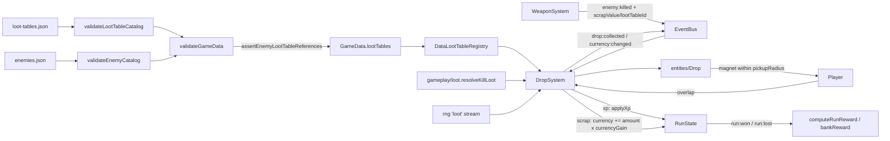

# Epic 8: Loot and Economy — Architecture Overview

Status: implementation-ready architecture for Epic 8 / issue #9. Slices 1 and
2 are merged; Slice 3 is next. This document is the repository **source of
truth** for Epic 8 and the index for its five focused slices. It supersedes
conflicting issue-#9 wording in one place: the issue's
`Drop.update(dtMs, playerPos, pickupRadius)` sketch gains a
`magnetSpeed` parameter so tuning stays in `RuntimeConfig` rather than being
hard-coded in the entity.

Epic 8 is implemented as **five dependency-ordered slices**, each shipped as
its own sub-issue under #9 and a focused implementation PR. This overview
freezes the shared contracts every slice depends on; each sub-issue carries the
exact, self-contained implementation spec for that slice.

## 1. Decision summary

- **Kill-to-loot flows through the event bus, not through WeaponSystem.**
  Today `WeaponSystem` both emits `enemy:killed` *and* directly creates the XP
  drop via an injected `createXpDrop` factory. Epic 8 removes that factory:
  `WeaponSystem` only emits an **enriched** `enemy:killed` payload, and
  `DropSystem` subscribes to the event, resolves loot, and spawns drops.
  Weapon code stops knowing drops exist; loot code stops being reached from
  combat internals.
- **The `enemy:killed` payload is extended, not replaced.** It gains required
  `scrapValue: number` and optional `lootTableId?: string`, symmetric with the
  existing `xpValue`. This is the only `GameEventMap` change in Epic 8 — no
  new events. `drop:collected` and `currency:changed` already exist and are
  finally exercised.
- **Loot tables are a new fail-closed catalog** (`src/data/loot-tables.json`)
  validated by one authoritative path (`validateLootTableCatalog`) reused by
  both `validateGameData` and a defensive `DataLootTableRegistry` constructor —
  exactly the `DataArenaRegistry` precedent. Enemy→table references are checked
  only from `validateGameData` (`assertEnemyLootTableReferences`), mirroring
  `assertArenaSpawnCurveReferences`.
- **Enemies without a `lootTableId` keep deterministic default drops** derived
  from `xpValue`/`scrapValue`. All three shipped enemies use this path, so the
  shipped run's economy is strictly additive versus today: guaranteed XP plus
  guaranteed scrap on every kill. Table-driven drops (including chests) are
  content shells, proven by fixtures — the same discipline Epic 7 used for
  obstacles/hazards.
- **Scrap finally flows.** `scrapValue` already exists in enemy data, types,
  scaling, and elite multipliers, but nothing spawns scrap and
  `RunState.currency` stays 0 forever (so Epic 5's `computeRunReward` always
  banks 0). Epic 8 activates the economy without touching banking.
- **The chest is a grant shell, not a physical-drop loop.** A `chest` drop is
  collectible; on pickup it resolves its referenced chest table with the loot
  RNG and grants the resulting XP/scrap immediately. Chest-referenced tables
  must not contain `chest` entries (validation rejects them), so recursion is
  impossible by construction.
- **`XpDrop` is replaced by a poolable `Drop` entity** with the same
  `active`/`spawn()`/`reset()` shape as `Projectile`, so Epic 12 can pool both
  without redesign. `DropSystem` keeps its name and gains the loot pipeline.
- **One named RNG stream** (`deriveRunSeed(seed, 'loot')`) is created in
  `GameScene` and consumed by every loot resolution (kill tables and chest
  opens) in event order. Default-path drops consume no RNG.
- **No save-schema change, no `MetaState` writes, no new dependencies.**
  Epic 5 keeps exclusive ownership of end-of-run banking.

## 2. Repository baseline (after Epic 8 Slices 1–2, merged PRs #58 and #59)

- `RunState.currency` exists (`src/gameplay/runState.ts`) and is read by
  Epic 5's `computeRunReward`/`bankReward`; nothing writes it mid-run.
- `scrapValue` is present end-to-end in the enemy pipeline:
  `enemies.json`, `EnemyStats` (`src/systems/types.ts`), enemy validation,
  `scaleEnemy` (unscaled), `ELITE_MULTIPLIERS.scrapValue` (×2), and
  `SpawnSystem`'s runtime definition. Slice 2 added `Enemy.scrapValue` and the
  enriched `enemy:killed` payload early; the legacy XP-drop side effect remains
  until Slice 4.
- Slice 1 added the required, fail-closed `loot-tables.json` catalog,
  `LootEntry`/`LootTable` types, validation and cross-catalog references, and
  the immutable `DataLootTableRegistry`. Slice 2 added the pure resolver in
  `src/gameplay/loot.ts`.
- `DropSystem` (`src/systems/DropSystem.ts`) owns XP-drop lifecycle: it is
  constructed with a `createXpDrop`-shaped factory consumed by `WeaponSystem`,
  registers the player×dropGroup physics overlap, collects instantly when a
  drop is within the resolved `pickupRadius` (clamped `>= 0`), calls
  `applyXp`, and emits `drop:collected` with `kind: 'xp'`. Its
  `compactActive` helper and mocked-overlap test style are reused.
- `XpDrop` (`src/entities/XpDrop.ts`) is a minimal non-poolable entity:
  circle sprite, arcade body, `active`/`x`/`y`/`body`/`destroy()`.
- `WeaponSystem.handleProjectileEnemyOverlap` emits `enemy:killed` with
  `{ instanceId, enemyId, xpValue, scrapValue, lootTableId?, x, y }` and then
  calls `this.createXpDrop(hitX, hitY, enemy.xpValue)`. `XpDropFactory` is
  exported from `WeaponSystem.ts` and bound in `GameScene`
  (`dropSystem.createXpDrop.bind(...)`).
- `applyXp` (`src/gameplay/xp.ts`) already applies `xpGain` and emits
  `xp:gained` / `level:up`. `ModifierStack` already supports `currencyGain`
  and `pickupRadius`; the `extra-scrap` card (`currencyGain ×1.25`) and the
  `magnetic-whiskers` meta upgrade (`pickupRadius +5`) already exist.
- `GameScene` creates named run RNG streams (`'spawns'`, `'upgrades'`) via
  `createRng(deriveRunSeed(seed, name))` — the `'loot'` stream follows this
  exact pattern. Registries are constructed two ways: `DataWeaponRegistry`
  in `GameScene` and injected; `DataEnemyRegistry` inside `SpawnSystem`.
  Epic 8 follows the `GameScene`-injection precedent for
  `DataLootTableRegistry` so a future chest/UI surface can share it.
- `PassiveCoordinator` subscribes to `enemy:killed`; its tests already include
  the required `scrapValue` field.
- Validation (`src/systems/validation.ts`) now includes the Epic 8 catalog
  pattern: `lootTables` in `ROOT_FIELDS`, `validateLootTableCatalog`, bounded
  `MAX_*` caps, unique IDs, chest-safety checks, and enemy→table references
  running only from `validateGameData`.
- The HUD (`GameScene.updateHud`) shows status/time/health/level/XP/kills/
  weapons; no scrap line exists. Epic 9 owns real UI; Epic 8 adds one
  dev-grade HUD line for playtest legibility.

## 3. Ownership table

| Owner | Owns in Epic 8 | Does not own |
| --- | --- | --- |
| `src/data/loot-tables.json` | Loot table content | Enemy/arena/character content |
| `src/systems/types.ts` | `LootKind`, `LootEntry`, `LootTable`; `lootTables` on `GameData`; optional `lootTableId` on `EnemyStats` | Runtime drop objects |
| `src/systems/validation.ts` | `validateLootTableCatalog`, chest-entry rules, `MAX_LOOT_TABLES`/`MAX_LOOT_ENTRIES` caps, `assertEnemyLootTableReferences`, `lootTables` in `ROOT_FIELDS` | Drop runtime, magnet rules |
| `src/systems/lootTables.ts` | `LootTableRegistry`/`DataLootTableRegistry`: immutable lookup | Loot resolution, spawn/collection rules |
| `src/gameplay/loot.ts` | Pure `resolveLoot`, `defaultLoot`, `resolveKillLoot`, `LootGrant`, `LootSourceInfo`, `LootTableLookup` | Phaser, scene wiring, event emission |
| `src/entities/Drop.ts` | Poolable drop object: `spawn`/`update`(homing)/`reset`, kind visuals | Collection rules, currency/XP math |
| `src/systems/DropSystem.ts` | `enemy:killed` subscription, drop spawning, magnet parameters, pickup collection and grants (xp/scrap/chest), event emission | Loot table content, kill timing |
| `src/entities/Enemy.ts` | `scrapValue` and `lootTableId` getters on the instance definition | Loot rules |
| `src/systems/WeaponSystem.ts` | Emitting the enriched `enemy:killed`; **loses** `XpDropFactory`/`createXpDrop` | Drop creation of any kind |
| `src/engine/eventBus.ts` | The one payload extension | — |
| `src/engine/config.ts` | `gameplay.drop` (`radius`, `magnetSpeed`), replacing `gameplay.xpDrop` | Table amounts (live in JSON) |
| `src/scenes/GameScene.ts` | Constructing `DataLootTableRegistry` + `'loot'` RNG stream, rewiring `DropSystem`/`WeaponSystem`, HUD scrap line, dev chest hotkey (Slice 5) | Loot/grant rules |

Explicit non-goals (deferred, per issue #9 and cross-epic rules):

- no end-of-run banking or `MetaState` writes (Epic 5 owns both);
- no drop pooling implementation (Epic 12; Epic 8 only ships the pool-ready
  shape), no drop despawn/expiry timers, no drop scatter/bounce physics;
- no chest-opening UI, animations, or burst effects (Epic 9/12);
- no production loot/balance UI and no economy re-tuning beyond the starter
  data here (Epic 11);
- no paid currency, ad multipliers, daily-login pressure, or near-miss
  reward patterns (project-wide ban);
- no new `GameEventMap` events (audio/polish subscribe to the existing
  `drop:collected`/`currency:changed`);
- no pathfinding-aware drops and no obstacle collision for drops — drops
  home over obstacles, matching Vampire-Survivors-style pickup behaviour.

## 4. Shared TypeScript contracts (frozen here)

### 4.1 Loot data (`src/systems/types.ts` additions)

```ts
export type LootKind = 'xp' | 'scrap' | 'chest' | 'nothing';

export interface LootEntry {
  readonly kind: LootKind;
  readonly amount: number;    // xp/scrap: >= 1; chest/nothing: exactly 0
  readonly weight: number;    // >= 0, finite
  readonly tableId?: string;  // chest entries only; references a chest-safe table
}

export interface LootTable {
  readonly id: string;
  readonly entries: readonly LootEntry[];
}

export interface GameData {
  // ...existing fields...
  lootTables: LootTable[];
}

export interface EnemyStats {
  // ...existing fields (health, damage, speed, xpValue, scrapValue)...
  lootTableId?: string;       // optional; elites inherit via base spread
}
```

- `lootTableId` lives on `EnemyStats` so every spawnable archetype interface
  inherits it, elite resolution (`...spawnableBase` spread) carries it, and
  `SpawnSystem`'s runtime definition passes it through unchanged. Elites
  cannot declare their own `lootTableId` in Epic 8 (they inherit the base's);
  `EliteEnemyDefinition` stays `{ id, name, archetype, baseEnemyId }`.
- `scaleEnemy` neither scales nor strips `lootTableId`; `ScaledEnemyStats`
  is unchanged.

### 4.2 Loot registry (`src/systems/lootTables.ts`)

```ts
export interface LootTableLookup {
  lootTableById(id: string): Readonly<LootTable> | undefined;
}

export interface LootTableRegistry extends LootTableLookup {
  all(): readonly Readonly<LootTable>[];
}

export class DataLootTableRegistry implements LootTableRegistry {
  constructor(data: Pick<GameData, 'lootTables'>);
  lootTableById(id: string): Readonly<LootTable> | undefined;
  all(): readonly Readonly<LootTable>[];
}
```

Mirrors `DataArenaRegistry` exactly: constructor calls
`validateLootTableCatalog(data.lootTables)`, `structuredClone` + recursively
`deepFreeze`s each table and the frozen snapshot, builds a `byId` map. It
takes only `Pick<GameData, 'lootTables'>` — cross-catalog enemy references
are a `validateGameData`-only concern (§4.3). `LootTableLookup` is the
minimal interface the pure resolver depends on.

### 4.3 Catalog and cross-catalog checks (`src/systems/validation.ts`)

- `ROOT_FIELDS` gains `'lootTables'`; `GameData` requires it like every
  other catalog.
- `validateLootTableCatalog(raw)` runs per-row checks plus `assertUniqueIds`,
  bounded by `MAX_LOOT_TABLES = 64` and `MAX_LOOT_ENTRIES = 32` (per table)
  so the chest-safety scan stays constant-cost.
- Entry rules:
  - `kind` is one of the four `LootKind` values.
  - `amount` is a safe integer; `xp`/`scrap` entries require `amount >= 1`;
    `chest`/`nothing` entries require `amount === 0` (explicit units, no
    hidden payload in an ignored field).
  - `weight` is finite and `>= 0`; the per-table weight sum must be `> 0`.
  - `tableId` is present exactly on `kind: 'chest'` entries, is a non-empty
    string, and references a table in the same catalog that itself contains
    **no** `chest` entries ("chest-safe"). Because the target must exist in
    the same catalog and be chest-free, cycles are impossible by
    construction — no graph walk is needed.
- `assertEnemyLootTableReferences(enemies, lootTables)` runs only from
  `validateGameData`, after both catalogs validate (mirrors
  `assertCharacterWeaponReferences`): every defined direct-enemy
  `lootTableId` must exist in the loot catalog. Elite rows cannot declare the
  field; they inherit the resolved base definition. Enemies without the field
  are skipped.
- `checkEnemy` treats `lootTableId` as an optional non-empty string when
  present (absent is the common case).

### 4.4 Pure loot resolution (`src/gameplay/loot.ts`, no Phaser)

```ts
export interface LootSourceInfo {
  readonly xpValue: number;
  readonly scrapValue: number;
  readonly lootTableId?: string;
}

export type LootGrant =
  | { readonly kind: 'xp' | 'scrap'; readonly amount: number }
  | { readonly kind: 'chest'; readonly amount: 0; readonly tableId: string };

export function resolveLoot(
  tableId: string,
  tables: LootTableLookup,
  rng: Pick<Rng, 'next'>,
): readonly LootGrant[];

export function defaultLoot(info: LootSourceInfo): readonly LootGrant[];

export function resolveKillLoot(
  info: LootSourceInfo,
  lookup: LootTableLookup,
  rng: Pick<Rng, 'next'>,
): readonly LootGrant[];
```

- `resolveLoot` resolves `tableId` through `tables`, then makes **one** weighted
  draw with `rng.next()` over `entry.weight` (weights need not sum to 1; total
  is validated `> 0`). A direct call throws for a missing or malformed table;
  `resolveKillLoot` owns the runtime fail-soft boundary.
  `'nothing'` yields `[]`; `'xp'`/`'scrap'` yield one grant with the entry
  amount; `'chest'` yields one grant carrying `tableId`.
- `defaultLoot` is deterministic and consumes no RNG:
  `[{ kind: 'xp', amount: xpValue }]` when `xpValue > 0`, plus
  `[{ kind: 'scrap', amount: scrapValue }]` when `scrapValue > 0`.
- `resolveKillLoot` = table path when `lootTableId` is set **and** the table
  exists in `tables`; otherwise the default path. A set-but-missing
  `lootTableId` fails soft to `defaultLoot` — validation is the integrity
  gate; a live run must never crash on loot.
- Chest-open resolution (Slice 5) reuses `resolveLoot(tableId, tables, rng)`
  and filters any `kind: 'chest'` grants defensively (validation already
  guarantees none exist).

### 4.5 The one event change (`src/engine/eventBus.ts`)

```ts
'enemy:killed': {
  instanceId: number; enemyId: string;
  xpValue: number; scrapValue: number;
  lootTableId?: string;
  x: number; y: number;
};
```

Slice 2 landed the payload extension and `Enemy.scrapValue` getter early.
`WeaponSystem` reads optional `lootTableId` from the frozen definition and
spreads it into the payload exactly where it already reads `enemy.xpValue`.
Slice 4 may add the convenience getter while removing the legacy XP-drop
factory. `PassiveCoordinator` and every other `enemy:killed` listener are
unaffected (the new fields are read only by `DropSystem`).

### 4.6 Poolable drop entity (`src/entities/Drop.ts`; `XpDrop.ts` is deleted in Slice 4 alongside the `DropSystem` rework — deleting it earlier would break the compile between slices)

```ts
export type DropKind = 'xp' | 'scrap' | 'chest';

export class Drop {
  readonly sprite: Phaser.GameObjects.Arc;
  active: boolean;
  kind: DropKind;
  amount: number;
  tableId?: string;

  constructor(scene: Phaser.Scene, radius: number);
  spawn(x: number, y: number, kind: DropKind, amount: number, tableId?: string): void;
  update(dtMs: number, playerPos: Vec2, pickupRadius: number, magnetSpeed: number): void;
  reset(): void;
  destroy(): void;
  get x(): number; get y(): number;
  get body(): Phaser.Physics.Arcade.Body;
}
```

- Shape mirrors `Projectile`: constructed disabled (`body.enable = false`,
  inactive/invisible sprite); `spawn` positions, sets kind visuals
  (`xp` = `0x7dd3fc` today's sky, `scrap` = `0xd1d5db` light grey — chosen
  over an earlier green candidate for accessibility; see
  `epic-8-slice-3-drop.md` §6 for the color-vision-deficiency analysis,
  `chest` = `0xf472b6` pink; depth 2 preserved), enables the body;
  `reset` disables and hides.
- `update` homes only: when `distanceSq(drop, playerPos) <= pickupRadius^2`
  and `pickupRadius > 0`, set velocity toward the player at `magnetSpeed`;
  otherwise velocity 0. Non-finite `dtMs <= 0` is a no-op. Collection is **not**
  the entity's job — the existing physics overlap fires on contact.
- `magnetSpeed` must stay above the player's maximum attainable `moveSpeed`
  (base × every stackable passive/meta/card multiplier), or a fully built
  fast character can outrun a homing drop indefinitely once Slice 4 makes
  collection depend on physical overlap rather than radius alone. At
  current data (`bolt-hound`: 205 base × 1.05 passive × 1.03⁵ meta ×
  1.08⁵ cards ≈ 366.6), `magnetSpeed` must clear ~367; re-check this
  ceiling whenever `moveSpeed` base values, passives, or stack limits
  change.
- Drops ignore obstacles and world bounds (no colliders); they exist where
  the kill happened and home once in range.

### 4.7 `DropSystem` rework (`src/systems/DropSystem.ts`)

```ts
export interface DropSystemOptions {
  readonly scene: Phaser.Scene;
  readonly ctx: GameContext;
  readonly runState: RunState;
  readonly player: Player;
  readonly dropGroup: Phaser.Physics.Arcade.Group;
  readonly lootTables: LootTableLookup;
  readonly rng: Pick<Rng, 'next'>;
  readonly dropRadius: number;
  readonly magnetSpeed: number;
  readonly basePickupRadius: number;
}

export class DropSystem implements System {
  constructor(options: DropSystemOptions);
  spawnDrop(x: number, y: number, grant: LootGrant): Drop;
  update(dtMs: number): void;
  destroy(): void;
}
```

- The constructor registers the player×dropGroup overlap (unchanged pattern)
  and subscribes to `enemy:killed`; `destroy()` unsubscribes. On the event:
  `resolveKillLoot(payload, lootTables, rng)` → `spawnDrop` per grant at
  `(payload.x, payload.y)`. The subscription fires synchronously during
  `WeaponSystem`'s emit; listener ordering relative to `PassiveCoordinator`
  does not matter (independent side effects).
- `update(dtMs)` (active runs only) resolves
  `pickupRadius = max(0, stats.resolve('pickupRadius', basePickupRadius))`
  once per tick and calls `drop.update(dtMs, playerPos, pickupRadius,
  magnetSpeed)`; then `compactActive`. The negative-radius clamp preserves
  the behaviour pinned by the existing `dropSystem.test.ts`.
- Collection (overlap callback, active run only):
  - `xp` → `applyXp(runState, amount, bus)` (applies `xpGain`, emits
    `xp:gained`/`level:up`); then emit `drop:collected` with the **face
    value** `amount` — multiplier-adjusted gains surface on `xp:gained`.
  - `scrap` → `gained = amount * stats.resolve('currencyGain', 1)`; when
    finite and `> 0`, `runState.currency += gained` and emit
    `currency:changed { runTotal: runState.currency }`. Currency accumulates
    unrounded mid-run; Epic 5 floors at bank time. `drop:collected` is
    emitted with the face value regardless of the multiplier result.
  - `chest` (Slice 5) → resolve `tableId` via `resolveLoot`, skip nested
    `chest` grants defensively, apply each xp/scrap grant exactly as above,
    emitting `drop:collected` per grant (kinds stay `'xp' | 'scrap'`; the
    map is untouched).
  - The drop is `destroy()`ed after collection (today's behaviour — no
    retired-sprite leak, no half-built pool). `reset()` ships on the entity
    for Epic 12, which owns pooling and flips collection to reset-and-reuse.
- `createXpDrop` and `XpDropFactory` are deleted. `WeaponSystem`'s
  constructor loses the factory parameter; `GameScene` stops binding it.

### 4.8 Wiring (`src/scenes/GameScene.ts` + `src/engine/config.ts`)

```ts
// config.ts
gameplay: {
  // ...player, projectile...
  drop: { radius: 8, magnetSpeed: 450 },   // replaces xpDrop; must exceed max attainable moveSpeed (~367, see §4.6)
}

// GameScene.create()
const lootRng = createRng(deriveRunSeed(this.runState.seed, 'loot'));
const lootTables = new DataLootTableRegistry(ctx.data);
const dropSystem = new DropSystem({
  scene: this, ctx, runState: this.runState, player: this.player,
  dropGroup: this.dropGroup, lootTables, rng: lootRng,
  dropRadius: RuntimeConfig.gameplay.drop.radius,
  magnetSpeed: RuntimeConfig.gameplay.drop.magnetSpeed,
  basePickupRadius: RuntimeConfig.gameplay.player.pickupRadius,
});
```

- `WeaponSystem` is constructed without the drop factory; everything else in
  its signature is unchanged.
- HUD gains one line: `Scrap: ${Math.floor(runState.currency)}` — dev-grade
  legibility only; Epic 9 owns presentation.

## 5. Starter data (`src/data/loot-tables.json`)

Ships two tables; **no shipped enemy references a table**, so the starter run
uses only deterministic default drops and stays strictly additive:

```json
[
  {
    "id": "chest-standard",
    "entries": [
      { "kind": "xp", "amount": 15, "weight": 55 },
      { "kind": "scrap", "amount": 10, "weight": 35 },
      { "kind": "scrap", "amount": 40, "weight": 10 }
    ]
  },
  {
    "id": "brute-cache",
    "entries": [
      { "kind": "xp", "amount": 6, "weight": 60 },
      { "kind": "scrap", "amount": 5, "weight": 30 },
      { "kind": "chest", "amount": 0, "weight": 10, "tableId": "chest-standard" }
    ]
  }
]
```

`chest-standard` is the chest-safe target (no chest entries);
`brute-cache` demonstrates the rare-drop hook (10% chest) for content
fixtures and Slice 5's dev hotkey. Attaching `brute-cache` to `trash-brute`
in shipped data is a deliberate content decision deferred to Epic 11
balancing — Epic 8 ships the shell exactly as Epic 7 shipped hazards.

## 6. Dependency-ordered slice index

Each slice is a sub-issue under #9 and a focused implementation PR. Prereqs
are strict: a slice's PR should not be implemented before its prerequisites
merge.

| # | Slice | Creates / modifies | Prereqs |
| --- | --- | --- | --- |
| 1 | Loot table data model, validation & registry (+ enemy `lootTableId` field) — **merged #58** | `loot-tables.json`, `types.ts`, `validation.ts`, `lootTables.ts`, tests | none (post-Epic-7 `main`) |
| 2 | Pure loot resolver — **merged #59** | `gameplay/loot.ts`, tests; payload + `Enemy.scrapValue` seams landed early | 1 |
| 3 | [Poolable `Drop` entity + magnet geometry](epic-8-slice-3-drop.md) — **merged #60** | `entities/Drop.ts`, tests | 1 |
| 4 | Kill-to-loot pipeline: payload extension, `Enemy` getters, `WeaponSystem` slim-down, `DropSystem` rework (xp+scrap), `config.ts` drop section, `GameScene` rewiring, HUD line, delete `XpDrop.ts` | `eventBus.ts`, `Enemy.ts`, `WeaponSystem.ts`, `DropSystem.ts`, `config.ts`, `GameScene.ts`, migrated tests | 1, 2, 3 |
| 5 | Chest shell + integration harness + dev hotkey + docs sign-off | `DropSystem.ts` (chest collect), integration tests, `GameScene.ts` (F10 dev-only), `epics.md`, `roadmap.md` | 4 |

Slice 3 is now the next independent unit. Slice 4 must treat the payload and
`Enemy.scrapValue` changes from #59 as already complete and avoid reimplementing
them. Slices 1–4 leave the shipped run behaviourally identical except that
kills spawn guaranteed scrap drops once Slice 4 lands; Slice 5 is an additive
shell no shipped content exercises.

## 7. Dependency and data-flow map



## 8. Cross-epic boundaries

- **Epic 5 (meta/banking):** unchanged and exclusive at run end. Epic 8 only
  fills `RunState.currency`/`RunState.xp` mid-run; `computeRunReward` already
  sanitizes and banks whatever is there, including zero. The old
  `epics.md` "Epic 5 can ship first" note resolves here: Epic 8 changes only
  how currency is generated.
- **Epic 4 (enemies):** `Enemy` gains two getters; movement/AI untouched.
  `scrapValue`/`lootTableId` ride the existing definition pipeline (scaling
  passes them through; elites inherit `scrapValue ×2` and the base's
  `lootTableId`).
- **Epic 3 (upgrades):** `currencyGain` cards gain a live consumer; no card
  changes. Stack/modifier rules untouched.
- **Epic 6 (characters):** reactive passives listening to `enemy:killed`
  receive a wider payload; handler signatures are payload-driven and need no
  change. A future economy-flavoured passive reads `currency:changed` — no
  new event kinds in Epic 8.
- **Epic 7 (arenas/hazards):** unaffected. Drops ignore obstacles and hazards
  neither drop nor destroy loot. `spawnPoint` rules are orthogonal to drop
  positions (drops spawn at kill points).
- **Epic 9 (UI):** owns the real scrap/XP presentation later; Epic 8's HUD
  line is dev-grade and expected to be replaced.
- **Epic 10 (audio):** subscribes to `drop:collected`/`currency:changed`;
  Epic 8 only guarantees they now fire.
- **Epic 12 (polish/perf):** pools `Drop` (shape already matches
  `Projectile`), adds pickup/scatter/chest effects, and may add drop
  despawn caps. No gameplay change expected.

  Two measured caveats for whoever picks this up, recorded during the
  Slice 3 review so the rationale is not lost:

  - **Pooling alone will not buy the expected frame time.** `Drop`'s hot
    path is cheap: `update()` measured ~18 ns/call, so 400 simultaneous
    drops cost ~0.007 ms/frame against a 16.67 ms budget (~0.04%).
    Hand-inlining the vector math is ~3.4x faster in isolation but saves
    ~0.005 ms/frame — not worth deviating from §4.6's instruction to reuse
    `distanceSq`/`towards`. The real cost is rendering: `Phaser.GameObjects.Arc`
    is **not** sprite-batched — `ArcWebGLRenderer` runs
    `pipelines.preBatch()` → `FillPathWebGL` → `postBatch` per instance, so
    cost scales with the number of rendered drops. Pooling recycles
    CPU-side objects but does not reduce batch flushes. If drop count
    becomes a frame-time problem, the fix is a texture/atlas-backed sprite,
    which is a **change to the frozen `Drop` contract** (§4.6 commits to
    `Arc`), not a drop-in optimisation.
  - **A despawn/expiry timer is a contract amendment, not an addition.**
    `Drop` has no `spawnedAt`/age field, and `update()` deliberately treats
    `dtMs` as a validity gate that is never integrated (see the Slice 3 work
    package §7). Adding a TTL therefore requires both a new field on the
    frozen public contract and a change to `update()`'s documented
    semantics. Until then, uncollected drops persist for the whole run,
    each holding an enabled Arcade body in the per-frame player×dropGroup
    overlap check plus its own draw call — this, not the vector math, is
    the unbounded-growth risk.

## 9. Global acceptance criteria (all slices)

- `loot-tables.json` is a required, fail-closed catalog with one
  authoritative validator reused by the registry constructor.
- The shipped starter run keeps guaranteed-per-kill XP and gains
  guaranteed-per-kill scrap; no shipped enemy uses a loot table.
- Killing an enemy emits exactly one `enemy:killed` with the extended
  payload; `WeaponSystem` contains no drop code.
- Loot resolution is pure, Phaser-free, and deterministic under
  `deriveRunSeed(seed, 'loot')`: identical seeds and kill order produce
  identical drops, including chest opens.
- `xp` collection applies `xpGain` (via `applyXp`); `scrap` collection
  applies `currencyGain`, increments `RunState.currency`, and emits
  `currency:changed` with the post-add total.
- Magnet behaviour: drops within the resolved (clamped non-negative)
  `pickupRadius` home at `magnetSpeed`; drops outside it hold still;
  collection happens on physics overlap only.
- Chest tables cannot recurse (validation); chest pickup grants only
  xp/scrap and emits `drop:collected` per grant.
- `Drop` has the pool-ready `active`/`spawn`/`reset` shape; `XpDrop.ts` and
  `XpDropFactory` are gone.
- No new events, no save-schema change, no `MetaState` writes, no new
  runtime dependencies.
- Every slice keeps lint, the full Vitest suite, the production build, and
  `git diff --check` green.

## 10. Reviewer traps (repeated in each slice doc as relevant)

- Do not leave `createXpDrop`/`XpDropFactory` anywhere after Slice 4 — the
  kill pipeline is event-driven; `WeaponSystem` must not import drop types.
- Do not add fields to `enemy:killed` beyond `scrapValue`/`lootTableId`, and
  do not create a `loot:resolved`/`scrap:gained` event — `drop:collected`
  and `currency:changed` already cover feedback.
- Do not read `Math.random()` or `ctx.menuRng` for loot; only the run-scoped
  `'loot'` stream, and only on the table path (default drops are
  RNG-free).
- Do not let `resolveKillLoot` throw on a missing `lootTableId` — fail soft
  to `defaultLoot`; strictness belongs to validation.
- Do not apply `currencyGain`/`xpGain` inside `resolveLoot` — grants are
  face values; multipliers apply only at collection time through
  `ModifierStack`.
- Do not floor or round `RunState.currency` mid-run; Epic 5's
  `sanitizeScrap` owns flooring at bank time.
- Do not give chest tables `chest` entries, and do not spawn physical drops
  from a chest open — the grant is immediate.
- Do not persist drop counts, pity timers, or near-miss state anywhere —
  there is no save surface in Epic 8.
- Do not keep `gameplay.xpDrop` in `RuntimeConfig` after Slice 4 — it is
  replaced by `gameplay.drop` in the same slice that rewires `GameScene`.
- Do not attach `lootTableId` to a shipped enemy as part of Epic 8 — the
  chest/rare-drop path is fixture- and hotkey-proven; shipped-content
  changes are Epic 11 balancing.
- Do not let drops collide with obstacles or respect world bounds — homing
  must not snag on arena geometry.
- Do not mutate the `enemy:killed` emission order: `kills += 1` and the
  existing payload fields stay exactly where they are in `WeaponSystem`.
