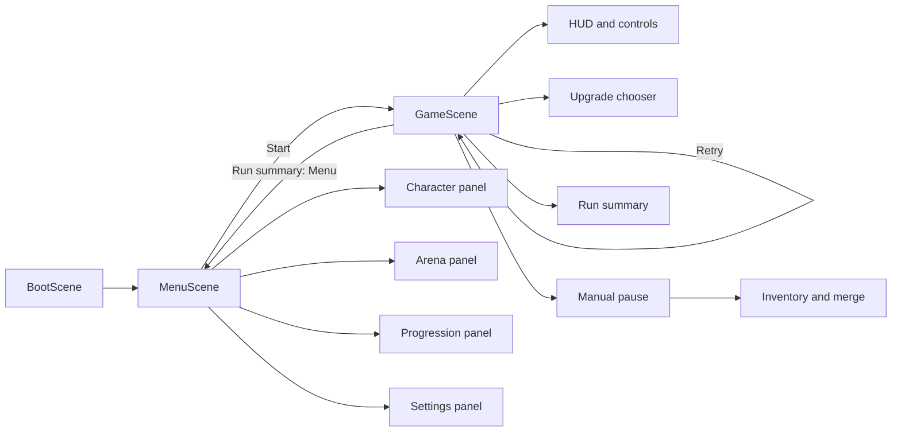

# Epic 9: UI and UX — Architecture and Implementation Handoff

Status: **implementation-ready architecture** for Epic 9 / issue #10 on the
single delivery branch `agent/epic-9-ui-and-ux`.

Baseline: `main` at `e7999cd` after Epic 8 closeout PR #63. This document is
the repository source of truth for Epic 9. It supersedes issue #10 where the
issue describes pre-Epic-3/5/6/7 seams that have since changed.

Epic 9 is one branch and one eventual delivery PR. The six slices below are
ordered commit and review gates on that same branch; they are not separate
branches or PRs. Every intermediate commit must compile and keep the existing
test suite green.

## 1. Outcome

Turn the current developer-grade game shell into a readable, controllable
mobile-first product surface without moving gameplay rules into presentation:

- a production menu exposes character selection, arena selection, permanent
  progression, settings, and the start-run command through the headless
  controllers already shipped by Epics 5–7;
- a compact HUD replaces `GameScene`'s multiline debug-style text with health,
  XP, time, level, scrap, kills, and equipped-weapon presentation;
- the existing upgrade chooser remains the only level-up hard interrupt and is
  brought under shared layout, focus, and accessibility conventions;
- a manual pause surface exposes resume and the inventory/merge shell;
- touch drag keeps driving the existing `InputController`, with a visible
  virtual-stick presentation and input-mode-aware control hints;
- a terminal run summary reports the finished run and the already-banked Epic
  5 result, then offers retry or return-to-menu navigation;
- existing settings (`muted`, `musicVolume`, `sfxVolume`, `reducedMotion`) are
  editable through `GameContext.updateSettings` and remain SaveDataV2 — no
  migration or storage-key change;
- Phaser remains the UI runtime. Epic 9 does not introduce React, a DOM overlay
  framework, a state-management package, or final art.

## 2. Architecture-pass findings and frozen corrections

The live repository was packed and inspected as 156 source, test, and
documentation files (approximately 265k tokens). The following issue #10
statements must be read through the current implementation:

1. **Card commands require the offer token.** The issue sketches
   `chooseCard(upgradeId)`, but the shipped stale-command defence is
   `UpgradeSystem.chooseCard(offerId, upgradeId)`. Epic 9 must preserve the
   `offerId`; no compatibility overload may discard it.
2. **There is no need for a god `UiCommands` object.** The repository already
   uses narrow read/command owners: `UpgradeChooserController`,
   `ProgressionController`, `CharacterSelectionController`, and
   `ArenaSelectionController`. Epic 9 adds equally narrow settings, pause,
   inventory, and summary controllers and composes them in scenes.
3. **Player health is not in `RunState`.** `Player` owns current/max health.
   The HUD receives a read-only `HudSource` closure from `GameScene`; it must
   not relocate health or mutate `Player`.
4. **Touch movement already exists.** `InputController` owns pointer-drag
   intent and keyboard intent. Epic 9 adds copied presentation state and a
   virtual-stick view; it does not implement a second movement path.
5. **Meta, character, and arena UI seams already exist.** Production menus
   must delegate to those controllers exactly as shipped. The Epic 6 `C` and
   Epic 7 `M` developer hotkeys are retired once the production menu lands.
6. **Run rewards are banked before summary rendering.** `ProgressionSystem`
   is the only owner of terminal banking and exposes `lastBankedRun`. A summary
   may display that result; it must not call `computeRunReward`, `bankReward`,
   or `GameContext.updateMeta` itself.
7. **Settings already use the current schema.** SaveDataV2 contains all Epic 9
   settings. UI work must not create SaveDataV3, rename
   `meowcenary.save.v1`, or write browser storage directly.
8. **The logical canvas stays 390×844.** Phaser `FIT` scales that canvas into
   phone, landscape, and desktop displays. Layout helpers reason about both
   logical canvas dimensions and physical display scale; Epic 9 does not turn
   the game into a dynamically resized world.

## 3. Ownership and non-goals

| Owner | Owns in Epic 9 | Does not own |
| --- | --- | --- |
| `src/ui/format.ts` | Pure player-facing number, time, and stat formatting | Gameplay rounding or reward arithmetic |
| `src/ui/layout.ts` / `theme.ts` | Shared safe-area, physical-size, focus, color, and depth tokens | World/camera bounds or gameplay tuning |
| Existing selection/progression controllers | Character, arena, and meta read/command models | Phaser rendering and navigation |
| New `SettingsController` | Current settings snapshot and one context command | Storage, migration, audio playback |
| New `MainMenuController` | Menu navigation state and delegation to headless controllers | Run creation or RNG consumption |
| New `HudController` | Read-only presentation snapshots, dirty/render cadence, bus cleanup | Health/XP/currency/weapon rules |
| `InputController` additions | Copied input-mode and pointer-gesture presentation state | Joystick rendering or player movement rules |
| New `InventoryController` | Selected instance IDs, merge command orchestration, result snapshot | Merge eligibility/result rules |
| Existing `UpgradeChooserController` | Offer-token-safe selection lifecycle | Card generation/application rules |
| New `RunSummaryController` | Terminal presentation over `RunState` + `BankedRun` | Banking or persistence mutations |
| `MenuScene` / `GameScene` | Construction, scene navigation, lifecycle wiring | Business rules or duplicated controller logic |

Explicit non-goals:

- no gameplay balance, enemy, weapon, card, loot, reward, or progression-rule
  changes;
- no new save schema, persisted character/arena choice, cloud/account support,
  or direct LocalStorage access;
- no final character/map/weapon art, animation set, particles, combat feedback,
  or object pooling (Epic 12);
- no music/SFX content or event-to-sound map (Epic 10); Epic 9 only preserves
  and exposes the existing volume settings;
- no gamepad support, remappable key bindings, localization framework, DOM UI,
  or screen-reader claims for the canvas;
- no inventory capacity, drag-and-drop item system, weapon acquisition, or
  auto-merge. The shipped inventory shell can be fixture-tested before normal
  gameplay produces duplicate weapons;
- no new dependency and no broad scene framework.

## 4. Runtime topology and modal priority

Epic 9 changes the scene flow from `Boot → Game` to:



Only one blocking surface is interactive at a time. Priority is fixed:

1. terminal run summary (`won`/`lost`);
2. level-up upgrade chooser (`paused`, reason `levelUp`);
3. manual-pause surface and its inventory child (`paused`, reason `manual`);
4. HUD and movement controls (`active`).

Views below the active modal are visible only where useful and never remain
interactive. Scene shutdown destroys every view and controller exactly once.

## 5. Shared presentation contracts

### 5.1 Pure formatting (`src/ui/format.ts`)

```ts
export function formatTime(ms: number): string;
export function formatNumber(value: number): string;
export function formatStat(key: StatKey, value: number): string;
```

Frozen behavior:

- `formatTime`: non-finite/negative values clamp to zero; milliseconds floor to
  whole seconds; output is unbounded minutes plus two-digit seconds (`0:00`,
  `1:05`, `120:00`).
- `formatNumber`: non-finite returns `—`; normalize negative zero; integers use
  deterministic comma grouping; finite fractions show at most one decimal and
  strip a trailing `.0`. It is presentation only and never writes the rounded
  value back into state.
- `formatStat`: `critChance` is a percentage, `attackSpeed`/`xpGain`/
  `currencyGain` are `×N` multipliers, `projectileCount` is an integer, and all
  other keys delegate to `formatNumber`.

### 5.2 Layout and theme (`src/ui/layout.ts`, `src/ui/theme.ts`)

```ts
export interface UiViewport {
  readonly canvasWidth: number;
  readonly canvasHeight: number;
  readonly displayWidth: number;
  readonly displayHeight: number;
}

export function safeDisplayScale(viewport: UiViewport): number;
export function physicalToLogical(px: number, viewport: UiViewport): number;
export function minimumHitTarget(viewport: UiViewport): number;
```

- Reuse the existing `upgradeChooserLayout.ts` scale behavior; move its shared
  scale calculation into `layout.ts` instead of maintaining two versions.
- Minimum physical body text is 12 px, essential labels 14 px, headings 18 px,
  and interactive hit targets 44×44 px where the display can accommodate it.
- Logical safe margin starts at 12 px and grows only to preserve the physical
  minimum on down-scaled displays.
- Theme colors stay within the shipped navy/teal/cream palette. Color is never
  the only selection/locked/error signal; add text/iconography and a focus
  stroke.
- Depth bands are centralized: world `< 100`, HUD `100–199`, transient hints
  `200–299`, pause/summary `800–899`, upgrade chooser `1000–1099`, debug above
  production surfaces only in development.
- `reducedMotion` maps every optional UI tween duration to zero. Do not change
  combat timings, physics, or camera behavior in this epic.

### 5.3 Focus and activation

All production menus and modals support pointer/touch plus keyboard:

- `ArrowUp`/`ArrowDown` (or left/right for horizontal lists) move a wrapping
  focus index;
- `Enter`/`Space` activate the focused enabled control;
- `Escape` goes back one panel or resumes a manual pause;
- number keys 1–3 remain the upgrade chooser shortcuts;
- repeat keydown events never cause an activation command;
- disabled/locked controls remain readable but are not interactive;
- focus is restored to the control that opened a child panel.

Canvas focus is visual only. Do not claim screen-reader support without a real
DOM accessibility surface; that is a separate product decision.

## 6. Settings contract

Add `src/ui/settings.ts` with a Phaser-free controller and a Phaser view:

```ts
export interface SettingsSnapshot extends Settings {
  readonly storageAvailable: boolean | null;
}

export interface SettingsUpdateResult {
  readonly settings: Settings;
  readonly persisted: boolean;
  readonly changed: boolean;
}

export class SettingsController {
  constructor(context: GameContext);
  snapshot(): SettingsSnapshot;
  set(patch: Readonly<Partial<Settings>>): SettingsUpdateResult;
}
```

- `snapshot` rereads `context.settings` every call and returns a frozen value.
- `storageAvailable` starts `null` and records the most recent persistence
  result after `set`.
- `set` captures the previous settings reference, calls
  `context.updateSettings` exactly once, reports `changed` by reference
  identity, and surfaces `persisted`; it never retries or writes storage itself.
- A failed persistence result still reflects the new in-memory context snapshot,
  matching Epic 5. The view shows a non-blocking “Saved for this session only”
  message.
- Controls: mute toggle, music-volume steps of 0.1, SFX-volume steps of 0.1,
  reduced-motion toggle. `GameContext` remains responsible for clamping and
  sanitization.
- Menu changes apply before the next `GameScene` is constructed. `AudioManager`
  continues reading mute/SFX volume in `GameScene.create`; Epic 10 later owns
  live music/SFX behavior.

No `settings:changed` event is added. There is no long-lived production
subscriber that needs one in Epic 9, and `GameContext.updateSettings` remains
the single write boundary.

## 7. Production menu contract

### 7.1 Scene and routing

- Add `SceneKey.Menu`, add `MenuScene` to `src/main.ts`, and make `BootScene`
  start `MenuScene` after context construction.
- `MenuScene` constructs fresh presentation controllers over the existing
  registry-held `GameContext`. It never constructs `RunState`, calls
  `assembleRunRequest`, or consumes `ctx.menuRng`.
- The Start action calls `this.scene.start(SceneKey.Game)`. `GameScene` remains
  the only place that calls `assembleRunRequest(ctx, ctx.menuRng)`, exactly once
  per run lifecycle.

### 7.2 Main-menu read/command model (`src/ui/menus.ts`)

```ts
export type MenuPanel =
  | 'home'
  | 'character'
  | 'arena'
  | 'progression'
  | 'settings'
  | 'reset-confirmation';

export interface MainMenuSnapshot {
  readonly panel: MenuPanel;
  readonly character: CharacterSelectionSnapshot;
  readonly arena: ArenaSelectionSnapshot;
  readonly progression: ProgressionSnapshot;
  readonly settings: SettingsSnapshot;
  readonly notice?: string;
}

export class MainMenuController {
  snapshot(): MainMenuSnapshot;
  open(panel: Exclude<MenuPanel, 'reset-confirmation'>): MainMenuSnapshot;
  back(): MainMenuSnapshot;
  selectCharacter(id: string, expectedRevision: number): MainMenuSnapshot;
  selectArena(id: string, expectedRevision: number): MainMenuSnapshot;
  purchase(upgradeId: string): MainMenuSnapshot;
  requestReset(): MainMenuSnapshot;
  cancelReset(): MainMenuSnapshot;
  confirmReset(): MainMenuSnapshot;
  setSettings(patch: Readonly<Partial<Settings>>): MainMenuSnapshot;
}
```

- Delegate every domain command to the shipped controller; do not re-run
  unlock, price, selection, or reset logic in `menus.ts`.
- `confirmReset` is the only path that calls `ProgressionController.reset(true)`.
  `requestReset` and `cancelReset` are presentation state only.
- After a meta purchase/reset, re-snapshot character and arena state because
  `GameContext` may revalidate a now-locked selection.
- Home shows current character, arena, available scrap, Start, Progression,
  Settings, and concise control hints.
- Character and arena panels use catalog order, show locked state and the
  shipped names/descriptions, and pass the snapshot revision back on command.
- Progression shows level/max, next cost, affordability, and persistence
  failure. It never invents upgrade copy; definitions own names/descriptions.
- Remove `GameScene`'s `CharacterSelectionController`/
  `ArenaSelectionController` fields and the dev-only `C`/`M` hotkeys when this
  slice lands. Keep F8/F9/F10 development gates.

## 8. HUD, controls, and input presentation

### 8.1 HUD source and controller (`src/ui/hud.ts`)

```ts
export interface HudWeaponView {
  readonly instanceId: string;
  readonly name: string;
  readonly tier: number;
}

export interface HudSnapshot {
  readonly status: RunStatus;
  readonly timeMs: number;
  readonly durationMs: number;
  readonly health: number;
  readonly maxHealth: number;
  readonly level: number;
  readonly xp: number;
  readonly xpToNext: number;
  readonly kills: number;
  readonly currency: number;
  readonly weapons: readonly HudWeaponView[];
}

export interface HudSource {
  snapshot(): HudSnapshot;
}

export class HudController implements System {
  constructor(bus: EventBus, source: HudSource, view: HudView);
  update(dtMs: number): void;
  destroy(): void;
}
```

- `GameScene` supplies a closure over `RunState`, `Player`, the resolved run
  duration, and the same `DataWeaponRegistry` used by `WeaponSystem`.
- Subscribe to `player:damaged`, `xp:gained`, `level:up`,
  `currency:changed`, `weapon:merged`, `run:paused`, `run:resumed`, `run:won`,
  and `run:lost` only to mark the model dirty.
- Also re-render when the displayed whole second changes. Build a deterministic
  render key from the snapshot so a missed or duplicated event cannot make the
  HUD stale or cause redundant per-frame text rebuilding.
- Clamp only for drawing widths; display formatting never mutates source state.
- Replace `GameScene.hudText` and `updateHud`. Keep `DebugOverlay` developer-only
  diagnostics separate from the player HUD.
- Layout: top status/timer, health and XP bars, scrap/kills counters, and a
  bottom weapon strip. The active player sprite and arena center remain visible.

### 8.2 Input presentation (`src/systems/input.ts`, `src/ui/controls.ts`)

Extend `InputController` without changing movement math:

```ts
export type InputMode = 'keyboard' | 'pointer';

export interface InputPresentationSnapshot {
  readonly mode: InputMode;
  readonly pointerStart: Readonly<Vec2> | null;
  readonly pointerCurrent: Readonly<Vec2> | null;
  readonly moveVector: Readonly<Vec2>;
}

getPresentationSnapshot(): InputPresentationSnapshot;
```

- Copy/freeze every vector; never expose the controller’s mutable objects.
- Pointer down selects pointer mode. A non-zero keyboard vector selects keyboard
  mode. Idle frames do not flap the mode.
- The virtual-stick view draws only during an active pointer gesture: a base at
  the start point and a thumb clamped to the same 64-logical-pixel radius the
  existing intent calculation uses.
- The view never writes movement. Pointer handlers remain owned by
  `InputController`; this avoids two listeners racing to own a gesture.
- Replace the timed center text with input-mode-aware concise hints. Pointer:
  “Drag to move • Tap pause”. Keyboard: “WASD / arrows • P / Esc”. Hints may
  fade once unless `reducedMotion` is enabled, in which case visibility changes
  immediately without tweening.
- Add a 44-physical-pixel HUD pause button. Its callback uses the manual-pause
  controller; it does not emit synthetic keyboard events.

## 9. Manual pause and inventory/merge contract

### 9.1 Pause controller (`src/ui/pause.ts`)

```ts
export type PausePanel = 'closed' | 'pause' | 'inventory';

export class PauseController {
  pause(): boolean;
  resume(): boolean;
  openInventory(): boolean;
  back(): boolean;
  snapshot(): Readonly<{ panel: PausePanel; inventory: InventorySnapshot }>;
}
```

- `pause` succeeds only from `active` and calls `pauseRun(..., 'manual')`.
- `resume` succeeds only from `paused`/`manual` and calls
  `resumeRun(..., 'manual')`.
- It never resumes or replaces a `levelUp` pause.
- `P`/`Escape` and the HUD pause button delegate here. `Escape` from inventory
  returns to pause; `Escape` from pause resumes.

### 9.2 Inventory controller (`src/ui/inventory.ts`)

```ts
export interface InventoryWeaponView {
  readonly instanceId: string;
  readonly definitionId: string;
  readonly name: string;
  readonly family: string;
  readonly tier: number;
  readonly selected: boolean;
  readonly mergeableWith: readonly string[];
}

export interface InventorySnapshot {
  readonly weapons: readonly InventoryWeaponView[];
  readonly selectedInstanceIds: readonly string[];
}

export type MergeFailureReason =
  | 'run-not-manual-paused'
  | 'weapon-not-found'
  | 'same-instance'
  | 'not-mergeable'
  | 'stale-inventory';

export type MergeCommandResult =
  | { readonly ok: true; readonly snapshot: InventorySnapshot; readonly resultInstanceId: string }
  | { readonly ok: false; readonly reason: MergeFailureReason; readonly snapshot: InventorySnapshot };

export class InventoryController {
  snapshot(): InventorySnapshot;
  toggle(instanceId: string): InventorySnapshot;
  clearSelection(): InventorySnapshot;
  mergeSelected(): MergeCommandResult;
}
```

Command order is frozen:

1. Require `run.status === 'paused' && run.pauseReason === 'manual'`.
2. Re-read the two selected instances by exact `instanceId` from the current
   `run.equipped`; never retain `WeaponInstance` references across renders.
3. Delegate eligibility and result creation to `canMerge`/`mergeResult` using
   the same run-scoped `DataWeaponRegistry` as `WeaponSystem`.
4. Call `replaceMergedWeapons` and verify the two exact current instances were
   replaced by the fresh result. On any mismatch, return `stale-inventory`
   without assignment or event.
5. Assign `run.equipped` once, clear selection, then emit the existing
   `weapon:merged` with `{ fromId: a.defId, toId: result.defId }`. Both consumed
   definitions are identical by the merge contract, so one `fromId` remains
   sufficient.

No failure mutates the array, advances the weapon-registry counter beyond what
`mergeResult` already owns, or emits an event. The view offers explicit select
and Merge controls; no drag-and-drop behavior is required.

## 10. Upgrade chooser integration

The shipped `UpgradeChooserController` and `UpgradeSystem` are already the
correct architecture. Epic 9 must not replace them.

- Preserve `offerId` + ordered choice validation, synchronous event-delivery
  defenses, single-submit disabling, and all existing chooser tests.
- Refactor `upgradeChooserLayout.ts` only enough to consume shared display-scale
  helpers and theme/depth tokens.
- Keep pointer cards and number-key shortcuts. Add the shared visible focus
  treatment; if arrow navigation is added, it must remain presentation-only and
  still call `select(offerId, choiceIndex)`.
- Read `reducedMotion` at render/rebuild time. No card animation may delay the
  command or `card:chosen` event.
- The chooser stays above every non-terminal in-run surface and is destroyed on
  scene shutdown exactly once.

## 11. Run summary contract

Add `src/ui/runSummary.ts`:

```ts
export interface RunSummarySnapshot {
  readonly outcome: RunOutcome;
  readonly timeMs: number;
  readonly level: number;
  readonly kills: number;
  readonly runCurrency: number;
  readonly bankedScrap: number;
  readonly totalScrap: number;
  readonly persistenceSucceeded: boolean;
  readonly unlockedIds: readonly string[];
}

export interface RunSummarySource {
  readonly runState: Readonly<RunState>;
  readonly lastBankedRun: BankedRun | null;
}

export class RunSummaryController {
  snapshot(): RunSummarySnapshot | undefined;
}
```

- Store the one `ProgressionSystem` instance in a `GameScene` field and pass a
  getter-backed source into the summary controller.
- Construct `ProgressionSystem` before subscribing the summary view to terminal
  events. EventBus preserves listener insertion order, so banking completes
  before summary rendering. The controller still tolerates `lastBankedRun ===
  null` by showing the finished run with `bankedScrap: 0` and a save warning; it
  never tries to repair banking.
- `runCurrency` is the live run amount for transparency; `bankedScrap` is the
  sanitized integer from `BankedRun.reward.scrap`; `totalScrap` is the banked
  meta snapshot.
- Buttons: Retry (`scene.restart`) and Main Menu
  (`scene.start(SceneKey.Menu)`). Keep `R` as the desktop Retry shortcut only
  while the summary is visible.
- Replace the current win/loss text overlay. Do not end or bank a run merely
  because a user navigates a menu.

## 12. Lifecycle and scene responsibilities

### `MenuScene`

- get the existing `GameContext` from the Phaser registry;
- construct/destroy the menu controller and view;
- route Start to `GameScene`;
- own no gameplay system and no RNG call.

### `GameScene`

- continue resolving run request, character, arena, registries, and systems;
- retain the shared weapon registry, `ProgressionSystem`, `HudController`,
  pause/inventory surface, controls view, and run summary as fields where
  teardown or cross-view wiring requires them;
- route scene navigation and pass read-only closures/callbacks;
- remove `hudText`, `centerText`, `overlayText`, `updateHud`, `showOverlay`, and
  `hideOverlay` once their production replacements land;
- unregister every keyboard/pointer/scale listener on both SHUTDOWN and DESTROY;
- tolerate `handleShutdown` being called twice, as today.

No view may subscribe without storing its unsubscribe function. No view may
outlive its scene or retain destroyed Phaser objects.

Render-failure ownership convention (all modal/menu surfaces): every display
object is parented into its container immediately after construction and before
any chained mutation (`setOrigin`, `setInteractive`, `setScrollFactor`, ...), so
a mid-chain failure can never orphan an object on the scene display list outside
the container the failure path destroys. The container is only published to the
view field once the whole tree is built and styled; a failed render destroys the
partial container and leaves the view without a published root, so the next
render (menu: Esc via `handleBack`; pause/summary: next snapshot; chooser:
resize or next offer) retries from a clean slate. `MenuScene.renderFallback`
additionally keeps a best-effort visible recovery hint on the screen. The
chooser's failure path deliberately keeps `offer`/`currentOfferId`/`select`/
`enabled` so a resize rebuild can retry the same offer; only the arrays
referencing destroyed objects are cleared.

## 13. Single-branch slice plan

All work stays on `agent/epic-9-ui-and-ux`.

| Slice | Outcome | Create / modify | Focused gate |
| --- | --- | --- | --- |
| 1. Presentation primitives | Pure formatting, display scale, theme/focus rules, settings controller | `ui/format.ts`, `layout.ts`, `theme.ts`, `settings.ts`; related tests; refactor chooser scale helper only | format/layout/settings + existing chooser tests, typecheck |
| 2. Production menu | `Boot → Menu → Game`, character/arena/progression/settings panels, reset confirmation, retire C/M hotkeys | `sceneKeys.ts`, `main.ts`, `BootScene.ts`, `MenuScene.ts`, `ui/menus.ts`, `GameScene.ts`; tests | menu/controller/scene-routing tests, full typecheck |
| 3. HUD and controls | Production HUD, copied input presentation, virtual stick, hints, pause button | `ui/hud.ts`, `ui/controls.ts`, `systems/input.ts`, `GameScene.ts`; tests | HUD/input/controller tests + existing player tests |
| 4. Pause and inventory | Manual-pause routing and merge shell over Epic 2 rules | `ui/pause.ts`, `ui/inventory.ts`, `GameScene.ts`; tests | pause/inventory/merge/weapon-system tests |
| 5. Chooser and summary | Shared chooser presentation, terminal summary, Retry/Menu | `UpgradeChooser.ts`, `upgradeChooserLayout.ts`, `ui/runSummary.ts`, `GameScene.ts`; tests | chooser/summary/progression integration tests |
| 6. Integration and sign-off | Responsive/accessibility hardening, lifecycle proof, docs status | integration tests; `architecture.md`, `epics.md`, `roadmap.md`, `knowledge-graph.md`, this document | full test/lint/build/diff gate + manual matrix |

Commit each slice before beginning the next. A later slice may correct an
earlier contract defect on the same branch, but it must not silently redesign a
shipped controller or broaden into Epic 10/12 work.

## 14. Test and validation matrix

### Pure and controller tests

| Area | Required evidence |
| --- | --- |
| Formatting | negative/non-finite time; minute rollover; deterministic grouping; fractions; every `StatKey` class |
| Layout | 390×844 logical; displayed 320×568, 390×844, 844×390, 1280×720; collapsed display dimensions stay finite/positive |
| Settings | snapshot rereads context; one update call; clamp delegated; unchanged identity; persistence false is surfaced; no storage direct call |
| Menu | no menu RNG consumption; locked/selected entries; stale revisions; purchases; two-step reset; selection revalidation after reset; back/focus routing |
| HUD | first render; event dirtiness; whole-second cadence; weapon name lookup; non-finite/clamped drawing; destroy unsubscribes; duplicate events do not rebuild unnecessarily |
| Input/controls | current keyboard+pointer movement unchanged; copied snapshots; pointer/keyboard mode switch; joystick clamp matches 64; destroy removes listeners |
| Pause | active→manual pause; manual resume; level-up pause is never stolen; Escape routing; destroyed controller no-ops |
| Inventory | snapshot by current IDs; success path; every failure reason; same/max/mismatch; stale replacement; assignment before event; no mutation/event on failure |
| Upgrade chooser | entire existing suite stays green; focus/reduced-motion additions; no stale-offer regression; resize listener cleanup |
| Summary | won/lost snapshots; banked reward display; persistence false; missing `BankedRun`; Retry/Menu callbacks; no second banking call |

### Integration tests

- Boot registry survives `Boot → Menu → Game → Menu` with one loaded context.
- Menu selection feeds the next `RunRequest`; menu browsing consumes no RNG and
  one GameScene start consumes exactly one run seed.
- A manual pause opens inventory and can merge a synthetic valid duplicate pair;
  resume returns to active and `WeaponSystem` observes the replacement.
- A level-up offer suppresses pause/inventory interaction until the current
  token is chosen.
- `run:won` and `run:lost` each bank exactly once before summary display; Retry
  creates a fresh run and Main Menu does not bank again.
- Repeated scene restarts do not multiply keyboard, pointer, scale, or event-bus
  listeners.

### Manual playtest matrix

| Display | Required check |
| --- | --- |
| 390×844 phone target | all primary text readable; no world-critical occlusion; 44 px touch targets; drag stick and pause work |
| 320×568 compact phone | no negative/collapsed regions; descriptions crop deliberately; all commands reachable |
| 844×390 landscape viewport | fitted portrait canvas remains centered; no modal content escapes the displayed canvas |
| 1280×720 desktop | crisp centered layout; keyboard focus/activation and shortcuts work; pointer targets are not oversized |

Run with both `reducedMotion` values and with persistence success/failure test
adapters. Browser playtest evidence is separate from headless/unit proof.

### Commands

```bash
npm test -- --run \
  tests/format.test.ts \
  tests/settingsController.test.ts \
  tests/menuController.test.ts \
  tests/hud.test.ts \
  tests/input.test.ts \
  tests/pauseController.test.ts \
  tests/inventoryController.test.ts \
  tests/upgradeChooser.test.ts \
  tests/runSummary.test.ts
npm test
npm run lint
npm run build
git diff --check
```

Adjust focused filenames only if implementation chooses the same contracts
under equivalently named test files. The full gate is mandatory.

## 15. Global acceptance criteria

- [ ] Boot opens a production menu; Start uses the selected unlocked character
      and arena without menu RNG drift.
- [ ] Character, arena, progression, reset confirmation, and settings use the
      shipped headless command owners and surface failure/persistence state.
- [ ] HUD clearly presents health, XP, level, time, scrap, kills, and weapon
      names on the 390×844 target without moving game rules into UI.
- [ ] Pointer drag remains behaviorally identical and has a visible virtual
      stick; keyboard/pointer hints and a touch pause target are available.
- [ ] Manual pause cannot steal the level-up pause; inventory merge delegates
      to Epic 2 and is atomic/event-correct.
- [ ] The upgrade chooser preserves offer-token safety and supports shared
      focus, layout, and reduced-motion rules.
- [ ] Win/loss summaries read the already-banked result, expose save failure,
      and navigate Retry/Main Menu without duplicate banking.
- [ ] Settings remain SaveDataV2, survive reload, and never write storage
      outside `GameContext`/`SaveManager`.
- [ ] Every listener/view is destroyed once; repeated restart/navigation does
      not multiply subscriptions or input handlers.
- [ ] Existing 707-test baseline plus new tests, typecheck/lint, production
      build, and `git diff --check` are green.
- [ ] Manual phone/compact/landscape/desktop matrix is recorded honestly.

## 16. Reviewer traps

- Do not implement `chooseCard(upgradeId)` or infer the current offer; always
  carry `offerId`.
- Do not create a mutable UI store mirroring `RunState`, `Player`, settings, or
  meta. Controllers snapshot current owners.
- Do not put merge eligibility, costs, unlock checks, XP thresholds, reward
  rounding, or persistence rules in Phaser views.
- Do not consume `menuRng` in `MenuScene`; run seed creation remains once in
  `GameScene`.
- Do not persist character/arena selection or change SaveDataV2/storage key.
- Do not let manual pause resume a `levelUp` pause or keep inventory interactive
  beneath the upgrade chooser.
- Do not emit `weapon:merged` before the atomic equipped-array replacement and
  do not emit on failure.
- Do not recompute or bank rewards from the summary. Read `BankedRun`.
- Do not add a second pointer movement implementation. The virtual stick is a
  view of `InputController` state.
- Do not claim DOM/screen-reader accessibility for canvas-only controls.
- Do not hide persistence failure, locked state, or disabled actions using color
  alone.
- Do not leave C/M dev selection hotkeys after production selection exists.
- Do not remove F8/F9/F10 dev gates or make them production controls.
- Do not add dependencies, final art, audio content, particle effects, pooling,
  gamepad/remapping, or broad refactors.
- Do not open slice branches or slice PRs. This epic is explicitly one branch.

## 17. Kimi K2.7 implementation handoff

Use this prompt after the architecture commit is present on the remote branch:

> Implement Epic 9 UI and UX in `/Users/jonathanlim/Documents/GitHub/Meowcenary`
> on the existing branch `agent/epic-9-ui-and-ux`. The entire epic stays on
> this one branch. Do not create another branch or PR.
>
> Read `docs/knowledge-graph.md`, `docs/epics.md`, and this document in full
> before editing. `docs/architecture/epic-9-ui-and-ux.md` is authoritative and
> supersedes issue #10 where §2 says the issue is stale.
>
> Implement the six slices in §13 sequentially. Commit each green slice on the
> same branch. Preserve the existing headless controllers and all current
> gameplay/save contracts. In particular: keep `offerId` on card commands;
> consume no menu RNG; use `ProgressionSystem.lastBankedRun` for summary; keep
> settings SaveDataV2; make inventory merges manual-pause-only and delegate to
> Epic 2 pure rules; keep pointer movement owned by `InputController`.
>
> Use the exact contracts in §§5–12, the tests in §14, and the reviewer traps in
> §16. If a contract conflicts with current code, stop that slice and report the
> exact file/symbol mismatch rather than inventing a compatibility layer.
>
> After every slice run its focused tests and `npm run lint`. Before handoff run
> the full suite, production build, `git diff --check`, and the manual viewport
> matrix. Report exact counts, commit SHAs, any unrun browser checks, and any
> persistence warnings. Do not mark Epic 9 complete in docs until every global
> criterion has evidence.

## 18. DeepSeek V4 Pro review and hardening handoff

Use this prompt after Kimi's implementation commits are present on the same
branch:

> Review and harden Epic 9 on `agent/epic-9-ui-and-ux`; do not create another
> branch or PR. Diff from the architecture baseline `e7999cd` and read
> `docs/architecture/epic-9-ui-and-ux.md` in full.
>
> Treat this as an evidence-led architecture conformance review, not a redesign.
> Prioritize: scene/listener teardown; stale offer/selection/inventory commands;
> manual-vs-level-up pause ownership; menu RNG consumption; settings save
> failures; merge assignment/event order; banking-before-summary order; touch
> gesture conflicts; physical target/text sizes; collapsed/resized layouts; and
> hidden interactivity below modals.
>
> Run the §14 focused/full gates independently. Add mutation-style regression
> tests for any invariant that can be broken while the suite stays green. You
> may fix confirmed defects only within the Epic 9 files/tests listed in §13;
> preserve Kimi's correct work and do not broaden into Epics 10–12.
>
> For each finding, record the causal code path, user-visible effect, fix, and
> validation. End with exact test/build counts, the reviewed head SHA, remaining
> manual checks, and a clear ready/not-ready verdict against §15. Do not mark
> docs complete if hosted or manual evidence is missing.

## 19. Final delivery record

At implementation completion, replace this section with:

- the final branch head and delivery PR number;
- slice commit SHAs;
- exact test/file count, lint/typecheck, build, and diff-check results;
- hosted CI results;
- manual viewport/reduced-motion evidence;
- any explicitly deferred product limitations;
- Issue #10 closure evidence.

Until then, the status remains **implementation-ready architecture**, not Epic
9 complete.
