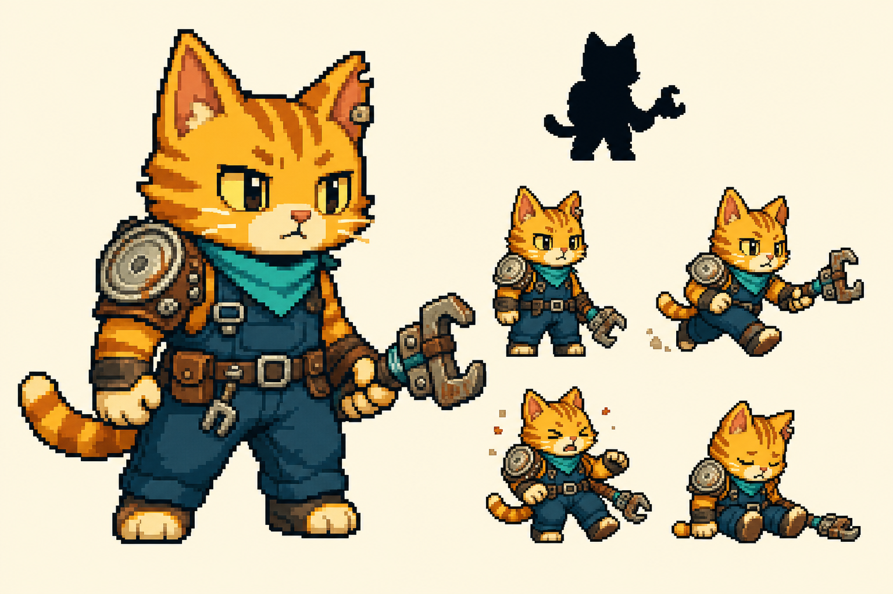
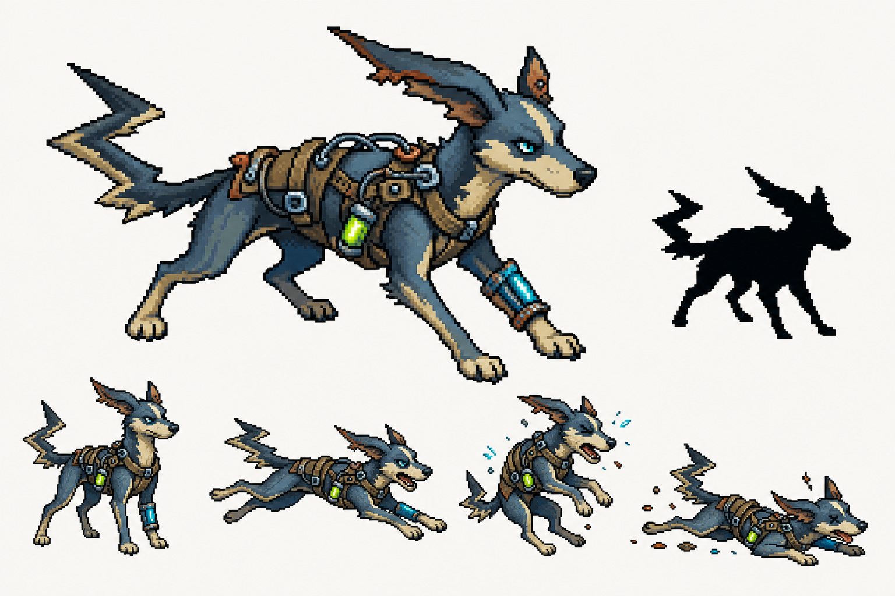
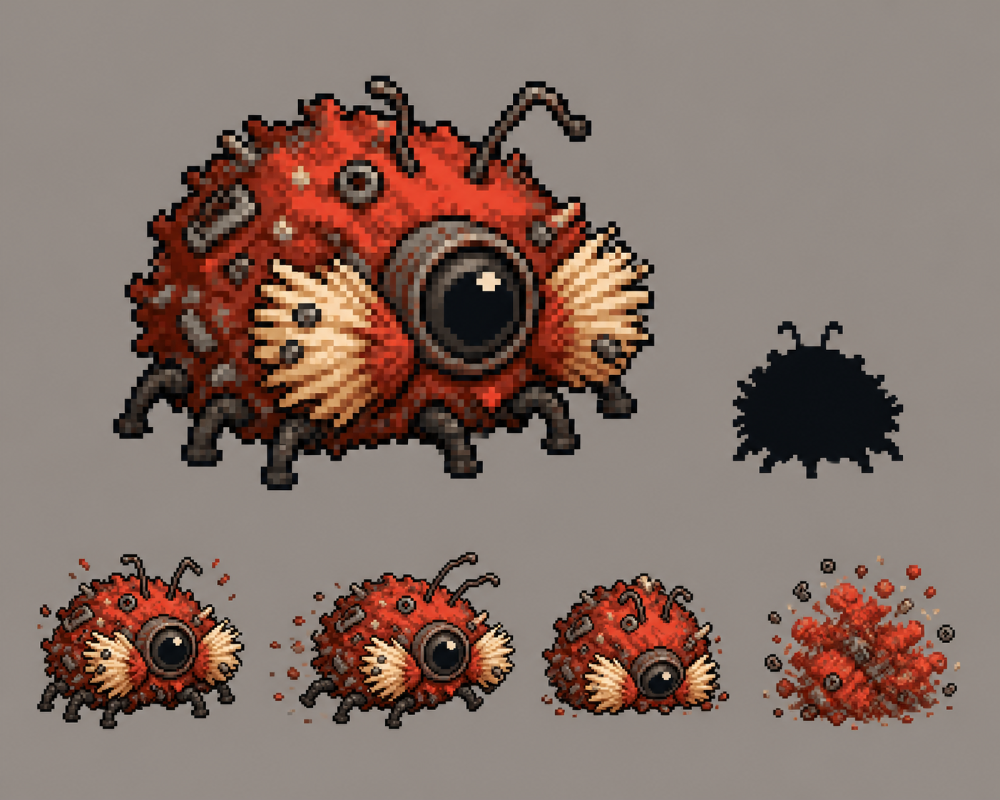
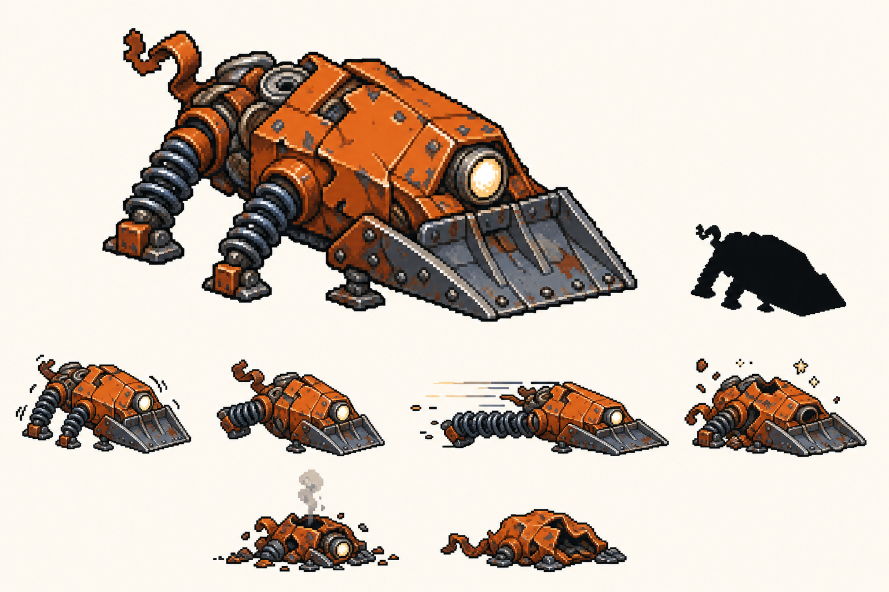
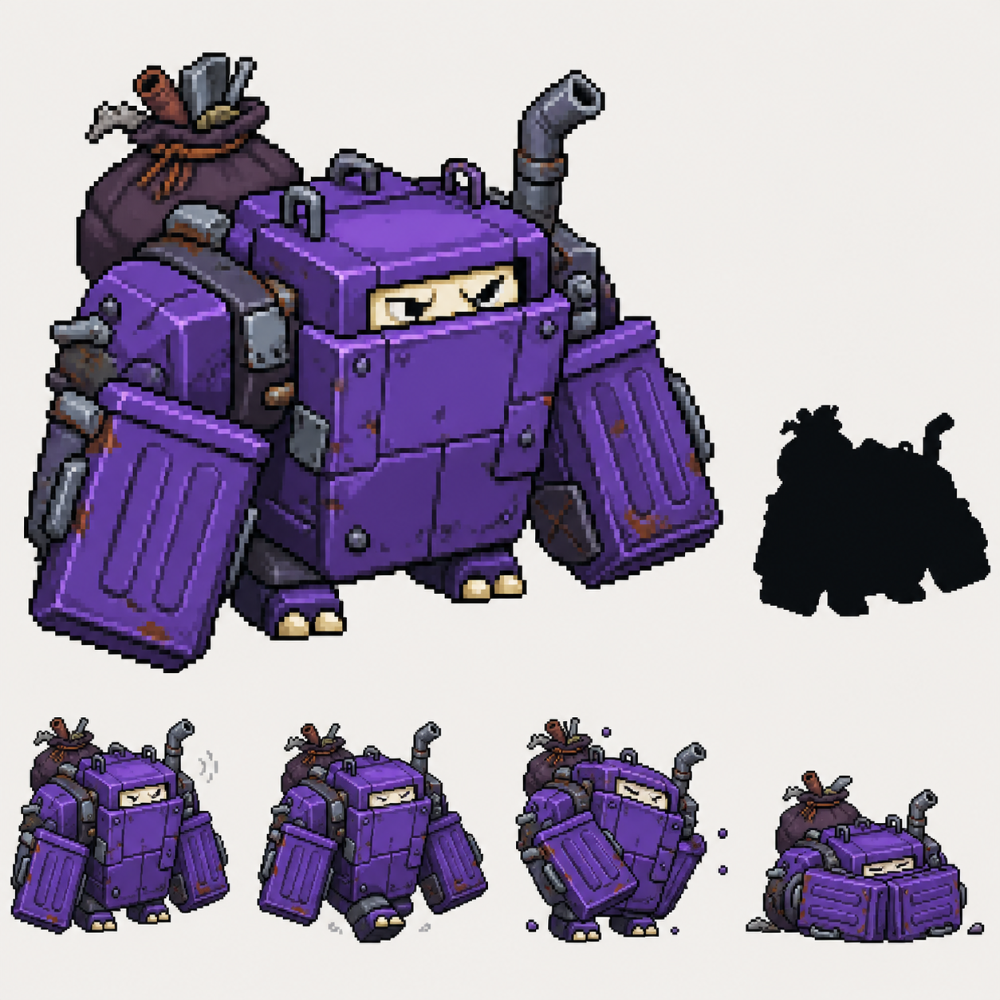
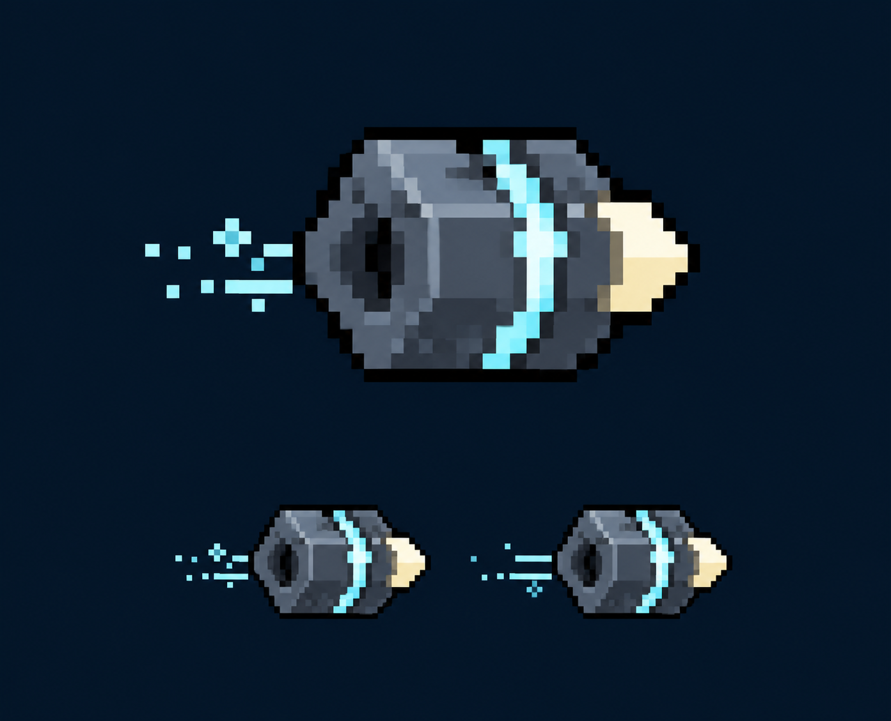
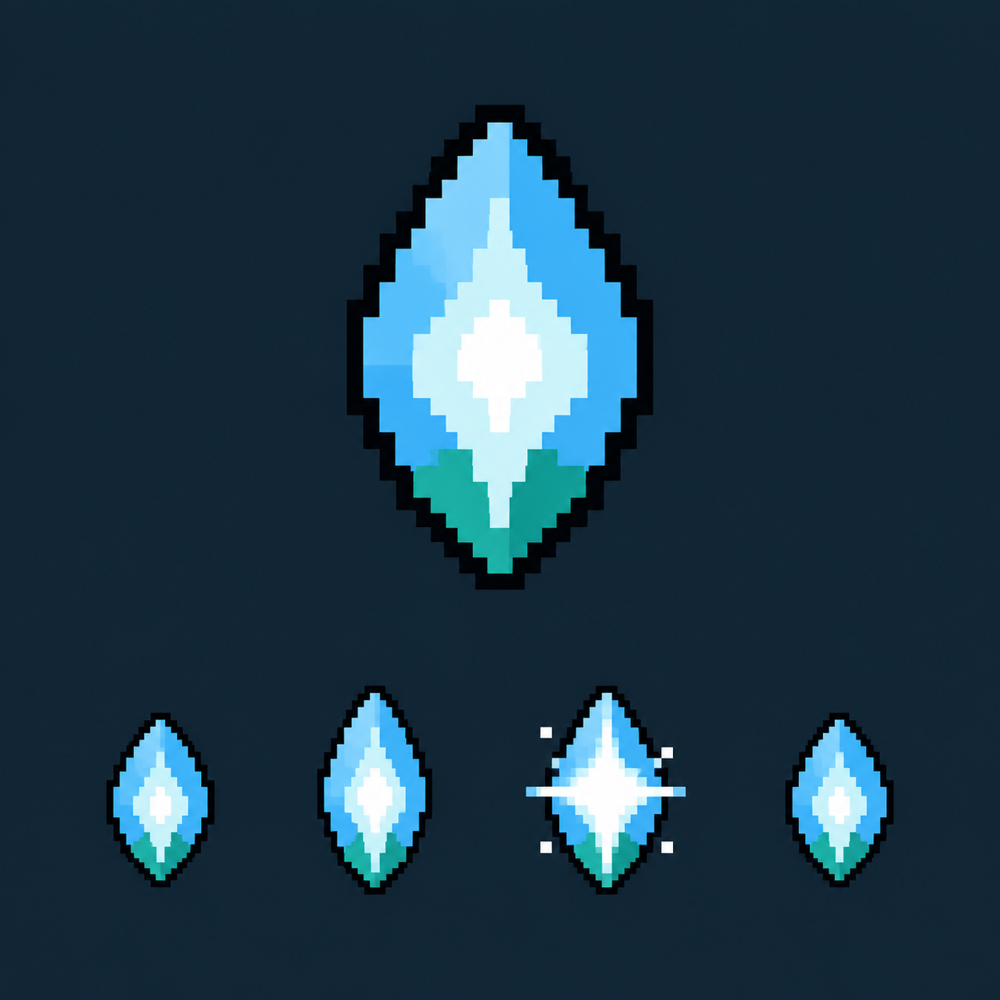

# Epic 13 Sprite Visual Design Packet

**Status:** implemented — AI-directed Pixelorama proving art is exported and
wired into the Epic 13 runtime. This packet
supplements [`../architecture/epic-13-presentation-runtime.md`](../architecture/epic-13-presentation-runtime.md),
the [visual style guide](style-guide.md), and the
[character asset standard](character-asset-standard.md). If a production detail
here conflicts with the Epic 13 architecture, the architecture wins.

The concept boards below are art-direction references. They are not runtime
sprites, Pixelorama sources, placeholder exports, or pixel-perfect tracing
targets. Production art must be redrawn as inspectable pixel clusters in the
seven Pixelorama project builders required by Epic 13.
The exact built-in generation prompts are retained in
[`concepts/epic-13/generation-prompts.md`](concepts/epic-13/generation-prompts.md)
for provenance and reproducibility.

The final production decisions are summarized in
[`concepts/epic-13/final-actor-direction.png`](concepts/epic-13/final-actor-direction.png)
and [`concepts/epic-13/final-prop-direction.png`](concepts/epic-13/final-prop-direction.png).
The seven builders translate those boards into deliberately simpler,
phone-readable pixel clusters; the runtime sheets are authoritative.

## Shared visual language

- Three-quarter top-down survivor-game view, initially right-facing. The engine
  mirrors the sprite for left-facing movement.
- Cute, chunky, readable junkyard creatures. Broad shapes and one dominant
  identifying feature per actor take priority over surface detail.
- One-pixel or two-pixel near-black `#0a0f14` outline at source resolution.
- Flat clusters with at most one shadow tone and one highlight tone per major
  material. No gradients, semitransparent edge pixels, subpixel detail, or
  baked lighting effects.
- No baked ground shadow. Runtime presentation remains the only shadow
  authority.
- Rivets, seams, straps, and rust are accent details. Remove any that disappear
  when the sprite is previewed at its runtime display size.
- Do not copy or trace another game's characters, enemies, items, or animation
  timing. The concept language is junkyard, workshop, improvised gear, and
  original creature families.

### Scale and anchor guides

| Kind | Source frame | Runtime display | Production guide |
| --- | --- | --- | --- |
| Character | 48×48 | 28×28 | Keep the body mass centered on `(24,24)` and the complete silhouette within roughly 42×42 pixels. |
| Enemy | 48×48 | 26×26 | Same center guide; use nearly the full frame so all three enemies retain distinct shapes at 26 pixels. |
| Projectile | 16×16 | 8×8 | Keep the solid slug mass within roughly 10×8 pixels and centered. Sparks may use the remaining horizontal space. |
| Pickup | 16×16 | 16×16 | Keep the mote within roughly 10×13 pixels and centered. |

The body center must not drift between frames. Feet, legs, tails, antennae, and
spark accents may animate around that fixed center, but the main torso mass must
not wobble because of frame changes.

### Layer policy

Characters use `body`, `face`, `outfit`, `weapon`, `shadow`, and hidden `notes`.
Enemies use `body`, `face`, and hidden `notes`. Props use `body` and hidden
`notes`.

For the two characters, create the required `weapon` layer but leave it empty
and hidden in the proving art. Scrap Tabby can start with multiple weapon
families, and Bolt Hound's weapon may also change; baking the concept-board
wrench or a fixed gun into the character would misrepresent runtime state.
Their armed/scavenger identity instead comes from the shoulder guard, harness,
bracer, straps, and utility gear. Dynamic weapon art remains future work.

Create the `shadow` layer for characters but leave it empty and hidden. Do not
add a shadow layer to the enemy or prop exports unless the architecture changes.

## Silhouette matrix

| Asset | Primary silhouette cue | Secondary cue | Must not become |
| --- | --- | --- | --- |
| Scrap Tabby | compact square head and two triangular ears | short striped tail and round tin-lid shoulder | tall, lean, or tool-dominated |
| Bolt Hound | long low runner with one swept ear | angular tail and cyan bracer | a compact biped or a generic wolf |
| Dust Mite | low circular rust-fluff body | central goggle eye, brush cheeks, pin legs | a red ball with no directional face |
| Junk Rusher | triangular wedge bumper | rear coil legs and cream readiness lamp | a wheeled vehicle or round beetle |
| Trash Brute | maximum-width square body | bin-lid forearms and narrow face slit | a tall humanoid robot |
| Scrap Shot | compact hexagonal slug | cream nose and alternating cyan seam spark | realistic ammunition |
| XP Mote | tall seed/diamond | white center and teal lower facet | a coin, scrap piece, or generic round orb |

## Shared actor frame intent

The five 48×48 sheets use the exact 16-frame layout frozen by Epic 13:

| Frames | Tag | Intent |
| --- | --- | --- |
| 1–4 | `idle` | neutral, one-pixel compression, one-pixel lift/open pose, settle; use an A-B-C-B rhythm |
| 5–10 | `run` | contact A, passing A, extension A, contact B, passing B, extension B |
| 11–12 | `hurt` | clear recoil/compression, partial recovery; keep body center pinned |
| 13–16 | `defeat` | lose balance, collapse, make contact, settled final pose |

Hurt and defeat frames ship but remain unwired in Epic 13. They still need
clean tags and stable anchors so later epics can adopt them without redrawing
the sheets.

## Scrap Tabby



**Read:** balanced, resourceful, friendly, prepared.

- Compact amber tabby with a square head, two strong triangular ears, and one
  notched ear. The head and ears should survive before any facial detail does.
- Short striped tail stays close to the body so it does not dominate the 28px
  silhouette.
- Round recycled tin-lid shoulder guard, teal neckerchief, dark work overalls,
  and a small utility belt communicate the junkyard-mercenary role.
- The large wrench in the concept board is mood reference only. Omit it from
  the proving sprite and keep the `weapon` layer empty/hidden.
- Run animation is a sturdy two-step jog, not a sprint. The scarf tip and tail
  provide secondary motion of at most one or two source pixels.

Palette: amber `#f7c948`, cream `#fff3c4`, burnt orange `#c86b2b`, teal
`#2dd4bf`, denim `#214756`, outline `#0a0f14`.

## Bolt Hound



**Read:** wiry, eager, high-speed, fragile.

- Long quadruped runner with one swept-back ear, one shorter upright ear, and
  an angular natural-fur tail. Do not add electricity effects to the body.
- Compress the concept's length to fit the 48×48 frame without clipping. Keep
  the torso centered even when the legs and tail reach their run extremes.
- Lightweight canvas-and-cable racing harness, cyan foreleg bracer, and a
  single lime timing light carry the improvised speed motif.
- Idle is alert and lightly coiled. Run is a readable six-frame bound with two
  contact frames and two airborne extension frames. Hurt tucks the forelegs;
  defeat ends in a low skid.
- Keep the required `weapon` layer empty/hidden for the proving sprite.

Palette: steel blue `#38bdf8`, pale cyan `#d6f7ff`, lime `#a3e635`, dark navy
`#17303b`, rusty copper `#b45309`, outline `#0a0f14`.

## Dust Mite



**Read:** numerous, twitchy, irritating, dangerous.

- Low circular body made from rust dust and metal filings. Express fluff as
  three or four large pixel clumps, not dozens of noisy spikes.
- One oversized dark goggle eye establishes direction. Two cream brush cheeks,
  six pin legs, and two bent wire antennae complete the silhouette.
- Idle alternates antenna/cheek movement. Run is a fast scuttle with opposite
  leg banks. Hurt compresses the circle; defeat breaks it into a small rust
  pile without moving the body center.
- At 26px, the dark central eye and cream cheeks must remain visible as three
  distinct value groups.

Palette: danger red `#ef4444`, coral `#f87171`, rust `#b9382f`, cream
`#fff3c4`, outline `#0a0f14`.

## Junk Rusher



**Read:** winding, armed, directional, about to dash.

- Low triangular ram-beetle construct. The bent dustpan bumper is the dominant
  shape; the orange crushed-can shell is secondary.
- A single cream readiness lamp replaces a conventional face. Rear coil legs
  compress and extend, while tiny front stabilizers prevent the body from
  reading as a vehicle.
- Do not add wheels. The creature must still look alive when shown as a black
  silhouette.
- Idle vibrates subtly. The run clip alternates a compressed wedge and a long
  spring extension so normal pursuit and dashing remain readable. Hurt dents
  the shell; defeat settles into a flattened scrap heap.

Palette: orange `#f97316`, dark rust `#9a3412`, cream `#fff3c4`, steel
`#64748b`, outline `#0a0f14`.

## Trash Brute



**Read:** slow, broad, heavy, hard to stop.

- Near-square trash-compactor body that uses more horizontal and vertical area
  than the other enemies. Two bin-lid forearms form the widest points.
- Narrow cream face slit, tiny planted feet, one bent exhaust pipe, and a small
  tied scrap sack add character without weakening the block silhouette.
- March animation shifts weight rather than travelling the torso up and down.
  Arms counter-swing by one or two pixels. Hurt rocks the armor plate; defeat
  compacts into a seated low block.
- Avoid making it a tall humanoid robot or adding military markings.

Palette: purple `#a855f7`, deep violet `#6d28d9`, cream `#fff3c4`, steel
`#64748b`, rust `#b45309`, outline `#0a0f14`.

## Scrap Shot



**Read:** fast improvised energy-charged scrap, generic across weapon families.

- Compact hexagonal filed-metal slug, cream nose pointing right, cyan energy
  seam, and dark rear recess.
- The two `fly` frames alternate only the seam brightness and a two-or-three
  pixel rear spark. The central mass and center anchor remain identical.
- No realistic cartridge case, pointed bullet profile, baked glow, or large
  trail. At the runtime 8px display, the cream nose and cyan seam are the only
  details that must survive.

Palette: cyan `#8bd3ff`, cream `#fff3c4`, steel `#64748b`, navy `#17303b`,
outline `#0a0f14`.

## XP Mote



**Read:** inviting collectible energy, not currency or ammunition.

- Tall seed/diamond with a white core, sky-blue upper facets, and teal lower
  facet. Preserve the pointed top and bottom at 16px.
- Four-frame `idle` shimmer: compact, one-pixel taller, bright cross-glint,
  compact. The center never rotates or drifts.
- Keep the glint inside the 16×16 frame and avoid semitransparent glow. The
  runtime's existing pickup highlight remains presentation authority.

Palette: sky blue `#7dd3fc`, pale cyan `#d6f7ff`, teal `#2dd4bf`, deep blue
`#214756`, white `#ffffff`, outline `#0a0f14`.

## Pixelorama production session

Run this session after the implementation agent has added all seven
`docs/art/scripts/build-<id>.lua` files. Do not run or export generated concept
PNGs through the game pipeline.

### 1. Build and validate the seven projects

Follow [`pixelorama-workflow.md`](./pixelorama-workflow.md) to install the free
Pixelorama app. From the repository root, run the structural preflight:

```bash
lua docs/art/scripts/validate-builders.lua
```

It rejects missing or blank cels, wrong frame/tag ranges, layer drift, hidden
layer regressions, and save-path drift. Build the native projects and export
them through the installed Pixelorama binary with:

```bash
docs/art/scripts/export-pixelorama.sh
```

The script creates the `.pxo` sources with the exact layers, frames, and tags
frozen by Epic 13, then produces horizontal untrimmed PNG/JSON exports.

### 3. Open and review the sources

Open each `.pxo` file in Pixelorama and compare it with this packet:

- toggle the `notes` guide layer and confirm it is hidden before export;
- confirm the character `shadow` and `weapon` layers are empty/hidden;
- scrub the animation at 100% and in Pixelorama's preview;
- zoom the preview down until the character/enemy is roughly its 28px/26px
  runtime size;
- check the body center does not drift and no frame clips the canvas;
- temporarily fill the actor with black to check silhouette separation;
- remove decorative pixels that turn to noise at runtime scale.

Make visual corrections in the `.pxo` source, then update the matching Lua
builder so rerunning the builder reproduces the approved source. The Lua script
and generated source must not silently diverge.

### 4. Export the sheets and metadata

After mirroring the accepted visual edits into the builders, run:

```bash
docs/art/scripts/export-pixelorama.sh
```

The script handles all seven asset paths. Pixelorama exports every source in a
single horizontal row without trimming, preserving stable full-frame anchors.

### 5. Verify before handing back

- Each character/enemy JSON contains the exact tags `idle`, `run`, `hurt`, and
  `defeat` with 4/6/2/4 frames.
- `scrap-shot` contains the two-frame `fly` tag.
- `xp-mote` contains the four-frame `idle` tag.
- No exported PNG includes the `notes`, `shadow`, or character `weapon` layer.
- Source files, PNGs, and JSON metadata exist at the frozen paths.
- The exported sprites are reviewed in the real game at 390×844, not only
  enlarged in Pixelorama.
- Record who ran the session, the date, and any approved deviations in Epic
  13's delivery record. Manual player-experience rows remain unverified until
  this export and browser review are complete.

## Production approval rule

The proving set is acceptable when every actor is recognizable from its black
silhouette, all seven remain distinct at runtime size, animations keep a fixed
body center, the palettes separate cleanly on the dark arena, and the exported
files are reproducible from the committed Lua scripts. Surface polish is useful;
readability and reproducibility are mandatory.
