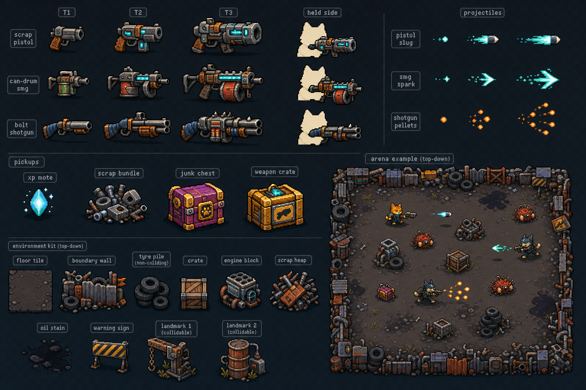

# Epic 16 Visual Identity Production Packet

**Status:** selected art direction for Issue #75; production exports are not
part of this architecture baseline.

This packet translates the Epic 16 concept board into concrete production
rules. The runtime and data contract lives in
[`../architecture/epic-16-visual-identity-and-junkyard-world.md`](../architecture/epic-16-visual-identity-and-junkyard-world.md).
The existing [visual style guide](style-guide.md),
[originality guardrails](originality.md), and Epic 13 actor packet remain
authoritative.

The board is a concept reference, not a sprite sheet or source asset. The
generation record is retained in
[`concepts/epic-16/generation-prompts.md`](concepts/epic-16/generation-prompts.md).

## 1. Shared visual language

- Near-black `#0a0f14` outlines and a limited flat palette keep forms readable
  against the dark Junkyard Lot floor.
- Gunmetal and charcoal carry structure; rust orange and worn leather make the
  equipment improvised; teal/cyan communicates powered components; warm cream
  marks important tips and faces.
- Every item gets one dominant silhouette cue. Rivets, seams, wires, scratches,
  and labels are removed if they disappear at runtime scale.
- Tier progression changes mass and outline before it changes color. Color is
  a reinforcing cue, never the only cue.
- No baked ground shadows, lighting cones, halos, trails, recoil, or impact
  effects. Runtime presentation owns those layers.
- Right-facing sources are mirrored by the engine when required. The body or
  projectile center stays fixed across frames.

## 2. Golden Run asset matrix

| Category | Source frame | Runtime display | Required production set |
| --- | ---: | ---: | --- |
| Existing character/enemy actors | 48x48 | 28x28 character; 26x26 enemy | Reuse the five Epic 13 sheets after a phone-scale audit; expose their existing `hurt` and `defeat` frames. |
| Rack weapon icon | 24x24 | 20x20 | Pistol, SMG, shotgun at T1/T2/T3: nine static frames. |
| Held weapon | 32x20 | max 24x15 | Pistol, SMG, shotgun at T1/T2/T3: nine stable-anchor static frames. |
| Projectile | 16x16 | 8x8 pistol/SMG; 10x10 shotgun cluster | One two-frame `fly` sheet per family. |
| XP and scrap | 16x16 | 16x16 | Four-frame `idle` sheet each. XP reuses the Epic 13 mote after audit. |
| Chest and weapon crate | 24x24 | 22x22 | Four-frame `idle` sheet each; animation is a subtle one-pixel pulse, not an opening sequence. |
| Floor | 32x32 | tiled 1:1 | One seamless base tile plus at most two low-contrast variants. |
| Boundary | 32x32 | tiled 1:1 | Straight, corner, and patched variants that read as the arena edge. |
| Decorative props | 16x16 to 48x48 | 1:1 | Tyre pile, crate, engine block, scrap heap, oil stain, warning sign, and small debris clusters. |
| Collidable landmarks | 48x64 max | 1:1 | Hanging press and barrel/power stack, each with an obvious solid footprint. |

All PNG sheets are horizontal, untrimmed, nearest-neighbour, and use integer
pixel placement. Editable `.pxo` projects live under `assets-src/`; runtime PNG
and metadata live under `public/assets/`.

## 3. Weapon families and tiers

### Scrap Pistol

The pistol is short and square with a pale muzzle cap and a worn wooden/rubber
grip. T2 adds a cyan side-cell. T3 adds one broad forward housing and a larger
energy chamber. It must never become a realistic handgun silhouette.

Its projectile is a compact cyan/cream slug with a short spark. The solid mass
does not change between its two `fly` frames.

### Can-Drum SMG

The SMG is low and horizontal. A repurposed can/drum below the center is its
dominant cue. T2 enlarges that drum and adds a short rear brace; T3 adds a
brighter horizontal energy strip and heavier front cap.

Its projectile is a narrow teal spark/chevron. It reads faster than the pistol
through length and shape, not through a larger glow.

### Bolt Shotgun

The shotgun is the longest family, with two parallel barrel masses and a blue
wrapped rear grip. T2 adds a second visible barrel band. T3 becomes a broad
three-part industrial front with an orange chamber accent.

Its projectile is a warm-orange pellet cluster. The cluster stays centered and
compact enough that its physics position remains visually honest.

### Tier rule

At the 20px rack-icon size, a player must distinguish adjacent tiers in a
grayscale screenshot:

- T1: one compact core mass;
- T2: core plus one clearly protruding module; and
- T3: wider front mass plus a bright energy/chamber cutout.

Do not use stars, Roman numerals, tiny badges, or palette swaps as the primary
tier distinction. Epic 15's text tier remains the accessible backup.

## 4. Pickups

| Pickup | Primary silhouette | Palette/read | Must not become |
| --- | --- | --- | --- |
| XP mote | tall diamond/seed | sky blue, white center, teal foot | coin or round orb |
| Scrap | irregular low bundle with one tyre/bolt cue | silver steel and rust | XP-colored gem |
| Chest | squat hinged purple box with gold corners | purple body, gold frame | weapon crate |
| Weapon crate | tall strapped gold/orange case | gold shell, dark weapon mark, cyan latch | chest recolor |

The blocked full-rack weapon crate keeps the same art while stationary. Any
blocked/readiness feedback belongs to runtime presentation and Epic 17, not a
second pickup sprite.

## 5. Junkyard Lot composition

The production arena is a navigable lot, not a uniform carpet of detail.

- Keep a clear start plaza around the arena center with no colliders and low
  visual noise.
- Use the hanging press and barrel/power stack as two distant landmarks that
  make camera travel legible. Their art aligns to explicit rectangular
  colliders; their decorative overhang never changes those bodies.
- Concentrate non-colliding tyre piles, crates, engine blocks and scrap heaps
  near boundaries and landmarks. Do not place decoration so it looks solid
  across an open movement lane.
- Oil stains and tiny debris are ground decals. They must never imply a hazard.
- The boundary is continuous and visibly impassable. Corner and patch variants
  may break repetition but must preserve a consistent inner edge.
- Keep enemy silhouettes clear: background values stay darker and less
  saturated than actors, pickups and projectiles.

The arena-data file owns fixed landmark/decor placement. Runtime randomness is
not used to decorate the world.

## 6. Production and review gates

1. Build every source through deterministic Pixelorama scripts based on the
   existing Epic 13 builder library.
2. Validate file presence, PNG dimensions, frame counts, tags, hidden notes,
   fixed centers, and manifest references before runtime tests.
3. Inspect source projects at 100% and runtime exports at actual display size.
4. Capture one clean 390x844 Golden Run screenshot and one desktop screenshot.
5. Capture grayscale/icon-only comparisons for the three families and tiers.
6. Confirm decorations do not create invisible collisions and collidable
   landmark art does not extend misleadingly into movement lanes.
7. Confirm no generated concept pixels were copied into production exports.

Reject an asset that is attractive when enlarged but ambiguous at runtime
scale. Readability is the production gate.
