# Issue 191 — Runtime fidelity evidence

This record is the review evidence for the implementation candidate. It does
not close issue #191: the final side-by-side judgement remains Jonathan's
visual approval.

## Authority and method

- Visual authority: `docs/art/alpha-3-art-production-briefs.md` and the selected
  concept/provenance boards named below.
- Canonical phone review size: 390×844. Foldable/tablet and desktop comparison
  sizes are 1114×720 and 1280×720.
- Actor comparisons use the actual display sizes produced by the game, nearest
  sampling, and the existing #190 responsive camera/layout model.
- A valid result needs all three links in the chain: selected reference,
  editable source, and the runtime capture. Loading or manifest parity alone
  is not visual acceptance.

## Actor classification

| Actor | Before | Native source after remediation | Review authority |
|---|---|---|---|
| Scrap Tabby | 22px-tall / 5-pose geometric approximation | restored native 48×48 pixel master, 16-frame PXO | Epic 13 final actor direction |
| Bolt Hound | 22px-tall / 5-pose geometric approximation | restored native 48×48 pixel master, 16-frame PXO | Epic 13 final actor direction |
| Volt Lynx | 23px-tall / 5-pose geometric approximation | restored native 48×48 pixel master, 16-frame PXO | selected Volt Lynx direction A |
| Brass Boar | 20px-tall / 5-pose geometric approximation | restored native 48×48 pixel master, 16-frame PXO | selected Alpha 3 roster direction B |
| Ember Cougar | 18px-tall / 6-pose geometric approximation | restored native 48×48 pixel master, 16-frame PXO | selected Alpha 3 roster direction B |
| Scrap Weasel | 20px-tall / 6-pose geometric approximation | restored native 48×48 pixel master, 16-frame PXO | selected Alpha 3 roster direction B |
| Rattle Raptor | 20px-tall / 6-pose geometric approximation | restored native 48×48 pixel master, 16-frame PXO | selected Alpha 3 roster direction B |
| Piston Ram | 23px-tall / 5-pose geometric approximation | restored native 48×48 pixel master, 16-frame PXO | selected Alpha 3 roster direction B |
| Dust Mite | geometric approximation | 48×48, 16-frame PXO | Epic 13 / enemy production direction B |
| Junk Rusher | geometric approximation | 48×48, 16-frame PXO | Epic 13 actor direction |
| Trash Brute | geometric approximation | 48×48, 16-frame PXO | Epic 13 actor direction |
| Scrap Sniper | geometric approximation | 48×48, 16-frame PXO | enemy production direction B |
| Scrap Skitter | 313×313 generated import | 48×48, 16-frame PXO | §11 authored silhouette |
| Bastion Beetle | 313×313 generated import | 48×48, 16-frame PXO | §11 authored silhouette |
| Junk Nester | 313×313 generated import | 48×48, 16-frame PXO | §11 authored silhouette |
| Shard Bot | 313×313 generated import | 48×48, 16-frame PXO | §11 authored silhouette |
| Scrap Crusher | geometric approximation at ordinary-enemy display scale | 64×64, 16-frame PXO; 38×38 boss display | enemy production direction B |
| Forge Warden | 309×309 generated import | 64×64, 16-frame PXO | §11 authored silhouette |

The “before” classification is intentionally evidence-based rather than
inferred from filenames: the former character and native enemy builders drew
ellipses/rectangles/lines, while the five expanded sheets contained one
`imagegen-import` layer and were reduced to 24–38 logical pixels at runtime.
Every remediated actor now exports from an editable Pixelorama source. For the
Mercenaries, the richer checked-in native-grid production pixels predating the
regressed tiny reconstructions were used as editable underdrawings, then each
sheet received connected native-pixel silhouette work against its selected
brief: Tabby's hooked tail/notched ear, Hound's swept ear/angular tail, Lynx's
three-point cheek ruff, Boar's paired tusks/broad plate, Cougar's curled
tail/mantle, Weasel's dominant satchel, Raptor's beak/crest, and Ram's projected
piston forearms. Versus the rejected candidate, 3.1–9.0% of each idle alpha
mask changed, the worst pairwise dominant-component overlap improved from
0.740 to 0.715, and at least 94% of every cue remains connected to the actor
rather than existing as a detached token. Their first frames are 30–46px tall
and their 16-frame sheets retain at least 10 distinct alpha poses. Conformance
regressions lock those properties.
The builders restore the exact checked-in native raster for audit/source
parity; they do not procedurally reconstruct actor silhouettes from geometric
shapes.

The four former 313px ordinary-enemy imports were reauthored directly on the
48px grid. Their approximate live idle bounds improved from 16×9 to 22×18
(Skitter), 16×12 to 26×22 (Beetle), 15×13 to 24×23 (Nester), and 15×10 to
18×21 (Shard Bot). Forge Warden was independently authored across all 16
frames on the 64px production grid; the selected generated sheet remains
reference/provenance and is not an export input. Its idle silhouette is a
margin-safe 59×56 and occupies about 37×35 live pixels, versus Crusher's low
33×23 footprint.
All ten release enemies now participate in the all-frame crop, anchor, motion,
display-scale distinction, editable-source, and runtime-parity regressions.

## Side-by-side review set

Selected references:

- `docs/art/concepts/epic-13/final-actor-direction.png`
- `assets-src/characters/alpha-3-roster-concepts/direction-b-selected.png`
- `assets-src/characters/volt-lynx/concepts/volt-lynx-direction-a-selected.png`
- `assets-src/enemies/alpha-3-production-concepts/direction-b-selected.png`

Runtime captures and committed screenshot baselines:

- `browser-tests/visual-fidelity.pw.ts-snapshots/home-*.png`
- `browser-tests/visual-fidelity.pw.ts-snapshots/mercenary-*.png`
- `browser-tests/visual-fidelity.pw.ts-snapshots/mercenary-lower-*.png`
- `browser-tests/visual-fidelity.pw.ts-snapshots/contract-selection-*.png`
- `browser-tests/visual-fidelity.pw.ts-snapshots/loadout-equipment-*.png`
- `browser-tests/visual-fidelity.pw.ts-snapshots/achievements-*.png`
- `browser-tests/visual-fidelity.pw.ts-snapshots/settings-*.png`
- `browser-tests/visual-fidelity.pw.ts-snapshots/gameplay-*.png`
- `browser-tests/visual-fidelity.pw.ts-snapshots/mercenary-gameplay-*-desktop-1280x720-linux.png`
- `browser-tests/visual-fidelity.pw.ts-snapshots/ordinary-gameplay-actor-*.png`
- `browser-tests/visual-fidelity.pw.ts-snapshots/boss-gameplay-desktop-1280x720-linux.png`
- `browser-tests/visual-fidelity.pw.ts-snapshots/boss-gameplay-actor-desktop-1280x720-linux.png`
- `browser-tests/visual-fidelity.pw.ts-snapshots/compendium-desktop-1280x720-linux.png`
- `browser-tests/visual-fidelity.pw.ts-snapshots/compendium-middle-desktop-1280x720-linux.png`
- `browser-tests/visual-fidelity.pw.ts-snapshots/compendium-lower-desktop-1280x720-linux.png`
- `browser-tests/visual-fidelity.pw.ts-snapshots/pause-modal-desktop-1280x720-linux.png`
- `browser-tests/visual-fidelity.pw.ts-snapshots/weapon-rack-desktop-1280x720-linux.png`

The browser baselines intentionally cover a phone, a foldable-sized viewport,
and desktop. The gameplay pair catches actor/world scale, nearest sampling,
HUD/action treatment, and the responsive viewport together; the menu set
catches brand hierarchy, reusable chrome, focus, navigation, scrolling, and
content art integration.

### Side-by-side approval evidence

These pairs render the selected authority beside the shipped browser output,
not merely links to files. The actor crops are the exact 96×96 browser pixels
captured around the live production sprite; they are not enlarged source art.

<table>
<tr><th>Approved reference</th><th>Runtime output at review scale</th></tr>
<tr><td>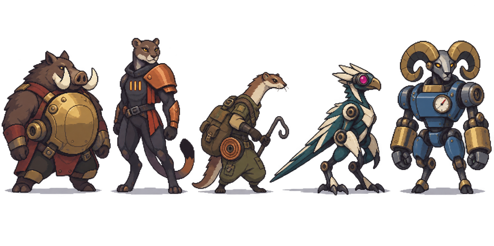</td><td>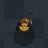 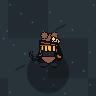 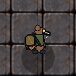 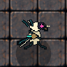 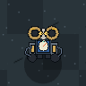</td></tr>
<tr><td>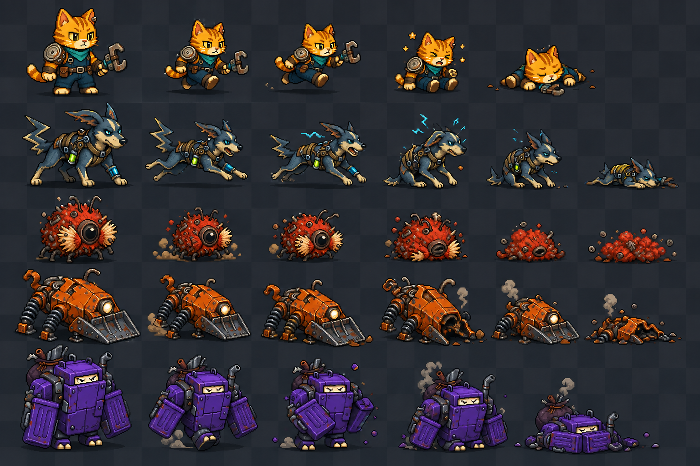 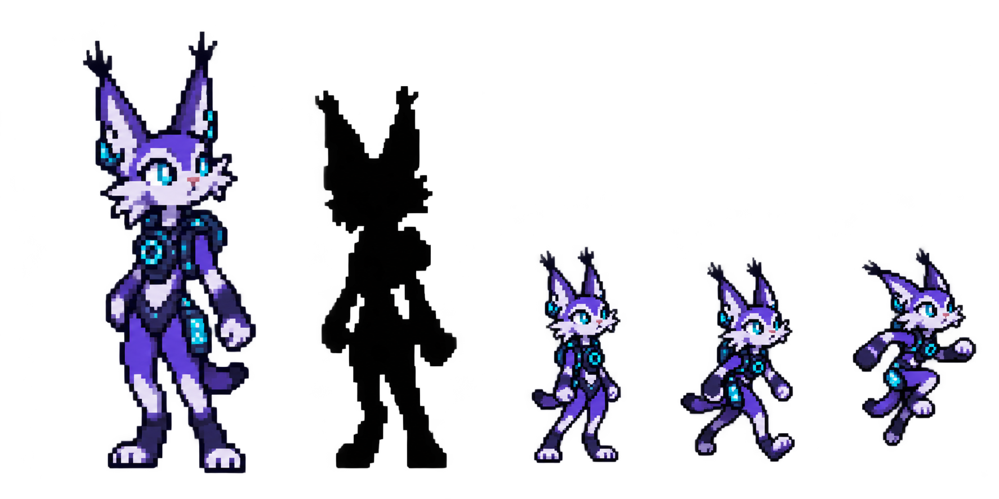</td><td>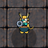 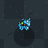 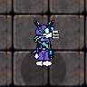</td></tr>
<tr><td>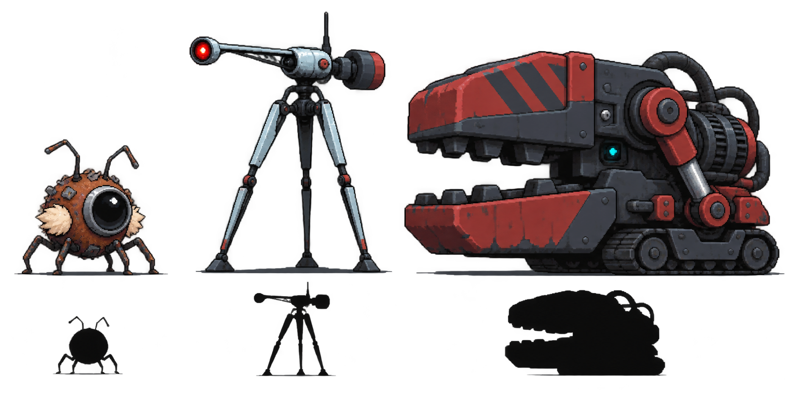</td><td>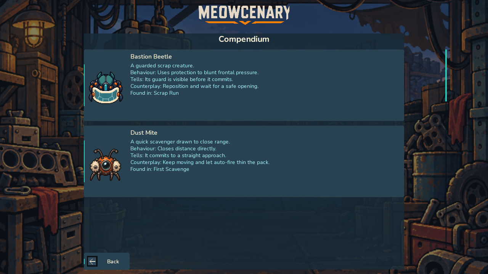 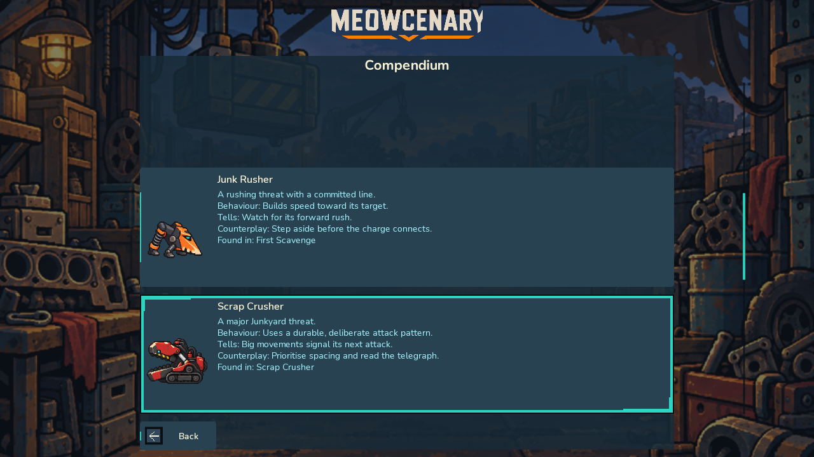 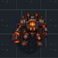</td></tr>
<tr><td>Art brief §§16–19: bespoke lockup, crop-safe workshop backdrop, semantic navigation/state/HUD glyphs, and shared modal/card chrome.</td><td>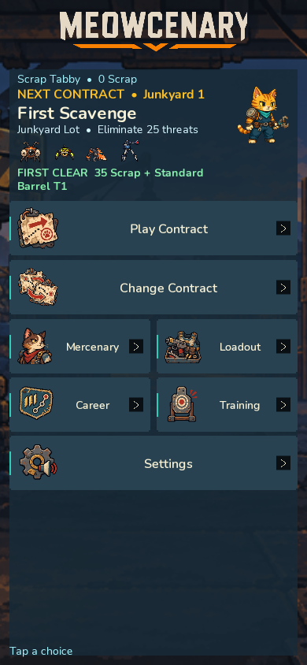 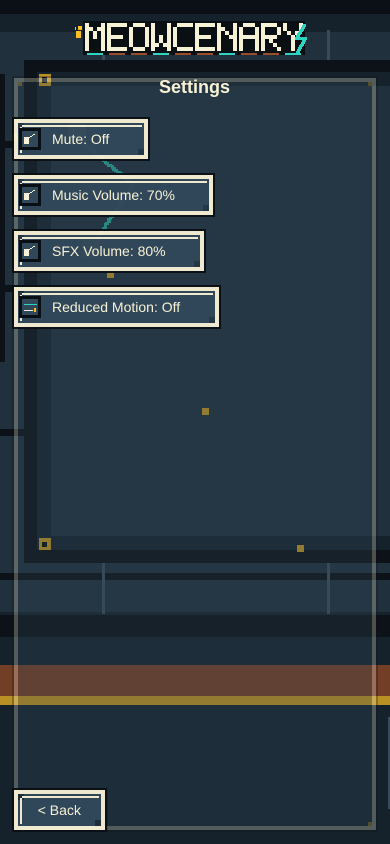 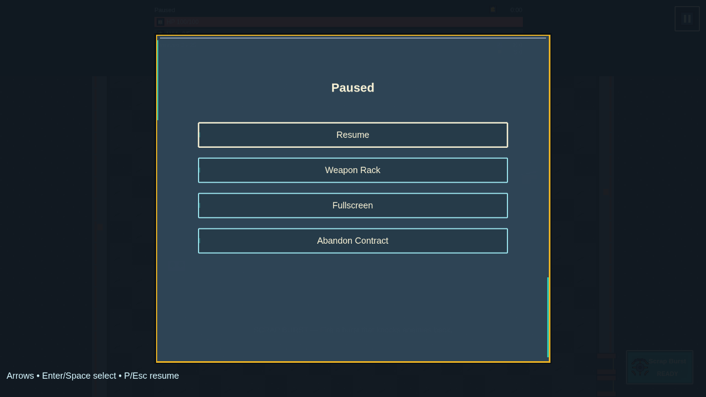</td></tr>
</table>

The visual-test controller is compiled only into the dedicated screenshot
build and uses a fixed boot/run seed. The ordinary production build contains
no mutable browser seam. Full-scene gameplay comparisons carry a bounded
tolerance for incidental player/held-weapon contact timing. Separate strict
96×96 actor-centred captures pose the real production actor view at a stable
world point, so an actor disappearance, scale change, or sprite drift cannot
hide inside that composition allowance. Compendium captures and PXO/runtime
parity independently lock the complete roster.

## Production fallback contract

Required release actors are fail-closed. Missing bindings, texture resources,
idle/run clips, or registered animations surface a diagnostic construction
error. Primitive actor geometry is available only through the explicit
development/test opt-in used by art-less harnesses; it is not an automatic
production recovery path. Data-authored elite enemies retain their own combat
identity while validation, resource closure, and runtime presentation all
resolve the authoritative base-enemy actor binding, including the cosmetic
defeat presentation emitted from the elite's logical kill event.

## Deliberate non-goals

- No campaign, combat, progression, save, or responsive geometry changed.
- No new actor or speculative future UI family was added.
- Selected and rejected provenance remains intact.
- Product-owner visual approval is intentionally outstanding; this candidate
  must not close #191 without that recorded approval.
