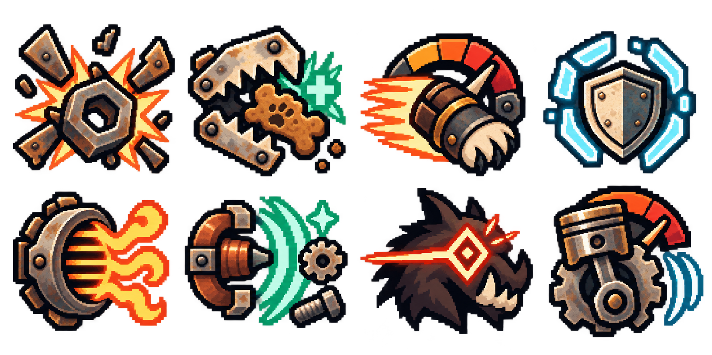
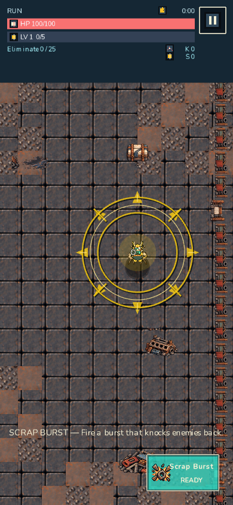
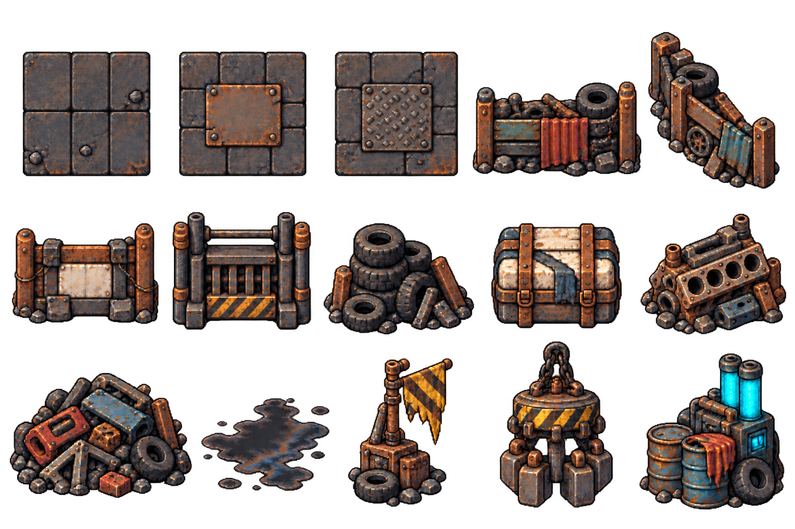
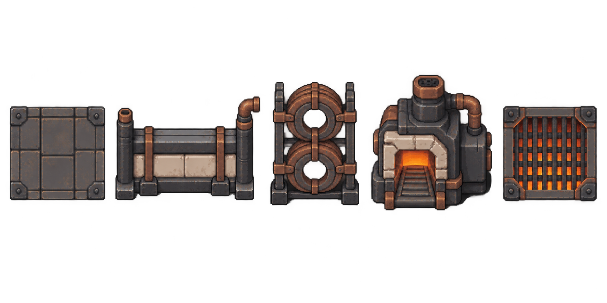
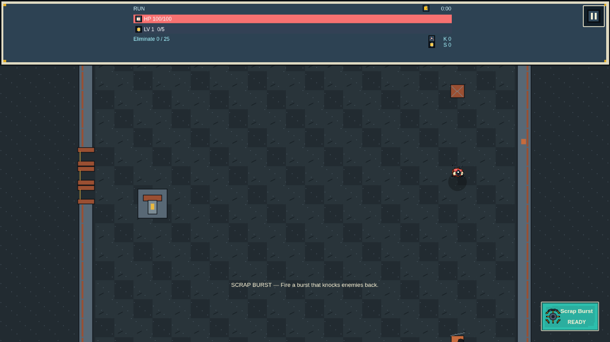
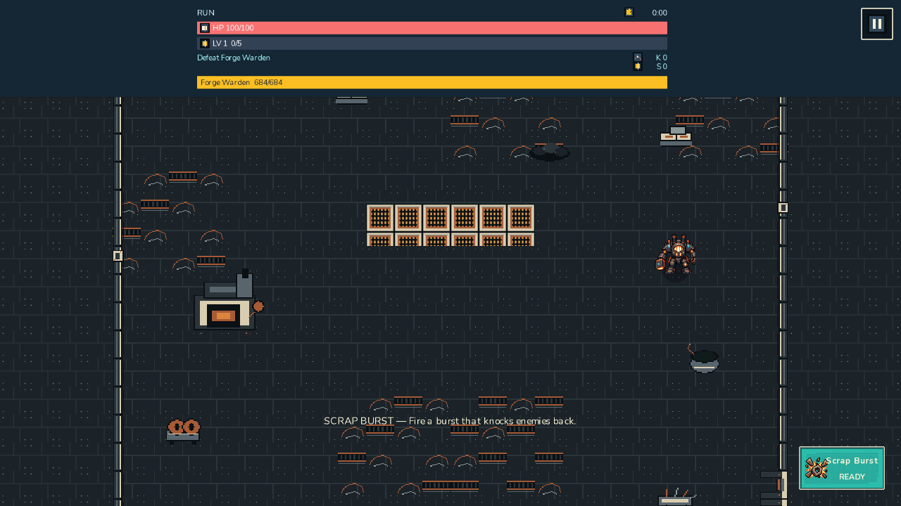

# Issue 191 — Runtime fidelity evidence

This record is the review evidence for the implementation candidate. It does
not close issue #191: the final side-by-side judgement remains Jonathan's
visual approval.

## Authority and method

- Visual authority: `docs/art/alpha-3-art-production-briefs.md` and the selected
  concept/provenance boards named below.
- Canonical phone review size: 390×844. Foldable/tablet and desktop comparison
  sizes are 1114×720 and 1280×720.
- Actor comparisons use the actual display sizes produced by the game, crisp
  nearest-neighbour sampling for the native-pixel actor sheets, and the
  existing #190 responsive camera/layout model.
- A valid result needs all three links in the chain: selected reference,
  editable source, and the runtime capture. Loading or manifest parity alone
  is not visual acceptance.

## Actor classification

| Actor | Before | Native source after remediation | Review authority |
|---|---|---|---|
| Scrap Tabby | 22px-tall / 5-pose geometric approximation | restored native 48×48 pixel master, 16-frame PXO | Epic 13 final actor direction |
| Bolt Hound | 22px-tall / 5-pose geometric approximation | restored native 48×48 pixel master, 16-frame PXO | Epic 13 final actor direction |
| Volt Lynx | 23px-tall / 5-pose geometric approximation | restored native 48×48 pixel master, 16-frame PXO | selected Volt Lynx direction A |
| Brass Boar | 20px-tall / 5-pose geometric approximation | restored native 48×48 pixel master, 16-frame PXO | selected Alpha 3 roster direction B |
| Ember Cougar | 18px-tall / 6-pose geometric approximation | restored native 48×48 pixel master, 16-frame PXO | selected Alpha 3 roster direction B |
| Scrap Weasel | 20px-tall / 6-pose geometric approximation | restored native 48×48 pixel master, 16-frame PXO | selected Alpha 3 roster direction B |
| Rattle Raptor | 20px-tall / 6-pose geometric approximation | restored native 48×48 pixel master, 16-frame PXO | selected Alpha 3 roster direction B |
| Piston Ram | 23px-tall / 5-pose geometric approximation | restored native 48×48 pixel master, 16-frame PXO | selected Alpha 3 roster direction B |
| Dust Mite | geometric approximation | selected master → 48×48, 16-frame PXO | Epic 13 / enemy production direction B |
| Junk Rusher | geometric approximation | selected master → 48×48, 16-frame PXO | Epic 13 actor direction |
| Trash Brute | geometric approximation | selected master → 48×48, 16-frame PXO | Epic 13 actor direction |
| Scrap Sniper | geometric approximation | selected master → 48×48, 16-frame PXO | enemy production direction B |
| Scrap Skitter | 313×313 generated runtime import | selected master → 48×48, 16-frame PXO | §11 silhouette brief |
| Bastion Beetle | 313×313 generated runtime import | selected master → 48×48, 16-frame PXO | §11 silhouette brief |
| Junk Nester | 313×313 generated runtime import | selected master → 48×48, 16-frame PXO | §11 silhouette brief |
| Shard Bot | 313×313 generated runtime import | selected master → 48×48, 16-frame PXO | §11 silhouette brief |
| Scrap Crusher | geometric approximation at ordinary-enemy display scale | selected master → 64×64, 16-frame PXO; 38×38 boss display | enemy production direction B |
| Forge Warden | 309×309 generated runtime import | selected master → 64×64, 16-frame PXO | §11 silhouette brief |

The “before” classification is intentionally evidence-based rather than
inferred from filenames: the former character and native enemy builders drew
ellipses/rectangles/lines, while the five expanded sheets contained one
`imagegen-import` layer and were reduced to 24–38 logical pixels at runtime.
Every remediated actor now exports from an editable Pixelorama source. For the
Mercenaries, the richer checked-in native-grid production pixels predating the
regressed tiny reconstructions were used as editable underdrawings, then each
sheet received connected native-pixel silhouette work against its selected
brief: Tabby's hooked tail/notched ear, Hound's swept ear/angular tail, Lynx's
three-point cheek ruff, Boar's paired tusks/broad plate, Cougar's curled
tail/mantle, Weasel's dominant satchel, Raptor's beak/crest, and Ram's projected
piston forearms. Versus the rejected candidate, 3.1–9.0% of each idle alpha
mask changed, the worst pairwise dominant-component overlap improved from
0.740 to 0.715, and at least 94% of every cue remains connected to the actor
rather than existing as a detached token. Their first frames are 30–46px tall
and their 16-frame sheets retain at least 10 distinct alpha poses. Conformance
regressions lock those properties.
The builders restore the exact checked-in native raster for audit/source
parity; they do not procedurally reconstruct actor silhouettes from geometric
shapes.

All ten selected enemy masters now pass through one deterministic importer.
The product-owner follow-up found that the first painterly imports became
muddy and low-contrast when reduced beside the native-pixel hero. The V3
masters preserve each authored 4×4 pose grid while translating it into the
hero's chunky pixel language: near-black silhouette edges, larger material
groups, brighter role accents, and less sub-pixel noise. They produce native
48×48 ordinary and 64×64 boss Pixelorama/runtime sheets with one common ground
datum. A separate 256px-per-entry portrait atlas feeds Contract threat strips
and Compendium cards, so those surfaces no longer upscale a 26px gameplay
actor. All ten release enemies participate in all-frame crop, anchor, motion,
display-scale distinction, editable-source, and runtime-parity regressions.
Junkyard actors additionally have an actual-display-size luminance gate against
the authoritative floor so a future import cannot silently return to the
low-contrast result.

## Side-by-side review set

Selected references:

- `docs/art/concepts/epic-13/final-actor-direction.png`
- `assets-src/characters/alpha-3-roster-concepts/direction-b-selected.png`
- `assets-src/characters/volt-lynx/concepts/volt-lynx-direction-a-selected.png`
- `assets-src/enemies/alpha-3-production-concepts/direction-b-selected.png`
- `assets-src/characters/identity/concepts/ability-icons-v2-selected.png`
- `assets-src/world/junkyard/concepts/junkyard-world-kit-selected.png`
- `assets-src/world/forge/concepts/forge-foundry-direction-a-selected.png`

Runtime captures and committed screenshot baselines:

- `browser-tests/visual-fidelity.pw.ts-snapshots/home-*.png`
- `browser-tests/visual-fidelity.pw.ts-snapshots/mercenary-*.png`
- `browser-tests/visual-fidelity.pw.ts-snapshots/mercenary-lower-*.png`
- `browser-tests/visual-fidelity.pw.ts-snapshots/contract-selection-*.png`
- `browser-tests/visual-fidelity.pw.ts-snapshots/loadout-equipment-*.png`
- `browser-tests/visual-fidelity.pw.ts-snapshots/loadout-gunsmith-*.png`
- `browser-tests/visual-fidelity.pw.ts-snapshots/gunsmith-assembled-*.png`
- `browser-tests/visual-fidelity.pw.ts-snapshots/gunsmith-parts-*.png`
- `browser-tests/visual-fidelity.pw.ts-snapshots/achievements-*.png`
- `browser-tests/visual-fidelity.pw.ts-snapshots/settings-*.png`
- `browser-tests/visual-fidelity.pw.ts-snapshots/gameplay-*.png`
- `browser-tests/visual-fidelity.pw.ts-snapshots/mercenary-gameplay-*-desktop-1280x720-linux.png`
- `browser-tests/visual-fidelity.pw.ts-snapshots/ordinary-gameplay-actor-*.png`
- `browser-tests/visual-fidelity.pw.ts-snapshots/ability-effect-*.png`
- `browser-tests/visual-fidelity.pw.ts-snapshots/boss-gameplay-desktop-1280x720-linux.png`
- `browser-tests/visual-fidelity.pw.ts-snapshots/boss-gameplay-actor-desktop-1280x720-linux.png`
- `browser-tests/visual-fidelity.pw.ts-snapshots/forge-gameplay-desktop-1280x720-linux.png`
- `browser-tests/visual-fidelity.pw.ts-snapshots/compendium-desktop-1280x720-linux.png`
- `browser-tests/visual-fidelity.pw.ts-snapshots/compendium-middle-desktop-1280x720-linux.png`
- `browser-tests/visual-fidelity.pw.ts-snapshots/compendium-lower-desktop-1280x720-linux.png`
- `browser-tests/visual-fidelity.pw.ts-snapshots/pause-modal-desktop-1280x720-linux.png`
- `browser-tests/visual-fidelity.pw.ts-snapshots/weapon-rack-desktop-1280x720-linux.png`

The browser baselines intentionally cover a phone, a foldable-sized viewport,
and desktop. The gameplay pair catches actor/world scale, nearest sampling,
HUD/action treatment, and the responsive viewport together; the menu set
catches brand hierarchy, reusable chrome, focus, navigation, scrolling, and
content art integration.

### Side-by-side approval evidence

These pairs render the selected authority beside the shipped browser output,
not merely links to files. The actor crops are the exact 96×96 browser pixels
captured around the live production sprite; they are not enlarged source art.

<table>
<tr><th>Approved reference</th><th>Runtime output at review scale</th></tr>
<tr><td></td><td>    </td></tr>
<tr><td> </td><td>  </td></tr>
<tr><td></td><td>  </td></tr>
<tr><td></td><td></td></tr>
<tr><td> </td><td> </td></tr>
<tr><td>Art brief §§16–19: bespoke lockup, crop-safe workshop backdrop, semantic navigation/state/HUD glyphs, and shared modal/card chrome.</td><td>  </td></tr>
</table>

The visual-test controller is compiled only into the dedicated screenshot
build and uses a fixed boot/run seed. The ordinary production build contains
no mutable browser seam. Full-scene gameplay comparisons carry a bounded
tolerance for incidental player/held-weapon contact timing. Separate strict
96×96 actor-centred captures pose the real production actor view at a stable
world point, so an actor disappearance, scale change, or sprite drift cannot
hide inside that composition allowance. Compendium captures and PXO/runtime
parity independently lock the complete roster.

## Player-facing screen polish audit

The final pass reviewed the live screen rather than only its asset request.
The numbered path below is the repeatable audit journey used at 390×844,
1114×720, and 1280×720.

1. **Home** — contract identity and first-clear value lead; the selected
   Mercenary portrait is a large supporting cue. Navigation now uses one
   quieter industrial card surface with 60–68px action tiles, 50–56px
   production-art thumbnails, and a consistent directional chevron. The
   selected ten-piece navigation atlas replaces the old mixed content/icon
   thumbnails. The last odd portrait action spans the row; compact landscape
   uses a roomy 4+3 gallery instead of seven undersized buttons.
2. **Choose Contract** — available/locked hierarchy, objective art, reward
   detail, focus visibility, and scroll containment were checked together.
3. **Mercenary** — the former tiny geometric avatars were replaced by crops
   from the approved identity board. Portraits are now the dominant card
   column; ability, passive, and weapon art remain secondary.
4. **Loadout / Equipment / Gunsmith** — selected identity, equipment pieces,
   blueprints, chassis, and part art are shown at card scale instead of being
   treated as utility glyphs. The selected Direction B Gunsmith board now owns
   the 12 Part icons, eight slot glyphs, and three trait emblems. The assembled
   weapon is the visual focal point; stocked desktop, foldable and phone
   regressions prove the fitted/owned/incompatible and Workshop surfaces with
   live domain state rather than an empty fixture. Text is grouped beside the
   visual it explains and reserves both icon columns on narrow phones.
5. **Career / Next Goals / Achievements / Compendium** — hub actions share the
   larger illustrated navigation system; goals use illustrated cards and keep
   their actionable requirement in compact landscape. All ten active
   Achievements—including Crusher Down and Warden Down—plus the hidden badge
   fallback use the approved industrial badge board; defeated Compendium rows
   use authoritative live actor art.
6. **Training / Settings** — short copy and controls retain a single readable
   column without inventing decorative content. Music, SFX, mute and reduced
   motion have distinct visual identities; toggle rows remain explicit
   commands rather than ambiguous cards.
7. **Upgrade chooser** — authored upgrade sprites are promoted from the old
   number-badge scale to the primary recognition cue, while the measured
   compact-landscape layout still preserves readable names and descriptions.
8. **Extraction / pause / Weapon Rack / result** — extraction now owns an
   opaque, bounded action plate so live actors cannot collide with its label;
   modal chrome no longer stretches decorative source bands into large solid
   bars; terminal actions share the same flat card language and use outer
   gutters rather than text or controls touching the screen frame.
9. **Playable arenas** — Junkyard's primitive world pieces were replaced by a
   selected 15-piece top-down production board with deterministic native-grid
   crops, editable PXO sources, and exact export checks. Runtime flooring now
   keeps the base material quiet and forms sparse deterministic repair zones
   instead of alternating every tile. Both Junkyard and Forge use denser,
   chapter-specific perimeter dressing while the authored clear start plaza,
   collision rectangles, hazards, spawn lanes, and camera geometry remain
   unchanged. A dedicated full-scene Forge regression complements the existing
   phone/foldable/desktop Junkyard captures.
10. **Abilities and combat feedback** — the eight active abilities now use a
    selected transparent symbol board whose art fills the HUD action rather
    than nesting a tiny badge inside it. Each authoritative ability event has
    a distinct bounded pixel-graphic effect (shock shards, heat tongues, loot
    pull, repair sparks, speed trails, overclock gear, shield hex, and precision
    brackets). Instant abilities retain their original gameplay duration but
    receive a short presentation-only hold so the action can be read on a
    phone. Dedicated phone, foldable, and desktop captures lock the live effect
    around the real player actor.

The approved Figma Clean Master is also integrated without redrawing: the
editable SVG and exact export are preserved under `assets-src/ui/brand`, a
deterministic importer emits the primary, title, emblem, monochrome and browser
derivatives, and the real menu plus favicon consume those exports. The locked
runtime typeface remains the self-hosted Nunito family; the isolated “Inter”
acceptance bullet in the cutover handoff conflicts with—and is superseded
by—the explicit locked Nunito section.

Health after remediation: **good candidate for product-owner visual review**.
All interactive targets retain the repository's 44 px physical minimum;
keyboard/controller focus uses the same logical rows as touch; text wrapping
and safe-area containment remain covered by the existing layout tests. Menu
copy uses self-hosted Nunito at doubled canvas resolution, with button labels
optically centred between their leading illustration and trailing direction
marker. The remaining limitation is subjective physical-device judgement of
density and colour at the owner's actual viewing distance. The approved clean
vector wordmark remains artwork rather than recreated text.

Additional deterministic evidence:

- `browser-tests/ui-audit-capture.pw.ts-snapshots/menu-*.png` covers all 12
  reachable menu panels at phone, foldable, and desktop sizes.
- `browser-tests/visual-fidelity.pw.ts-snapshots/upgrade-chooser-*.png`
- `browser-tests/visual-fidelity.pw.ts-snapshots/extraction-*.png`
- `browser-tests/visual-fidelity.pw.ts-snapshots/run-summary-won-*.png`
- `browser-tests/visual-fidelity.pw.ts-snapshots/run-summary-lost-*.png`

The selected Achievement, Mercenary, Junkyard-world, and primary/secondary navigation boards are now production masters,
cropped by deterministic importers into editable Pixelorama sources and
runtime atlases. Their source/export parity is part of `art:validate`; the
older geometric Lua entrypoints are explicitly classified as external-import
discovery shims and cannot silently overwrite the selected art.

## Production fallback contract

Required release actors are fail-closed. Missing bindings, texture resources,
idle/run clips, or registered animations surface a diagnostic construction
error. Primitive actor geometry is available only through the explicit
development/test opt-in used by art-less harnesses; it is not an automatic
production recovery path. Data-authored elite enemies retain their own combat
identity while validation, resource closure, and runtime presentation all
resolve the authoritative base-enemy actor binding, including the cosmetic
defeat presentation emitted from the elite's logical kill event.

## Deliberate non-goals

- No campaign, combat, progression, save, or playable-world geometry changed;
  world changes are presentation-only and remain data-authored.
- No new actor or speculative future UI family was added.
- Selected and rejected provenance remains intact.
- Product-owner visual approval is intentionally outstanding; this candidate
  must not close #191 without that recorded approval.
